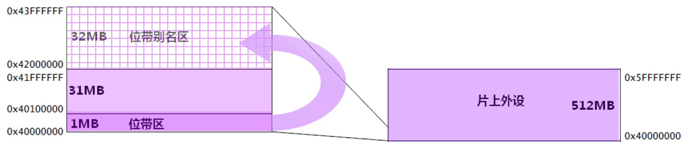

> https://www.bilibili.com/video/BV1N7411x7Yk?p=48

# Bit Band 位带操作



（form [权威指南](bookxnotepro://opennote/?nb={01a25f6c-fe16-454c-8f38-591392487e16}&book=da99ea474b8a9ac1f85ec2d26dd693a1&page=83&x=281&y=368&id=44)）

**位带区**提供 ODR 的映射，操作位带区映射出的新地址（**位带别名区**）就相当于操作 ODR 

本节懒得实验（button 里会使用），直接给出实现👇

```c
#define BITBAND(addr, bitnum) ((addr & 0xF0000000)+0x2000000+((addr &0xFFFFF)<<5)+(bitnum<<2)) 
#define MEM_ADDR(addr)  *((volatile unsigned long  *)(addr)) 
#define BIT_ADDR(addr, bitnum)   MEM_ADDR(BITBAND(addr, bitnum)) 
//IO口地址映射
#define GPIOA_ODR_Addr    (GPIOA_BASE+12) //0x4001080C 
#define GPIOB_ODR_Addr    (GPIOB_BASE+12) //0x40010C0C 
#define GPIOC_ODR_Addr    (GPIOC_BASE+12) //0x4001100C 
#define GPIOD_ODR_Addr    (GPIOD_BASE+12) //0x4001140C 
#define GPIOE_ODR_Addr    (GPIOE_BASE+12) //0x4001180C 
#define GPIOF_ODR_Addr    (GPIOF_BASE+12) //0x40011A0C    
#define GPIOG_ODR_Addr    (GPIOG_BASE+12) //0x40011E0C    

#define GPIOA_IDR_Addr    (GPIOA_BASE+8) //0x40010808 
#define GPIOB_IDR_Addr    (GPIOB_BASE+8) //0x40010C08 
#define GPIOC_IDR_Addr    (GPIOC_BASE+8) //0x40011008 
#define GPIOD_IDR_Addr    (GPIOD_BASE+8) //0x40011408 
#define GPIOE_IDR_Addr    (GPIOE_BASE+8) //0x40011808 
#define GPIOF_IDR_Addr    (GPIOF_BASE+8) //0x40011A08 
#define GPIOG_IDR_Addr    (GPIOG_BASE+8) //0x40011E08 
 
//IO口操作,只对单一的IO口!

#define PAout(n)   BIT_ADDR(GPIOA_ODR_Addr,n)  //输出 
#define PAin(n)    BIT_ADDR(GPIOA_IDR_Addr,n)  //输入 

#define PBout(n)   BIT_ADDR(GPIOB_ODR_Addr,n)  //输出 
#define PBin(n)    BIT_ADDR(GPIOB_IDR_Addr,n)  //输入 

#define PCout(n)   BIT_ADDR(GPIOC_ODR_Addr,n)  //输出 
#define PCin(n)    BIT_ADDR(GPIOC_IDR_Addr,n)  //输入 

#define PDout(n)   BIT_ADDR(GPIOD_ODR_Addr,n)  //输出 
#define PDin(n)    BIT_ADDR(GPIOD_IDR_Addr,n)  //输入 

#define PEout(n)   BIT_ADDR(GPIOE_ODR_Addr,n)  //输出 
#define PEin(n)    BIT_ADDR(GPIOE_IDR_Addr,n)  //输入

#define PFout(n)   BIT_ADDR(GPIOF_ODR_Addr,n)  //输出 
#define PFin(n)    BIT_ADDR(GPIOF_IDR_Addr,n)  //输入

#define PGout(n)   BIT_ADDR(GPIOG_ODR_Addr,n)  //输出 
#define PGin(n)    BIT_ADDR(GPIOG_IDR_Addr,n)  //输入
```

