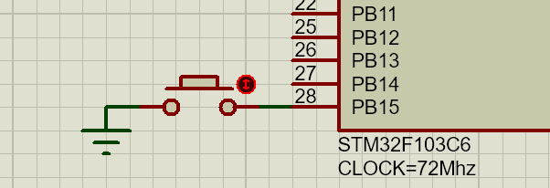
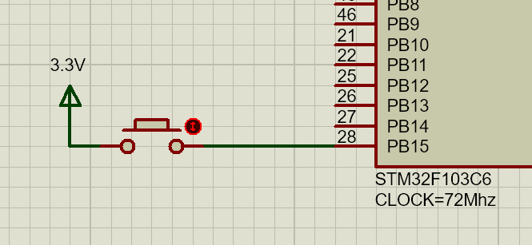

# 按键控制



## LED_Init

按键初始化与 LED 初始化类似，先看 LED 的初始化函数：

```c
void LED_GPIO_Config(void)
{
	GPIO_InitTypeDef GPIO_InitStruct;

	RCC_APB2PeriphClockCmd(LED_GPIO_CLK, ENABLE);
	GPIO_InitStruct.GPIO_Pin = LED_GPIO_PIN;
	GPIO_InitStruct.GPIO_Mode = GPIO_Mode_Out_PP;
	GPIO_InitStruct.GPIO_Speed = GPIO_Speed_50MHz;

	GPIO_Init(LED_GPIO_PORT, &GPIO_InitStruct);
}
```

总之就是建立结构体 → 结构体成员赋值 → 然后拿着写好配置的结构体要求 GPIO_Init() 进行实际的初始化操作

## KEY_Init

依照 LED 初始化函数的步骤，编写 KEY 的初始化函数：

```c
void KEY_GPIO_Config(void)
{
	GPIO_InitTypeDef GPIO_InitStruct;
	
	RCC_APB2PeriphClockCmd(KEY_GPIO_CLK, ENABLE);
	GPIO_InitStruct.GPIO_Pin = KEY_GPIO_PIN;
	GPIO_InitStruct.GPIO_Mode = GPIO_Mode_IPU;
	
	GPIO_Init(KEY_GPIO_PORT, &GPIO_InitStruct);
}
```

💡注意看二者的区别

首先，KEY 是检测引脚的低电平，所以配置的是**上拉输入**模式（`IPU`），也因为是输入，所以不需要配置 `Speed`

## 主函数

逻辑简单，就是一个按钮延迟检测，按下点亮，再按下熄灭

```c
int main(void)
{
    LED_GPIO_Config();
    delay_init();
    KEY_GPIO_Config();

    while (1)
    {
        if (PBin(15) == 0)
        {
            delay_ms(5);
            if (PBin(15) == 0)
            {
                LED_Change();
            }
            while (PBin(15) == 0)
                ;
        }
    }
}
```

## 仿真问题

Proteus 仿真又炸了

试了很久，甚至换电脑试了，也没用，最后用高电平触发解决了，不知道为什么看得到低电平，但是不识别，非常八嘎



# 功能解耦

建立按键扫描函数，扫描到按键后修改标志位，led 检测到标志位，进行响应，并恢复标志位

## KEY_Scan

```c
void KEY_Scan()
{
	if(PBin(15) == 0)
	{
		delay_ms(5);
		if(PBin(15) == 0)
		{
			flag = 1;
		}
		while(!PBin(15));
	}
}
```

## LED_Change

```c
void LED_Change()
{
	static u8 i =0;
	if(flag == 1)
	{
		flag = 0;	
		switch (i)
		{
			case 0:PAout(8) = 1;i++;break;
			case 1:PAout(8) = 0;i=0;break;
		}	
	}	
}
```

## 问题分析

在实际程序编写过程中，设置了两个LED灯，其中一盏灯始终点不亮，检查了很久，发现是赋值语句出错

`GPIO_Pin` 应该是 `GPIO_Pin_15`，不知道什么时候只写了个 15

```c
void LED_GPIO_Config(void)
{
	GPIO_InitTypeDef GPIO_InitStruct;
	/* 💡Proteus 一盏灯的闪烁似乎有问题，再加一盏灯，接到 A15 */

	GPIO_InitTypeDef GPIO_InitStruct2;

	RCC_APB2PeriphClockCmd(LED_GPIO_CLK, ENABLE);
	GPIO_InitStruct.GPIO_Pin = LED_GPIO_PIN;
	GPIO_InitStruct.GPIO_Mode = GPIO_Mode_Out_PP;
	GPIO_InitStruct.GPIO_Speed = GPIO_Speed_50MHz;

	RCC_APB2PeriphClockCmd(RCC_APB2Periph_GPIOA, ENABLE);
	GPIO_InitStruct2.GPIO_Pin =15;// 👈
	GPIO_InitStruct2.GPIO_Mode = GPIO_Mode_Out_PP;
	GPIO_InitStruct2.GPIO_Speed = GPIO_Speed_50MHz;

	GPIO_Init(LED_GPIO_PORT, &GPIO_InitStruct);
	GPIO_Init(GPIOA, &GPIO_InitStruct2);
}
```

# 补充

除了自行编写的 `Pxin`、`Pxout` 外，还可以使用库函数 `GPIO_ReadInputDataBit()` 、`GPIO_WriteBit() `等进行**位带操作**