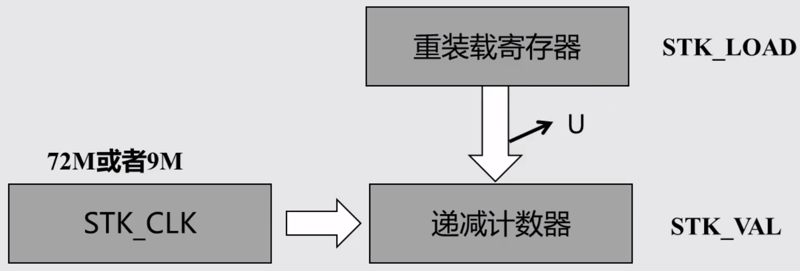
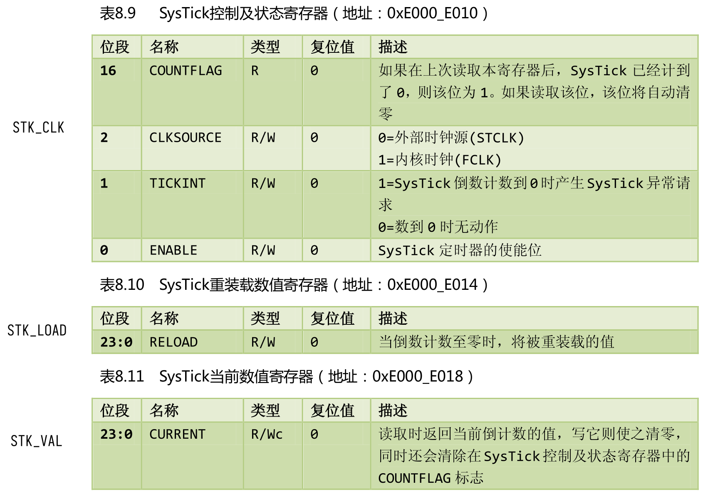
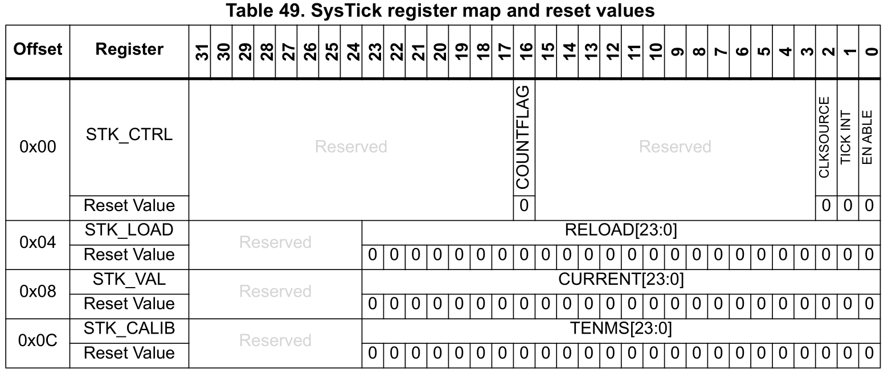
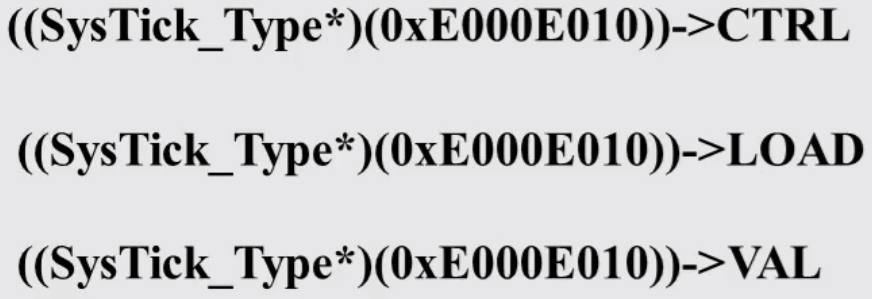

# 准备工作

通过 EIDE 内置模板 `STM32F1 Quickstart` 建立

默认芯片是 stm32f103c**8**，Proteus 只有 stm32f103c**6**

需要修改启动文件为 `startup_stm32f10x_ld.s`

同时修改预处理器定义为 `STM32F10X_LD`

修改 main.c

```c
#include "stm32f10x.h"

#define LED_PERIPH RCC_APB2Periph_GPIOC
#define LED_PORT GPIOC
#define LED_PIN GPIO_Pin_13

int main()
{
    GPIO_InitTypeDef gpioDef;
    RCC_APB2PeriphClockCmd(LED_PERIPH, ENABLE);
    gpioDef.GPIO_Mode = GPIO_Mode_Out_PP;
    gpioDef.GPIO_Pin = LED_PIN;
    gpioDef.GPIO_Speed = GPIO_Speed_10MHz;
    GPIO_Init(LED_PORT, &gpioDef);
    GPIO_ResetBits(LED_PORT, LED_PIN);

    while (1)
    {

    }
}
```

测试电灯，有效

# 时钟

HSE(High Speed External)

HSI(High Speed Internal)

LSI(Low Speed Internal)

LSE(Low Speed External)

PLL

# 总结

总的来说，没什么内容，就是引入了一个 delay 文件

# 其他问题

结构混乱是因为 EIDE 导出的项目有点问题，没办法仿真调试，所以改成重建 keil project

比较尴尬的是，测试结果发现晶振频率不能改，实验结果也不符合预期

## SysTick



👉[权威指南](bookxnotepro://opennote/?nb={01a25f6c-fe16-454c-8f38-591392487e16}&book=da99ea474b8a9ac1f85ec2d26dd693a1&page=137&x=174&y=259&id=34)



> 位段是 `23:0`，所以计数最大值是 $2^{24}$

对应 SysTick 结构体👇

```C
typedef struct
{
  __IO uint32_t CTRL;                         /*!< Offset: 0x00  SysTick Control and Status Register */
  __IO uint32_t LOAD;                         /*!< Offset: 0x04  SysTick Reload Value Register       */
  __IO uint32_t VAL;                          /*!< Offset: 0x08  SysTick Current Value Register      */
  __I  uint32_t CALIB;                        /*!< Offset: 0x0C  SysTick Calibration Register        */
} SysTick_Type;
```

> 从编程手册的 [Table 33](bookxnotepro://opennote/?nb={01a25f6c-fe16-454c-8f38-591392487e16}&book=060af922add9793b5c77ec3819c0d3d3&page=104&x=325&y=183&id=35) 可以找到 System timer 的地址（就是 SysTick）
>
> 然后跳转到 [Table 49](bookxnotepro://opennote/?nb={01a25f6c-fe16-454c-8f38-591392487e16}&book=060af922add9793b5c77ec3819c0d3d3&page=153&x=203&y=389&id=36) 就可以看到 SysTick 的内存结构
>
> 
>
> 可以看到，每个寄存器占 32 位，同时 SysTick 的地址是 `0xE000E010-0xE000E01F`，总共是 16 位
>
> 如果用地址直接找寄存器的话，是如下形式👇
>
> 

### 实现 my_delay()

```c
void my_delay_init(void)
{
    ((SysTick_Type *)(0xE000E010))->CTRL &= ~(1 << 2); // SysTick 设为8分频
}

void my_delay_ms(u16 nms)
{
    ((SysTick_Type *)(0xE000E010))->LOAD = (u32)nms * 9000; // 重装初值
    ((SysTick_Type *)(0xE000E010))->VAL = 0x00;             // 清空计数器
    ((SysTick_Type *)(0xE000E010))->CTRL |= 0x01;           // 启动计数(SysTick使能)

    while (!(((SysTick_Type *)(0xE000E010))->CTRL & (1<<16)))
        ; // 等待时间到达
    ((SysTick_Type *)(0xE000E010))->CTRL &= ~(1 << 0); // 关闭计数器
}
```

有点没搞懂 CTRL 的分频是怎么回事，在[权威指南里](bookxnotepro://opennote/?nb={01a25f6c-fe16-454c-8f38-591392487e16}&book=da99ea474b8a9ac1f85ec2d26dd693a1&page=137&x=133&y=349&id=39)只说 CLKSOURCE 是外部或者内部时钟源，在[编程手册](bookxnotepro://opennote/?nb={01a25f6c-fe16-454c-8f38-591392487e16}&book=060af922add9793b5c77ec3819c0d3d3&page=150&x=218&y=389&id=38)里写的一个是 AHB/8 分频，一个 是 AHB，找到[参考手册](bookxnotepro://opennote/?nb={01a25f6c-fe16-454c-8f38-591392487e16}&book=96b8b5eee15efdadc4e523147a804910&page=125&x=376&y=405&id=41)，才明白大概的意思：「[RCC 通过 AHB 时钟(HCLK) 8 分频后作为 Cortex 系统定时器 (SysTick) 的外部时钟](bookxnotepro://opennote/?nb={01a25f6c-fe16-454c-8f38-591392487e16}&book=47f07b86a273b11dbbc9034f7a90f448&page=55&x=279&y=685&id=45)」


再对照提供的 delay 实现，可以更好理解👇

```c
static u8 fac_us = 0;
static u16 fac_ms = 0;
void delay_init()
{
	SysTick_CLKSourceConfig(SysTick_CLKSource_HCLK_Div8);//在misc.c中，选择外部时钟源 HCLK/8
	fac_us = SystemCoreClock / 8000000;
	fac_ms = (u16)fac_us*1000;
}

void delay_us(u32 nus)
{		
	u32 temp;	    	 
	SysTick->LOAD=nus*fac_us; 					//时间加载	  		 
	SysTick->VAL=0x00;        					//清空计数器
	SysTick->CTRL|=SysTick_CTRL_ENABLE_Msk ;	//开始倒数	  
	do
	{
		temp=SysTick->CTRL;
	}while((temp&0x01)&&!(temp&(1<<16)));		//等待时间到达   
	SysTick->CTRL&=~SysTick_CTRL_ENABLE_Msk;	//关闭计数器
	SysTick->VAL =0X00;      					 //清空计数器	 
}
```

> ps：循环里先判断定时器使能位，再看时间是否到达

再附上库函数的实现（位于 misc.c）👇

```c
void SysTick_CLKSourceConfig(uint32_t SysTick_CLKSource)
{
  /* Check the parameters */
  assert_param(IS_SYSTICK_CLK_SOURCE(SysTick_CLKSource));
  if (SysTick_CLKSource == SysTick_CLKSource_HCLK)
  {
    SysTick->CTRL |= SysTick_CLKSource_HCLK;
  }
  else
  {
    SysTick->CTRL &= SysTick_CLKSource_HCLK_Div8;
  }
}
```

> 不再往下挖了，太多层了，总之就是各种宏定义嵌套

## `SysTick_CLKSourceConfig()` 和 `SysTick_Config()`

这里给出 `SysTick_Config` 的实现，`SysTick_CLKSourceConfig` 上面已列出

```c
static __INLINE uint32_t SysTick_Config(uint32_t ticks)
{ 
  if (ticks > SysTick_LOAD_RELOAD_Msk)  return (1);            /* Reload value impossible */
                                                               
  SysTick->LOAD  = (ticks & SysTick_LOAD_RELOAD_Msk) - 1;      /* set reload register */
  NVIC_SetPriority (SysTick_IRQn, (1<<__NVIC_PRIO_BITS) - 1);  /* set Priority for Cortex-M0 System Interrupts */
  SysTick->VAL   = 0;                                          /* Load the SysTick Counter Value */
  SysTick->CTRL  = SysTick_CTRL_CLKSOURCE_Msk | 
                   SysTick_CTRL_TICKINT_Msk   | 
                   SysTick_CTRL_ENABLE_Msk;                    /* Enable SysTick IRQ and SysTick Timer */
  return (0);                                                  /* Function successful */
}
```

注意两个函数的区别，`SysTick_CLKSourceConfig()` 只配置时钟源，`SysTick_Config()` 不仅配置了时钟源，同时也对中断进行了相关配置