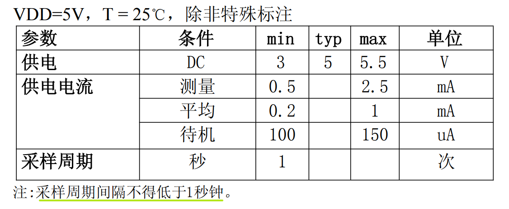
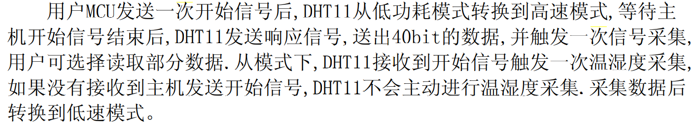
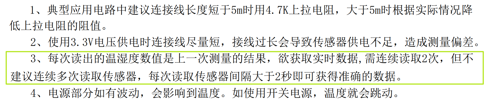
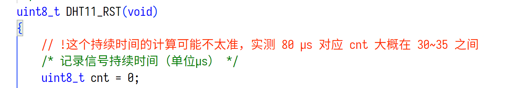
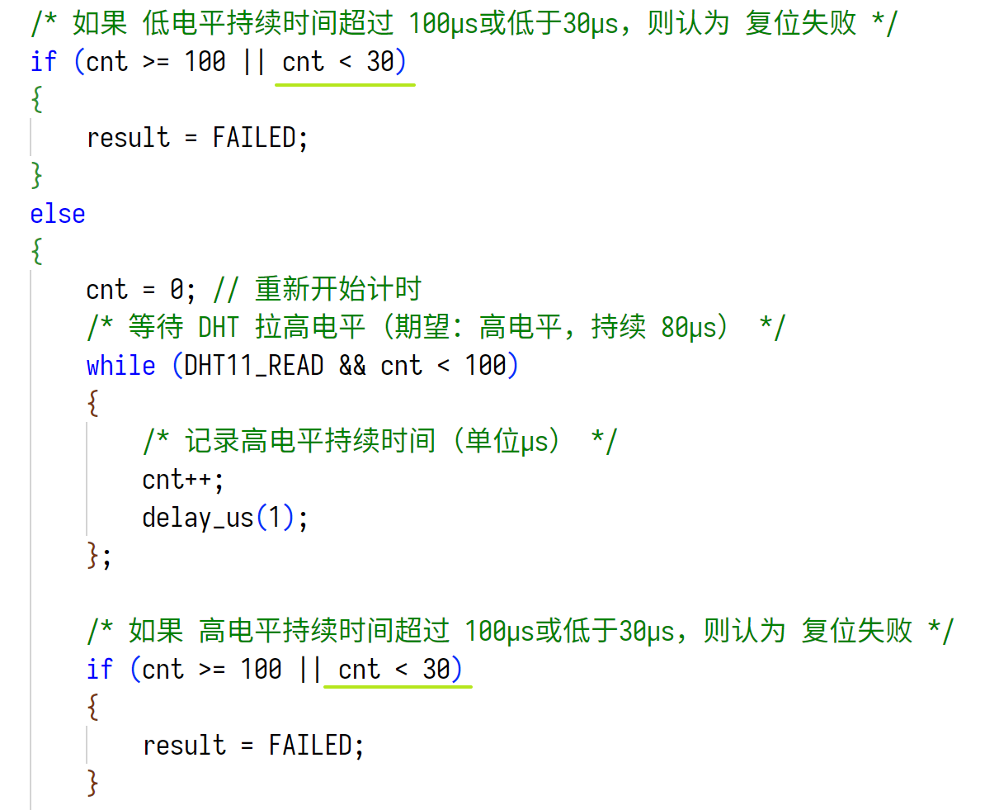

# DHT11

> DHT11 要点不多，代码中已添加足够详细的注释，这里只记录一些细节

## DHT11 工作流程

主机（MCU）发送开始信号 => 从机（DHT11）收到信号并发送响应信号 => 从机开始发送本次数据，主机接收数据、处理数据

## DHT11 系统特点

系统是单总线双向传输结构，半双工通信，一个发，一个收，MCU 请求一次数据，DHT11 就测一次，然后把数据发给 MCU（DHT11 也不管 MCU 有没有收到）

总的来说，编码时注意好时序就好，比较简单

## 采样间隔

说明书里要求 DHT11 的采样间隔不得低于 1 秒钟

> 我手上的这个 DHT11 是接收到开始信号触发一次温湿度采集
>
> 
>
> 网上有查到[广州奥松电子的 DHT11](DHT11-V1_3说明书（详细版）（广州奥松电子）.pdf)，每次读出的是上一次检测到的数据，所以需要精确数据的时候需要连续查两次，但是建议采样间隔是 2 秒
>
> 

# 未解决的问题

网上查到的 DHT11 的实现好像都是只卡上限不卡下限，并不关心 DHT11 回应信号之后拉高电平持续了多久，只是为了避免卡死，添加了计数上限不超过 100

自以为严谨加上了对于下线的判断，结果实验结果开始报错，一度以为自己的程序哪里写错，一句句挑错也没找到问题，最后锁定在下限判断，调参，从 70 一路滑倒 30 才算稳定，属实是苦涩

#TODO 后续还需要分析这个时间具体有多长，到底是延时函数的问题还是 DHT11 的问题