# IIC

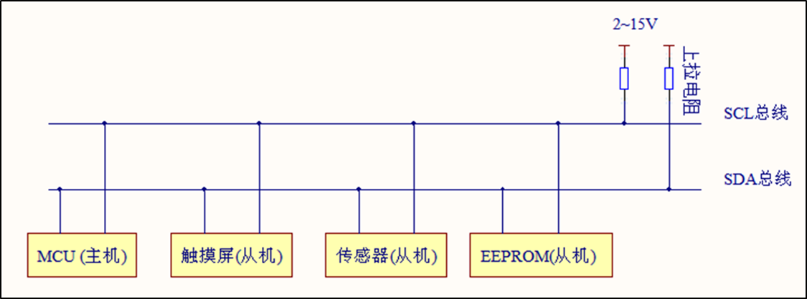

## 时序分析

### 起止信号

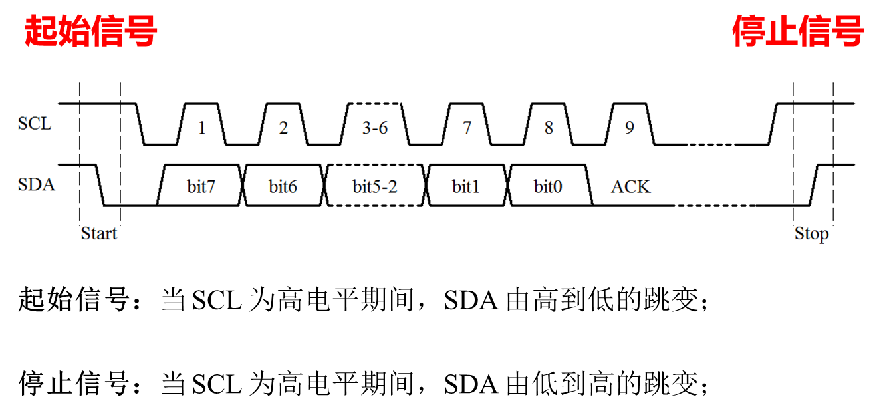

### 数据信号

#### 数据传输和应答位识别

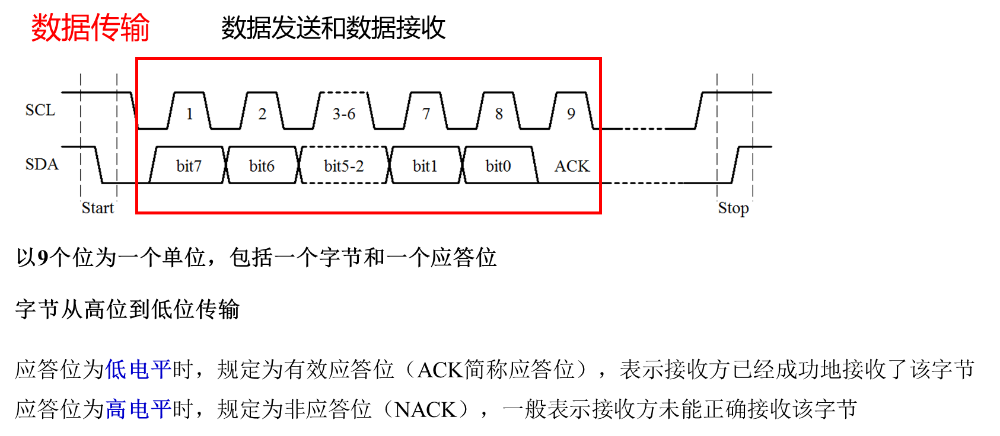

> 为什么低电平表示 ACK？因为 SCL 和 SDA 都接了上拉电阻，默认是高电平，所以如果 从机没有收到数据，自然也不会响应，所以是默认的高电平，如果收到了数据，就会主动拉低 SDA 进行回应

#### 数据有效性

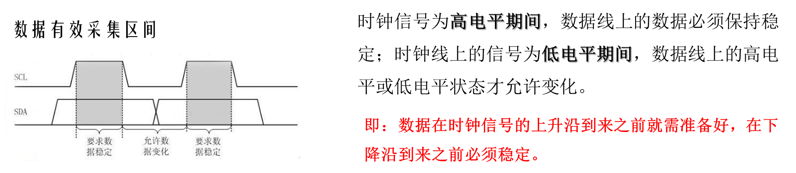

## 持续时间

商家给的资料太离谱了，全是英文的，有的 pdf 图片还是糊的，完全不知道写的啥，从 [SSD1306-Revision 1.1 (Charge Pump).pdf](SSD1306-Revision 1.1 (Charge Pump).pdf) 里捞了一张时序和时间对应关系的图作为参考


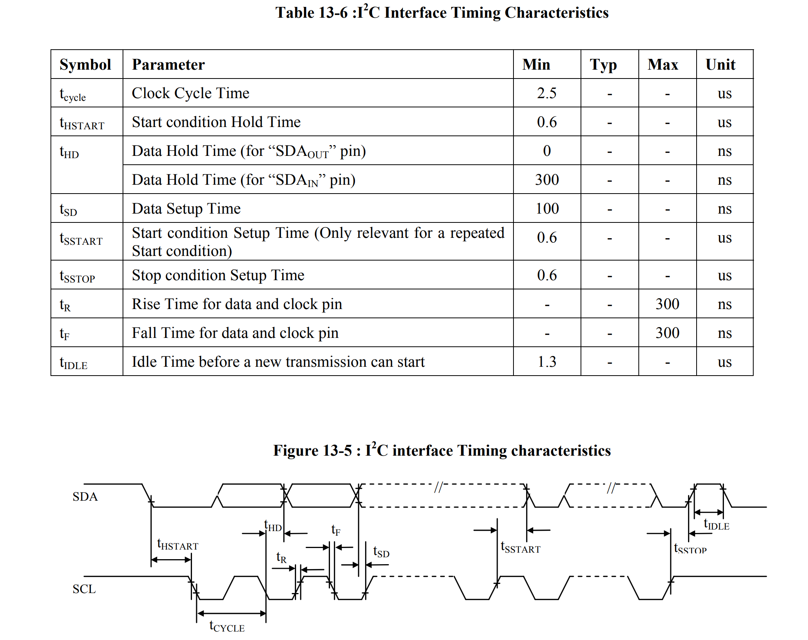


另外，在 [24C0X.pdf](24C0X.pdf) 也有类似的 IIC 时序关系


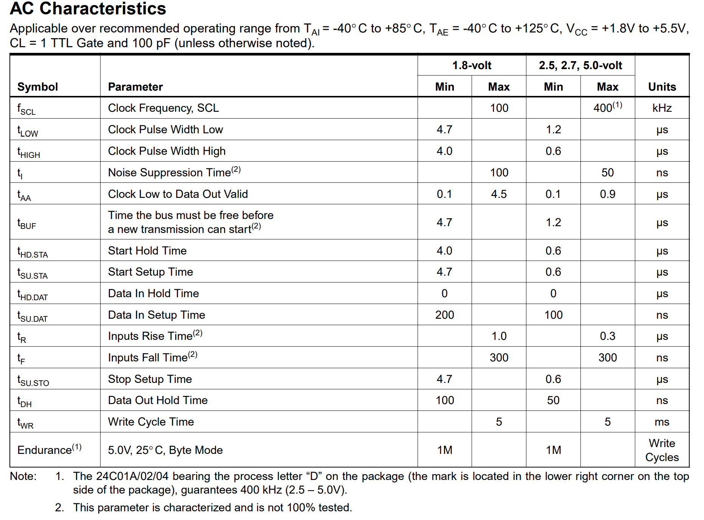

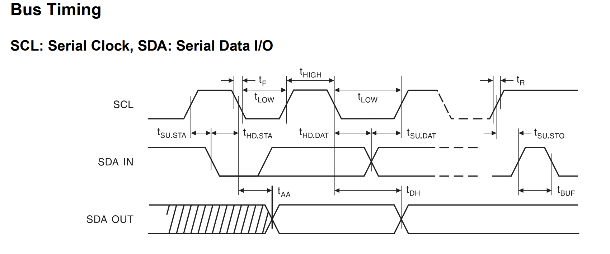

> 这个图看起来好像更好懂一点

## 总结

- IIC 双总线

  - SCL 时钟线，负责数据有效性，只有在高电平期间数据有效
  - SDA 数据线，负责数据本身

- 在 OLED、LCD 等设备中，通信是单向的（主机（MCU） => 从机），通常不需要过多考虑从机的应答

  - 在这种情况下，对于 IIC 传输数据的关键就是抓住 「SCL 控制数据有效性」 这一点

    - 保证 SCL 高电平之前，数据（SDA）已经准备好

      - > 在发送起止信号时，也要注意这一点，SDA 跳变前的电平要在 拉高 SCL 之前就准备好，然后在 SCL 高电平时改变 SDA 的电平

  - 从机的应答就是发送 8 位数据之后的 ACK/NACK，要做的就是拉高 SCL，读 SDA 的电平

    - 低电平：ACK
    - 高电平：NACK

# SSD1306(OLED 驱动芯片)

> 这部分的截图都来自 [SSD1306-Revision 1.1 (Charge Pump).pdf](SSD1306-Revision 1.1 (Charge Pump).pdf) 

## 数据含义

只有 IIC 的信息只能知道怎么发送数据，但是数据含义和怎么与从机通信还需要确定数据含义，对于 SD1306 而言，就是需要明确以下数据的表达方式：

- 从机地址（Slave Address）
- 控制字符（Control byte）
- 数据字符（Data byte）

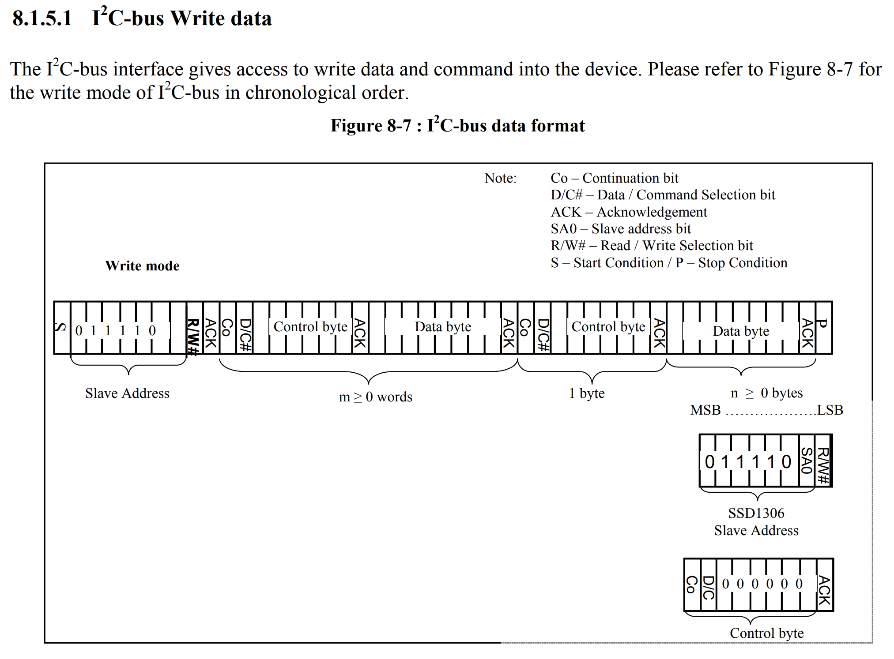

#### 从机地址

IIC 总线上可以挂载多个设备，需要**从机地址**区分不同的设备

SSD1306 从机地址可以是：0111 10**0**（0x3C）或 0111 10**1**（0x3D）

💡一些需要注意的细节：

- 并不是以上两个从机地址可以随便选择，根据文档的描述，`SA0` 的值是通过 `D/C#` 引脚决定的

  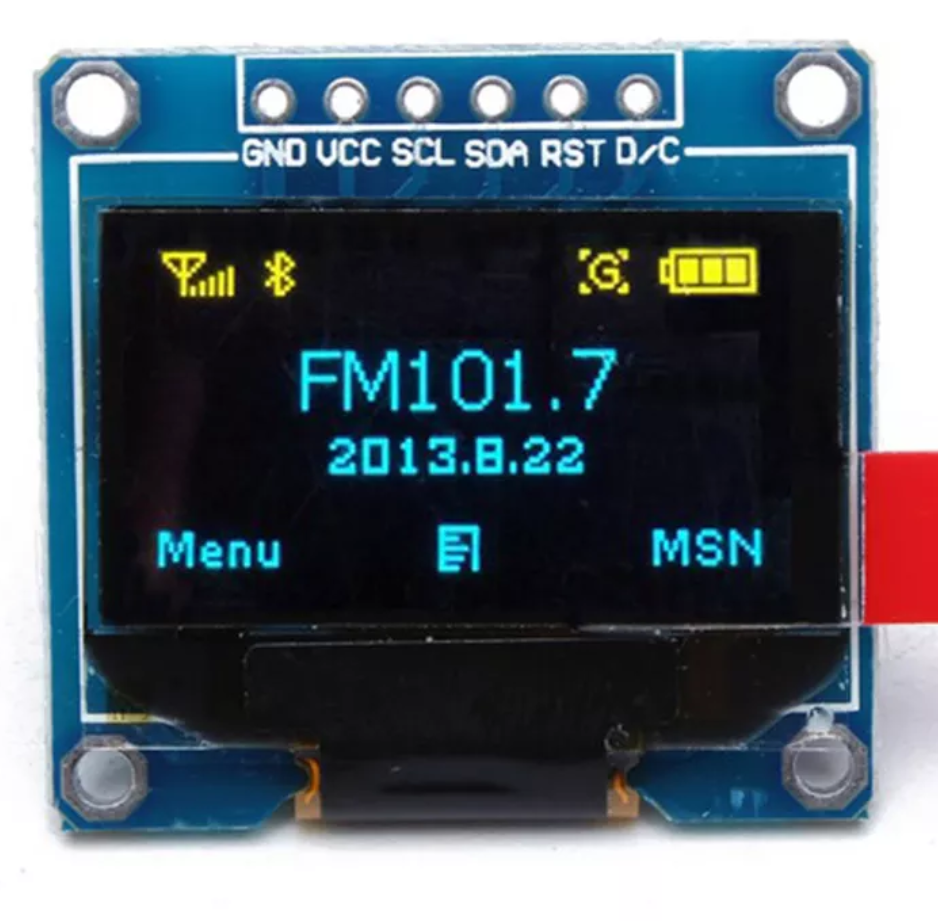

  - 当 D/C 引脚为低电平时，`SA0` 为 0，从地址为 0111 10**0**（0x3C）
  - 当 D/C 引脚为低电平时，`SA0` 为 1，从地址为 0111 10**1**（0x3D）

  但是对于 4 脚的 OLED 而言，压根儿没有 D/C 引脚，所以从机地址（经过测试）只能是 0111 10**0**（0x3C）

  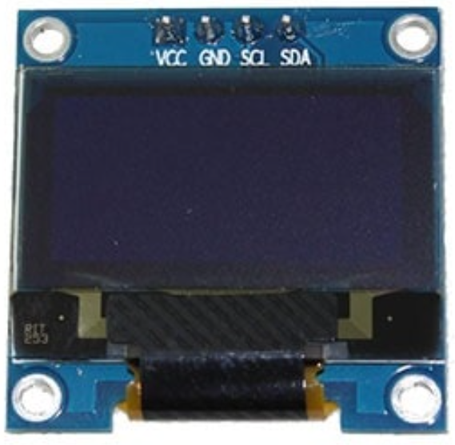

- `Slave Address` 一共 8 位，<u>从机地址是在高 7 位</u>，在编码时需要注意移位，不能直接使用 0x3C/0x3D
- 最后一位的 `R/W#` 位
  - 当 `R/W#=1` 时，为读模式
  - 当 `R/W#=0` 时，为写模式

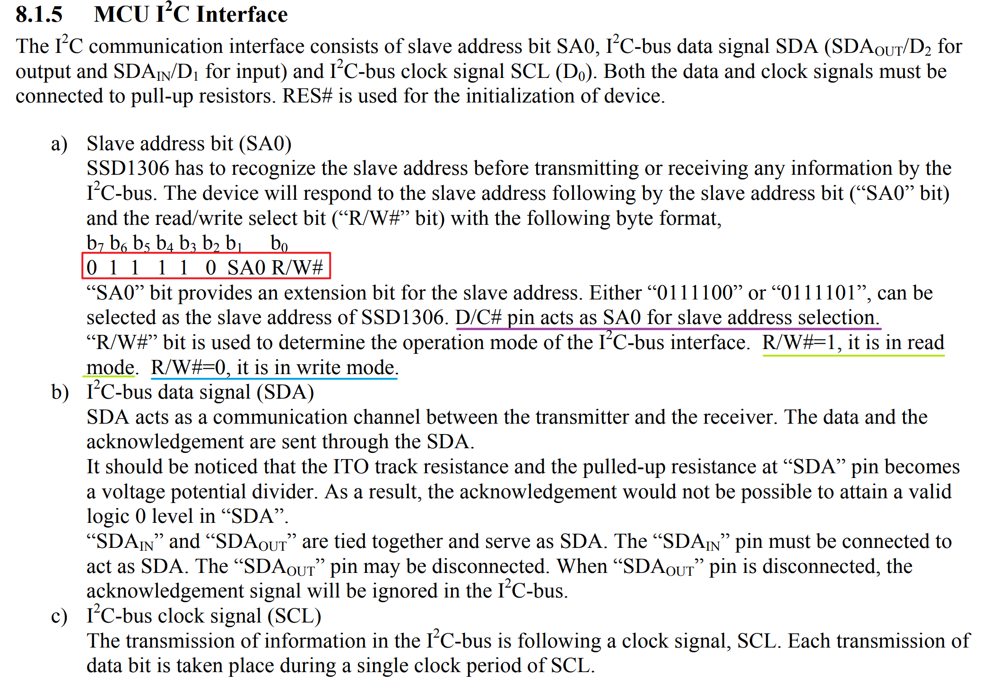

# 具体实现

因为 IIC 的内容需要结合具体的硬件，所以这里可以实现的内容实际上不多，本节实现了：初始化、起止信号的发送、数据的发送

为了验证功能，添加了一个机地址验证的函数，这里给出具体实现：

```c
/**
 * @brief 验证从机是否存在
 *
 * @param addr 从机的地址
 * @return uint8_t 收到的应答信号
 * @retval 0 收到应答信号，从机存在
 * @retval 1 没有收到应答信号，从机不存在
 */
uint8_t IICAdress(uint8_t address)
{
	/* 收到的应答信号 */
	uint8_t ack;

	/* 发送起始信号 */
	IIC_Start();

	/* 写入从机地址并读回应答信号 */
	/* 地址在高 7 位，所以左移一位，第 8 位为 0，表示写模式 */
	ack = IICWrite(address << 1);

	/* 发送停止信号 */
	IIC_Stop();

	/* 返回应答信号 */
	return ack;
}
```

以及用作测试的主函数

```c
int main(void)
{
	uint8_t ack;
	delay_init();
	USART1_Config();
	IIC_Init();
	ack = IICAdress(0x3C);
	if (ack == 0)
	{
		printf("IICAdress 0x3C ACK\r\n");
	}
	else
	{
		printf("IICAdress 0x3C NACK\r\n");
	}

	ack = IICAdress(0x3D);
	if (ack == 0)
	{
		printf("IICAdress 0x3D ACK\r\n");
	}
	else
	{
		printf("IICAdress 0x3D NACK\r\n");
	}

	ack = IICAdress(0x3E);
	if (ack == 0)
	{
		printf("IICAdress 0x3E ACK\r\n");
	}
	else
	{
		printf("IICAdress 0x3E NACK\r\n");
	}

	while (1)
	{
	}
}
```


> 其他内容见源文件

# 实验结果

符合预期

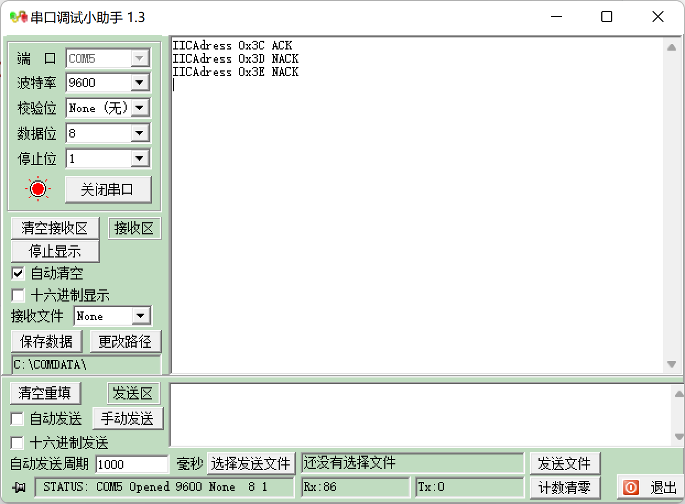

