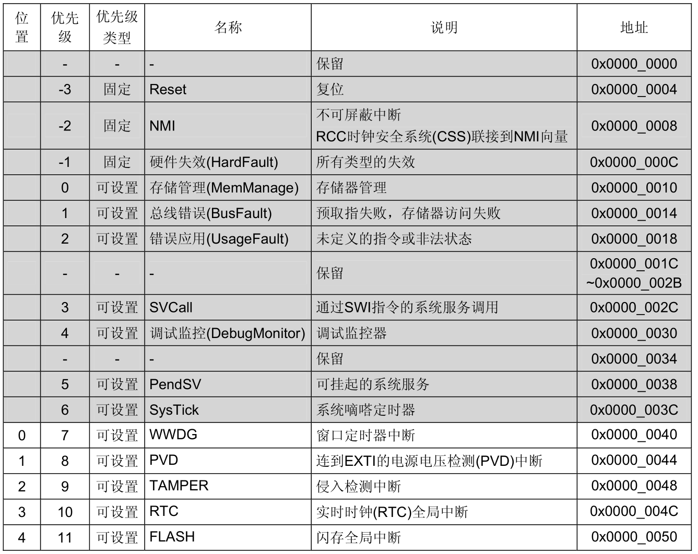
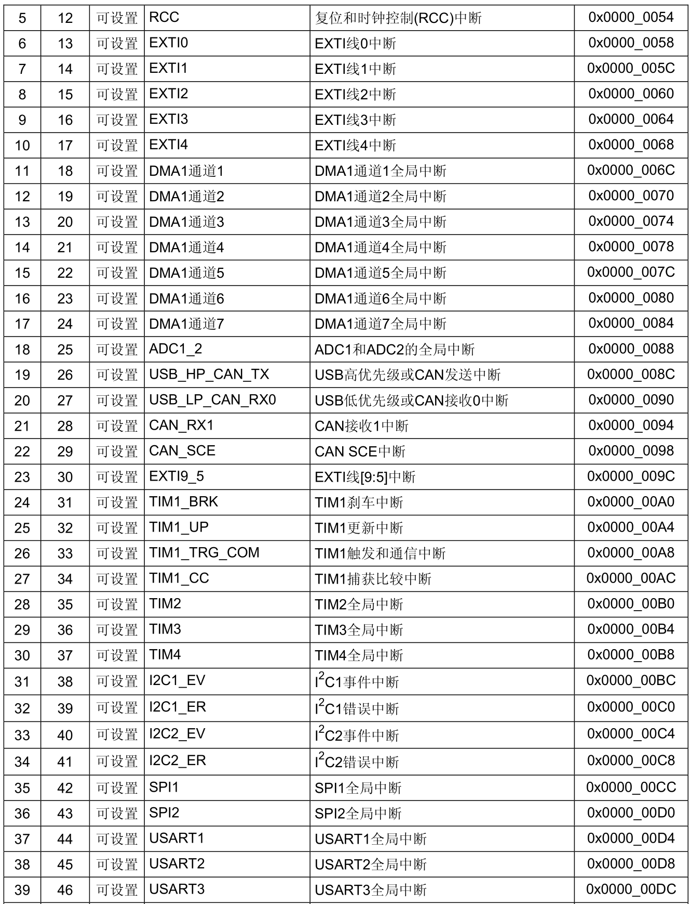
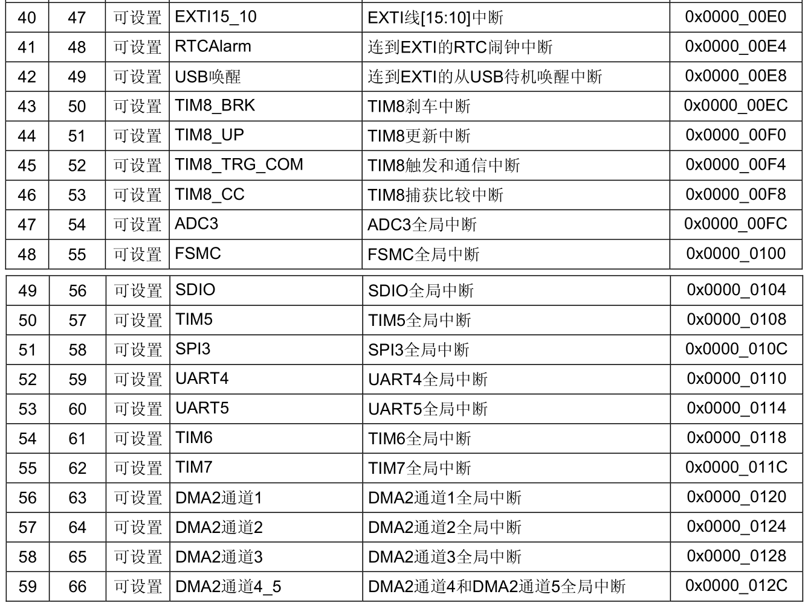
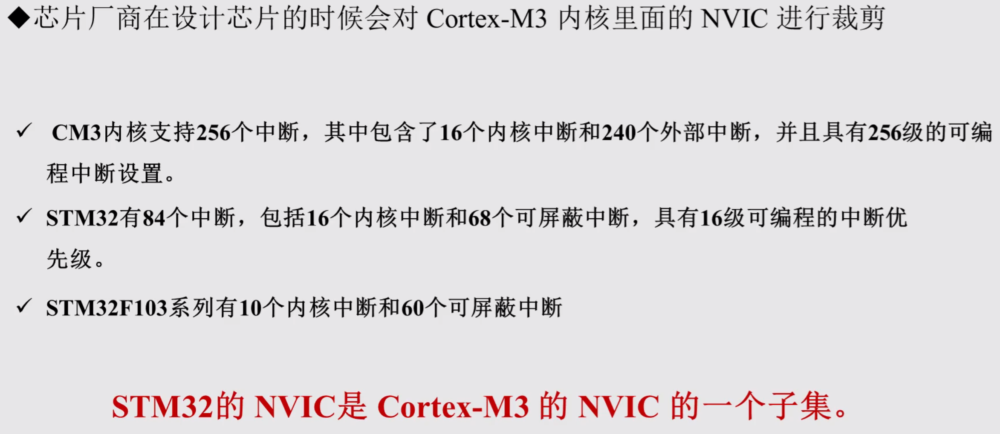
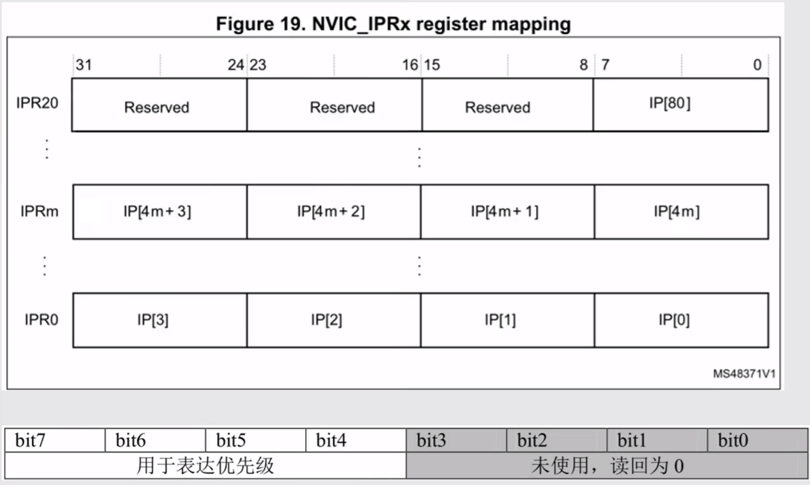
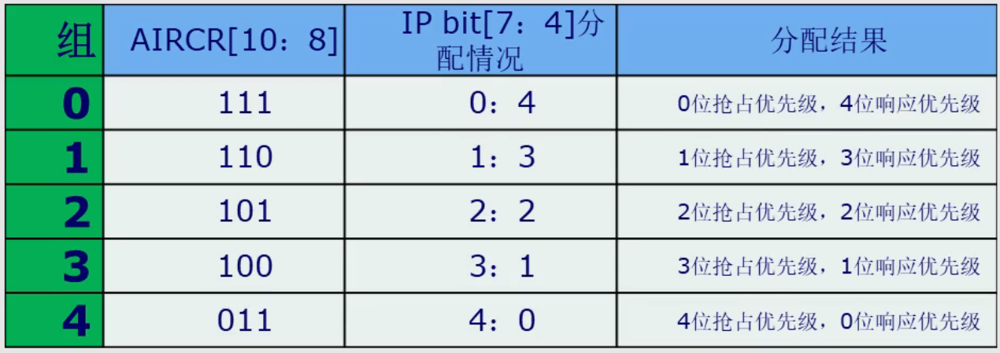
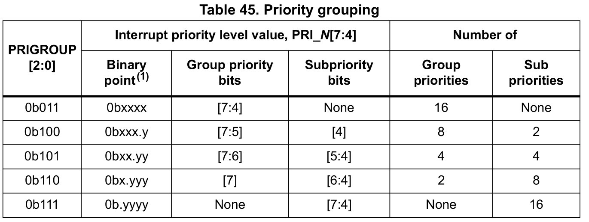

## 与 NVIC 相关的寄存器所在文件

`core_cm3.c`

`core_cm3.h`

`misc.c` 

`misc.h`

💡中断都需要配置 `NVIC`

## 中断类型

（[参考手册](bookxnotepro://opennote/?nb={01a25f6c-fe16-454c-8f38-591392487e16}&book=47f07b86a273b11dbbc9034f7a90f448&page=131&x=281&y=404&id=22)截图，灰色部分是内部中断）







##  为 Cortex-M3 内核设计的 NVIC

基于 `CM3` 内核的芯片中断数量都是从 NVIC 「刀」来的



## 优先级位数

实际上用了一个字节（8 位）表示优先级，但是低 4 位未使用



（from [编程手册](bookxnotepro://opennote/?nb={01a25f6c-fe16-454c-8f38-591392487e16}&book=060af922add9793b5c77ec3819c0d3d3&page=124&x=351&y=219&id=27)）

## 抢占优先级和相应优先级

💡一个工程只能设定一种优先级分组方式



> 优先级数字 是 0~3，数字越小，优先级越高

**高抢占优先级**<u>可以</u>打断正在进行的**低抢占优先级**的中断

**相同抢占优先级**的中断，**高响应优先级**<u>不可以</u>打断**低响应优先级**的中断

**相同抢占优先级**的中断**同时发生**，**响应优先级**高的先执行

**相同**<u>抢占优先级和响应优先级</u>的中断，先发生的先执行

**相同**<u>抢占优先级和响应优先级</u>的中断**同时发生**，**中断向量表里的优先级**高的先执行

> **抢占优先级和响应优先级**的概念与 51 单片机的**优先级和自然优先级**的概念类似

## 配置优先级分组

实际**配置优先级分组不是 `NVIC_IPRx`，而是 `SCB_AIRCR`**，在[编程手册](bookxnotepro://opennote/?nb={01a25f6c-fe16-454c-8f38-591392487e16}&book=060af922add9793b5c77ec3819c0d3d3&page=134&x=347&y=164&id=28)可以看到和前面类似的图，这里直接标明的是优先级的数量而不是[位数](bookxnotepro://opennote/?nb={01a25f6c-fe16-454c-8f38-591392487e16}&book=060af922add9793b5c77ec3819c0d3d3&page=118&x=326&y=464&id=32)



## NVIC

```c
typedef struct
{
  __IO uint32_t ISER[8];                      /*!< Offset: 0x000  Interrupt Set Enable Register           */
       uint32_t RESERVED0[24];                                   
  __IO uint32_t ICER[8];                      /*!< Offset: 0x080  Interrupt Clear Enable Register         */
       uint32_t RSERVED1[24];                                    
  __IO uint32_t ISPR[8];                      /*!< Offset: 0x100  Interrupt Set Pending Register          */
       uint32_t RESERVED2[24];                                   
  __IO uint32_t ICPR[8];                      /*!< Offset: 0x180  Interrupt Clear Pending Register        */
       uint32_t RESERVED3[24];                                   
  __IO uint32_t IABR[8];                      /*!< Offset: 0x200  Interrupt Active bit Register           */
       uint32_t RESERVED4[56];                                   
  __IO uint8_t  IP[240];                      /*!< Offset: 0x300  Interrupt Priority Register (8Bit wide) */
       uint32_t RESERVED5[644];                                  
  __O  uint32_t STIR;                         /*!< Offset: 0xE00  Software Trigger Interrupt Register     */
}  NVIC_Type;   
```

> 保留位没用到，但是长度也要凑出来

Interrupt set-enable registers (NVIC_ISERx) 中断使能

Interrupt clear-enable registers (NVIC_ICERx) 清除使能

Interrupt set-pending registers (NVIC_ISPRx) 中断挂起

Interrupt clear-pending registers (NVIC_ICPRx) 中断解挂

Interrupt active bit registers (NVIC_IABRx) 中断激活标志位（只读，为 1 时表明中断正在执行）