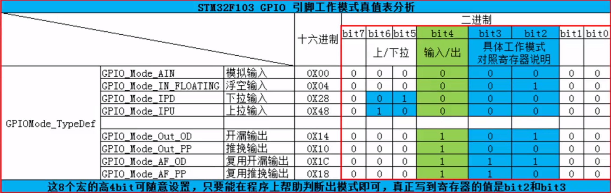
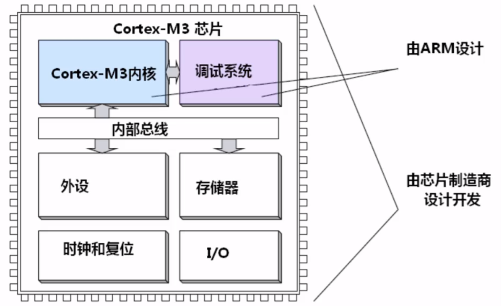
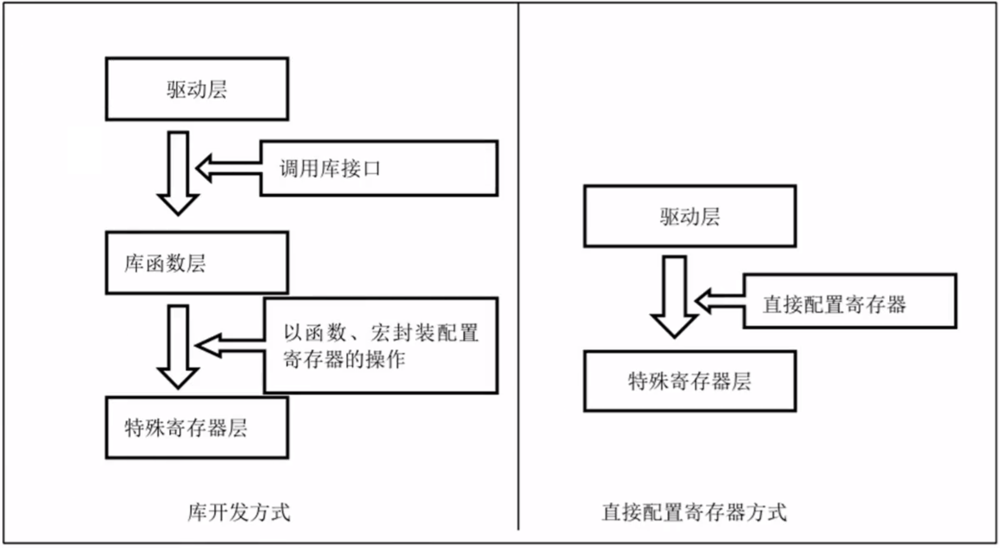
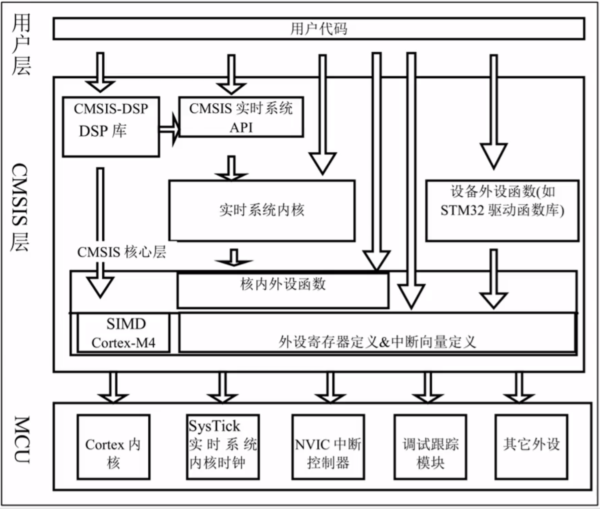
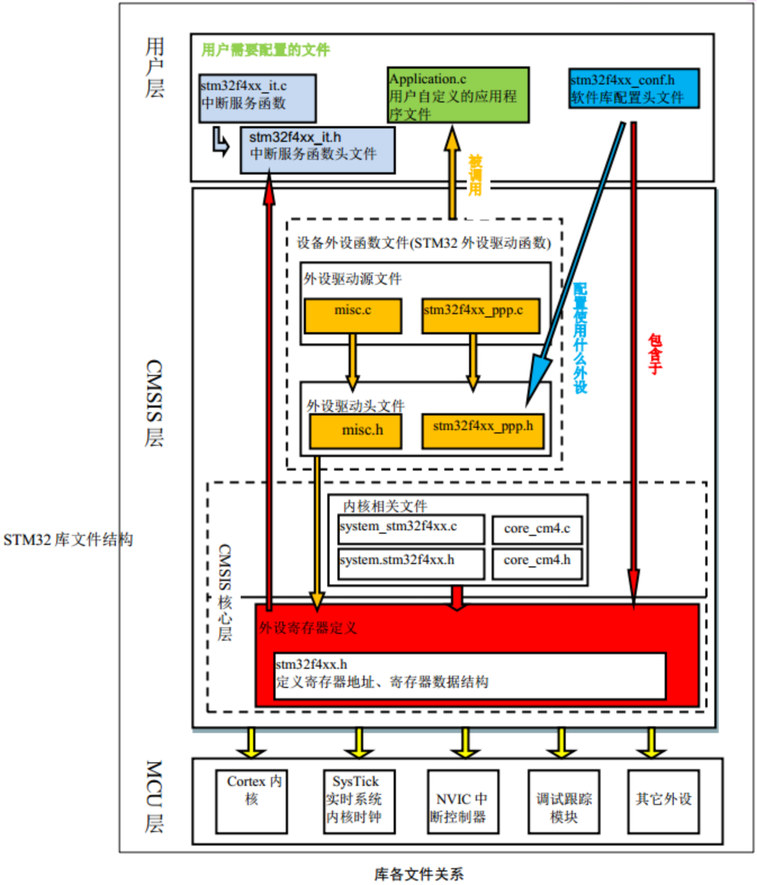
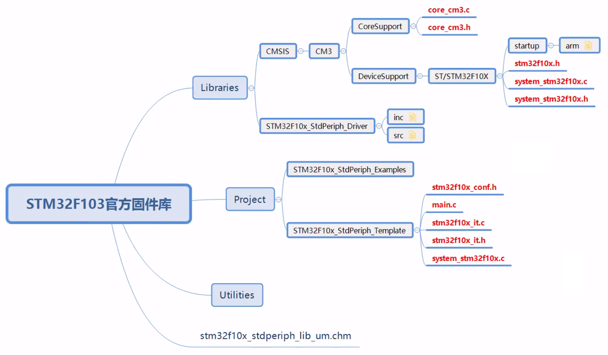

[寄存器基地址](bookxnotepro://opennote/?nb={01a25f6c-fe16-454c-8f38-591392487e16}&book=47f07b86a273b11dbbc9034f7a90f448&page=27&x=175&y=135&id=1)

> 有一个注释没写，补充在这里，通过 GPIOx_CRH 配置的**输出模式**是：**推挽输出，最大速度 10Hz**

# 从 0 到 1 —— 从显式地址到宏定义

## 直接操作地址

```c
    /* 寄存器操作，直接淦地址 */

    // RCC 基地址 0x40021000，APB2 使能偏移地址0x18，IOPC EN 是第 4 位
    *(unsigned int *)0x40021018 |= (1 << 4); // 打开 GPIOC 时钟

    // GPIOC 基地址 0x40011000，CRH（配置寄存器高位） 偏移地址0x04
    // F 是 4 个 1，往前推 20 位 GPIOC_CRH 中，CNF13 和 MODE13 是 23~20 位
    *(unsigned int *)0x40011004 &= ~(0x0F << (4 * 5)); // 配置输出模式（先清零）

    // 赋值 23~20 位为 0001
    *(unsigned int *)0x40011004 |= (1 << (4 * 5)); // 配置输出模式（再赋值）

    // GPIOC 基地址 0x40011000，ODR 偏移地址 0x0C，ODR13 就是第 13 位
    *(unsigned int *)0x4001100C &= ~(1 << 13); // 配置输出低电平
    //  *(unsigned int *)0x4001100C |= (1 << 13); // 配置输出高电平
```

## 为地址做宏定义

```c
#define RCC_APB2ENR *(unsigned int *)0x40021018
#define GPIOC_CRH *(unsigned int *)0x40011004
#define GPIOC_ODR *(unsigned int *)0x4001100C
```

> 👆写入一个自定义的头文件，名字就叫 `stm32f10x.h`

```c
    /* 寄存器操作，地址宏定义 */

    // RCC 基地址 0x40021000，APB2 使能偏移地址0x18，IOPC EN 是第 4 位
    RCC_APB2ENR |= (1 << 4); // 打开 GPIOC 时钟

    // GPIOC 基地址 0x40011000，CRH（配置寄存器高位） 偏移地址0x04
    // F 是 4 个 1，往前推 20 位 GPIOC_CRH 中，CNF13 和 MODE13 是 23~20 位
    GPIOC_CRH &= ~(0x0F << (4 * 5)); // 配置输出模式（先清零）

    // 赋值 23~20 位为 0001
    GPIOC_CRH |= (1 << (4 * 5)); // 配置输出模式（再赋值）

    // GPIOC 基地址 0x40011000，ODR 偏移地址 0x0C，ODR13 就是第 13 位
    GPIOC_ODR &= ~(1 << 13); // 配置输出低电平
    //  GPIOC_ODR |= (1 << 13); // 配置输出高电平
```

## 进一步从总线基地址做宏定义

```c
// 总线基地址
#define PERIPH_BASE 0x40000000
#define APB1PERIPH_BASE PERIPH_BASE
#define APB2PERIPH_BASE (PERIPH_BASE + 0x00010000)
#define AHBPERIPH_BASE (PERIPH_BASE + 0x00020000)
/* 👆AHB 基地址从 0x00020000开始
 * 从库函数的 stm32f10x.h 查表可以看到，SDIO_BASE 单独设置为从 0x00018000 开始
 */

// 根据总线得到的 GPIOC 的寄存器基地址
#define GPIOC_BASE (APB2PERIPH_BASE + 0x00001000)

// GPIOC 各个寄存器（从地址中取出）
#define GPIOC_CRL *(unsigned int *)(GPIOC_BASE + 0x00)
#define GPIOC_CRH *(unsigned int *)(GPIOC_BASE + 0x04)
#define GPIOC_IDR *(unsigned int *)(GPIOC_BASE + 0x08)
#define GPIOC_ODR *(unsigned int *)(GPIOC_BASE + 0x0C)
#define GPIOC_BSRR *(unsigned int *)(GPIOC_BASE + 0x10)
#define GPIOC_BRR *(unsigned int *)(GPIOC_BASE + 0x14)
#define GPIOC_LCKR *(unsigned int *)(GPIOC_BASE + 0x18)

// RCC 复位和时钟控制
#define RCC_BASE (AHBPERIPH_BASE + 0x1000)
#define RCC_APB2ENR *(unsigned int *)(RCC_BASE + 0x18)
```

# 从 1 到 N —— 从宏定义到面向对象

GPIOx（x=A..E）每一组都有相同的各种寄存器，引入结构体，简化描述

```c
typedef struct
{
  uint32_t CRL;
  uint32_t CRH;
  uint32_t IDR;
  uint32_t ODR;
  uint32_t BSRR;
  uint32_t BRR;
  uint32_t LCKR;
} GPIO_TypeDef;
```

> 每个结构体成员占用 4 个字节，与寄存器的占用地址一致

结构体只有各个寄存器的名字，但是没有地址

而单片机中只有各个寄存器的地址，但是没有名字

通过这个👇形式，把地址和名字串起来

`(GPIO_TypeDef *)GPIOC_BASE`

上式使得 `GPIOC_BASE` 所代表的地址 `0x40011000` 在逻辑上被认为指向一个**类型为 `GPIO_TypeDef` 的结构体**，它的内部有 7 个占用 4 字节的成员，与 GPIOC 的各个寄存器在单片机中的存放是一致的

定义如下宏定义，即可通过 GPIOC 取得各个寄存器的地址

```c
#define GPIOC ((GPIO_TypeDef *)GPIOC_BASE)
```

类似的，可以得到 RCC 的结构体及其宏定义

```c
typedef struct
{
    uint32_t CR;
    uint32_t CFGR;
    uint32_t CIR;
    uint32_t APB2RSTR;
    uint32_t APB1RSTR;
    uint32_t AHBENR;
    uint32_t APB2ENR;
    uint32_t APB1ENR;
    uint32_t BDCR;
    uint32_t CSR;
} RCC_TypeDef;

#define RCC ((RCC_TypeDef*)RCC_BASE)
```

将上一节 main 函数中的下划线改成 `->` 得到如下形式

```c
/* 寄存器操作，通过结构体访问 */

// RCC 基地址 0x40021000，APB2 使能偏移地址0x18，IOPC EN 是第 4 位
RCC->APB2ENR |= (1 << 4); // 打开 GPIOC 时钟

// GPIOC 基地址 0x40011000，CRH（配置寄存器高位） 偏移地址0x04
// F 是 4 个 1，往前推 20 位 GPIOC_CRH 中，CNF13 和 MODE13 是 23~20 位
GPIOC->CRH &= ~(0x0F << (4 * 5)); // 配置输出模式（先清零）

// 赋值 23~20 位为 0001
GPIOC->CRH |= (1 << (4 * 5)); // 配置输出模式（再赋值）

// GPIOC 基地址 0x40011000，ODR 偏移地址 0x0C，ODR13 就是第 13 位
GPIOC->ODR &= ~(1 << 13); // 配置输出低电平
//  GPIOC_ODR |= (1 << 13); // 配置输出高电平
```

# 从 N 到 Nⁿ —— 模块化

虽然通过结构体的封装使得对寄存器的操作更加直观，但是 mian 函数中对寄存器的操作依然直白却抽象，没有可读性

## 封装 GPIO 操作

添加一组功能文件 `stm32f10x_gpio.c` 和 `stm32f10x_gpio.h`，在其中编写 GPIO 相关操作

### 封装配置输出电平的操作

具体内容：

1. 添加 `GPIO_Pin_x` 针脚宏定义

2. 添加函数 `GPIO_SetBits(...)` 和 ` GPIO_ResetBits(...)`

电平输出操作经过封装后，main 函数中的语句发生了如下改变：

```c
RCC->APB2ENR |= (1 << 4);         // 打开 GPIOC 时钟
GPIOC->CRH &= ~(0x0F << (4 * 5)); // 配置 PC13 输出模式（先清零）
GPIOC->CRH |= (1 << (4 * 5));     // 配置 PC13 输出模式（再赋值）

GPIO_SetBits(GPIOC, GPIO_Pin_13); // 👈封装后的高电平输出指令
// GPIO_ResetBits(GPIOC, GPIO_Pin_13); // 👈封装后的低电平输出指令
```

> stm32f10x_gpio.h👇
>
> ```c
> #ifndef _STM32F10X_GPIO_H_
> #define _STM32F10X_GPIO_H_
> 
> #include "stm32f10x.h"
> 
> /* GPIO_Pin_x 针脚定义（从库里复制的），注意看数值，实际上是 1 在不断左移 */
> #define GPIO_Pin_0 ((uint16_t)0x0001) // 0x 0000 0000 0000 0001
> #define GPIO_Pin_1 ((uint16_t)0x0002) // 0x 0000 0000 0000 0010
> #define GPIO_Pin_2 ((uint16_t)0x0004) // 0x 0000 0000 0000 0100
> #define GPIO_Pin_3 ((uint16_t)0x0008)
> #define GPIO_Pin_4 ((uint16_t)0x0010)
> #define GPIO_Pin_5 ((uint16_t)0x0020)
> #define GPIO_Pin_6 ((uint16_t)0x0040)
> #define GPIO_Pin_7 ((uint16_t)0x0080)
> #define GPIO_Pin_8 ((uint16_t)0x0100)
> #define GPIO_Pin_9 ((uint16_t)0x0200)
> #define GPIO_Pin_10 ((uint16_t)0x0400)
> #define GPIO_Pin_11 ((uint16_t)0x0800)
> #define GPIO_Pin_12 ((uint16_t)0x1000)
> #define GPIO_Pin_13 ((uint16_t)0x2000)
> #define GPIO_Pin_14 ((uint16_t)0x4000)
> #define GPIO_Pin_15 ((uint16_t)0x8000)
> #define GPIO_Pin_All ((uint16_t)0xFFFF)
> 
> /**
>  * @brief 设置某个 P 口的某个引脚为高电平
>  *
>  * @param GPIOx 某个 P 口的结构体指针
>  * @param GPIO_Pin 某个针脚，值是宏定义的 GPIO_Pin_x（ x可以是 0~15，或者 All）
>  */
> void GPIO_SetBits(GPIO_TypeDef *GPIOx, uint16_t GPIO_Pin);
> 
> /**
>  * @brief 设置某个 P 口的某个引脚为低电平
>  *
>  * @param GPIOx 某个 P 口的结构体指针，x 可以是 A~E
>  * @param GPIO_Pin 某个针脚
>  */
> void GPIO_ResetBits(GPIO_TypeDef *GPIOx, uint16_t GPIO_Pin);
> 
> #endif
> 
> ```
>
> stm32f10x_gpio.c👇
>
> ```c
> #include "stm32f10x_gpio.h"
> 
> // 设置某个 P 口的某个引脚为高电平
> void GPIO_SetBits(GPIO_TypeDef *GPIOx, uint16_t GPIO_Pin)
> {
>     GPIOx->BSRR |= GPIO_Pin; // 为什么这么写？去看 GPIO_Pin_x 针脚定义
> }
> 
> // 设置某个 P 口的某个引脚为低电平
> void GPIO_ResetBits(GPIO_TypeDef *GPIOx, uint16_t GPIO_Pin)
> {
>     GPIOx->BRR |= GPIO_Pin; // 要不然就直接设置 BRR
> }
> 
> ```

### 封装配置输出模式的操作（GPIO 初始化）

显然，封装了配置输出电平的操作只是解决了一条语句（或者说两条）的可读性问题，其他三条语句依然令人费解，所以进一步封装配置输出模式的操作

预期的 main 函数语句如下👇

```c
RCC->APB2ENR |= (1 << 4);         // 打开 GPIOC 时钟

/* 通过创建 GPIO 初始化结构体，配置 GPIO 输出模式 */
GPIO_InitTypeDef GPIO_InitStructure;
GPIO_InitStructure.GPIO_Pin=GPIO_Pin_13;
GPIO_InitStructure.GPIO_Mode=GPIO_Mode_Out_PP;
GPIO_InitStructure.GPIO_Speed=GPIO_Speed_50MHz;
GPIO_Init(GPIOC, &GPIO_InitStructure);

GPIO_SetBits(GPIOC, GPIO_Pin_13); 
// GPIO_ResetBits(GPIOC, GPIO_Pin_13); 
```

简答观察上述语句，显然缺少一个类型为 `GPIO_InitTypeDef` 的结构体，在 `stm32f10x_gpio.h` 做如下定义👇

```c
typedef struct
{
    uint16_t GPIO_Pin;   // GPIO 对应的针脚，具体看 GPIO_Pin_x 针脚定义
    uint16_t GPIO_Speed; // 输出的速度
    uint16_t GPIO_Mode;  //输出模式
} GPIO_InitTypeDef;
```

解决了 `GPIO_InitTypeDef`，依然没有解决 `GPIO_Mode_Out_PP` 和 `GPIO_Speed_50MHz` 这两个值的来源，继续做如下定义👇

```c
/**
 * @brief GPIO 模式枚举
 *
 */
typedef enum
{
    GPIO_Mode_AIN = 0x0,          // 模拟输出
    GPIO_Mode_IN_FLOATING = 0x04, // 浮空输入
    GPIO_Mode_IPD = 0x28,         // 下拉输出？
    GPIO_Mode_IPU = 0x48,         // 上拉输出？

    GPIO_Mode_Out_OD = 0x14, // 通用开漏输出
    GPIO_Mode_Out_PP = 0x10, // 通用推挽输出
    GPIO_Mode_AF_OD = 0x1C,  // 复用功能开漏输出？
    GPIO_Mode_AF_PP = 0x18   // 复用功能推挽输出？
} GPIOMode_TypeDef;

/**
 * @brief GPIO 输出速度枚举
 * 
 */
typedef enum
{ 
  GPIO_Speed_10MHz = 1,
  GPIO_Speed_2MHz, 
  GPIO_Speed_50MHz
}GPIOSpeed_TypeDef;
```

> 与参考手册不完全对应

完善了枚举类型 `GPIOMode_TypeDef` 和 `GPIOSpeed_TypeDef` 之后，再次修改 `GPIO_InitTypeDef` 结构体的成员类型为对应枚举类型👇

```c
/**
 * @brief GPIO 初始化结构体
 *
 */
typedef struct
{
    uint16_t GPIO_Pin;            // GPIO 对应的针脚，详见 GPIO_Pin_x 针脚定义
    GPIOSpeed_TypeDef GPIO_Speed; // 输出的速度，数值为枚举
    GPIOMode_TypeDef GPIO_Mode;   //输出模式，数值为枚举
} GPIO_InitTypeDef;
```

#### 枚举数值的不同

观察枚举类型 `GPIOMode_TypeDef` 和 `GPIOSpeed_TypeDef`，可以发现，这些数值起来与对应寄存器中的对应位**有关**， `GPIOSpeed_TypeDef` 和 [MODEy](bookxnotepro://opennote/?nb={01a25f6c-fe16-454c-8f38-591392487e16}&book=47f07b86a273b11dbbc9034f7a90f448&page=112&x=180&y=577&id=21) 明显是对应的，但是 `GPIOMode_TypeDef` 显然有些**不同**，以下将结合 GPIO 初始化函数 `GPIO_Init(...)` 对着两个枚举类型的具体值的含义进行分析

##### GPIOMode_TypeDef

数值解释见下表👇

从[参考手册](bookxnotepro://opennote/?nb={01a25f6c-fe16-454c-8f38-591392487e16}&book=47f07b86a273b11dbbc9034f7a90f448&page=112&x=176&y=410&id=20)中可以看到到，有关设置模式的 CNFy 只有 2 位，但是在枚举里有 8 位，**实际写入寄存器的只有 2 位**（bit2 和 bit3），**其他位数是用于判断模式类型的**

从上表可以看出，上拉输入和下拉输入的 bit2 和 bit3 与参考手册中的（10）明显不一致，而且表中的**十六进制**和展开的**二进制**的数值也是不同的

> 所以 上拉/下拉输入 的 bit3 应该就是 1 没问题，暂时不知道为什么这么写（当然根据bit5 和 bit6 就能知道 Mode 该怎么配置，所以 `0x20` 和 `0x40` 也是可以的，只要能根据输入的 Mode 正确写入寄存器的对应位即可）

在具体实现中，是 `0x28 `和 `0x48` 没错的，在处理后能够得到 `0x08`，即**上拉/下拉输入**，然后通过判断 `Mode` 是 `GPIO_Mode_IPD` 还是 `GPIO_Mode_IPU` 进行对应的上拉/下拉处理

> 💡注意上拉/下拉的实现
>
> 在 F1 系列没有专门设置输入上拉或者下拉的寄存器，属于伪上/下拉
>
> 在 F4 系列里面有专门的寄存器进行设置

##### GPIOSpeed_TypeDef

Speed 的值比较简单，就是 0、1、2、3，与[参考手册](bookxnotepro://opennote/?nb={01a25f6c-fe16-454c-8f38-591392487e16}&book=47f07b86a273b11dbbc9034f7a90f448&page=112&x=180&y=577&id=21)中的 4 种模式完全对应，在 `GPIO_Init(...)` 中也只有一条语句与它直接相关👇

```c
currentmode |= (uint32_t)GPIO_InitStruct->GPIO_Speed;
```

直接把 Speed 写入 mode 的**低 2 位**

#### GPIO 初始化函数

再次回到 main 函数中关于的 GPIO 输出模式配置的语句

```c
/* 通过创建 GPIO 初始化结构体，配置 GPIO 输出模式 */
GPIO_InitTypeDef GPIO_InitStructure;
GPIO_InitStructure.GPIO_Pin=GPIO_Pin_13;
GPIO_InitStructure.GPIO_Mode=GPIO_Mode_Out_PP;
GPIO_InitStructure.GPIO_Speed=GPIO_Speed_50MHz;

GPIO_Init(GPIOC, &GPIO_InitStructure);
```

前三行分别是建立结构体和对结构体赋值，**实际执行 GPIO 输出模式配置的实际上是 `GPIO_Init`**，并且枚举类型 `GPIOMode_TypeDef` 和 `GPIOSpeed_TypeDef` 的枚举值设定也与 `GPIO_Init` 直接相关

这里给出带注释的 GPIO 初始化函数 `GPIO_Init`

```c
void GPIO_Init(GPIO_TypeDef *GPIOx, GPIO_InitTypeDef *GPIO_InitStruct)
{
    uint32_t currentmode = 0x00, currentpin = 0x00, pinpos = 0x00, pos = 0x00;
    uint32_t tmpreg = 0x00, pinmask = 0x00;

    /*-------------- GPIO Mode Configuration | GPIO 模式配置 ---------------*/

    // 把输入参数 GPIO_Mode 的低四位暂存在 currentmode
    currentmode = ((uint32_t)GPIO_InitStruct->GPIO_Mode) & ((uint32_t)0x0F);

    // bit4 是 1 表示输出，bit4 是 0 则是输入
    // 判断 bit4 是 1 还是 0，即判断是输入模式还是输出模式
    if ((((uint32_t)GPIO_InitStruct->GPIO_Mode) & ((uint32_t)0x10)) != 0x00)
    {
        /* Output mode 输出模式，则设置输出速度 */
        currentmode |= (uint32_t)GPIO_InitStruct->GPIO_Speed;
    }
    /*------ GPIO CRL Configuration | GPIO CRL 寄存器配置 -------------*/
    /* Configure the eight low port pins | 配置低 8 位引脚（Pin0 ~ Pin7） */
    if (((uint32_t)GPIO_InitStruct->GPIO_Pin & ((uint32_t)0x00FF)) != 0x00)
    {
        // 低 8 位里有 1，说明是低 8 位的某个引脚

        // 先备份 CRL 寄存器的值
        tmpreg = GPIOx->CRL;

        // 循环，从 Pin0 开始寻找具体的 Pin（0~7）
        for (pinpos = 0x00; pinpos < 0x08; pinpos++)
        {
            // pos的值为 1左移pinpos位
            pos = ((uint32_t)0x01) << pinpos;

            /* Get the port pins position */
            /* 令 pos 与输入参数 GPIO_Pin 作位与运算，为下面的判断作准备 */
            currentpin = (GPIO_InitStruct->GPIO_Pin) & pos;
            // 其实就是判断 currentpin==pos
            // 但是它们的类型不一样（uint16_t和uint32_t），所以先做与运算

            // 若 currentpin=pos，则找到目标引脚（pos = 0,1,2..7）
            if (currentpin == pos)
            {
                // pinpos 的值左移两位（乘以 4）因为寄存器中 4位 配置一个引脚
                pos = pinpos << 2;

                /* Clear the corresponding low control register bits */
                /* 把控制这个引脚的 4 个寄存器位清零，其它寄存器位不变
                   再把 4 个 1 挪到要清零的对应位置，取反，赋值 */
                pinmask = ((uint32_t)0x0F) << pos;
                tmpreg &= ~pinmask;

                /* Write the mode configuration in the corresponding bits */
                // 向寄存器写入将要配置的引脚的模式（暂存 tmpreg）
                tmpreg |= (currentmode << pos);

                /* 在 F1 系列没有专门设置输入上拉或者下拉的寄存器，属于伪上/下拉
                   在 F4 系列里面有专门的寄存器进行设置 */
                /* Reset the corresponding ODR bit */
                // 判断是否为下拉输入模式，是的话就把对应的 ODR 位置 0
                if (GPIO_InitStruct->GPIO_Mode == GPIO_Mode_IPD)
                {
                    // 下拉输入模式，引脚默认置 0，对 BRR 寄存器写 1 可对引脚置 0（低电平）
                    // BRR 里一位代表一个引脚，所以把 1 左移 pinpos 位即可
                    GPIOx->BRR = (((uint32_t)0x01) << pinpos);
                }

                /* Set the corresponding ODR bit*/
                // 判断是否为上拉输入模式，是的话就把对应的 ODR 位置 1
                //（高八位和低八位的 if else 写法还不一样，挺离谱的）
                if (GPIO_InitStruct->GPIO_Mode == GPIO_Mode_IPU)
                {
                    //上拉输入模式，引脚默认值为 1，对 BSRR 寄存器写 1 可对引脚置 1（高电平）
                    // BSRR 里一位代表一个引脚，所以把 1 左移 pinpos 位即可
                    GPIOx->BSRR = (((uint32_t)0x01) << pinpos);
                }
            }
        }
        // 把前面处理后的暂存值写入到 CRL 寄存器中
        GPIOx->CRL = tmpreg;
    }
    /*------ GPIO CRH Configuration | GPIO CRH 寄存器配置 -------------*/
    /* Configure the eight high port pins | 配置高 8 位引脚（Pin8 ~ Pin15） */
    if (GPIO_InitStruct->GPIO_Pin > 0x00FF)
    {
        //  比 0x00FF 大，说明是高 8 位的某个引脚

        // 先备份 CRH 寄存器的值
        tmpreg = GPIOx->CRH;

        // 循环，从 Pin8 开始寻找具体的 Pin（8~15）
        for (pinpos = 0x00; pinpos < 0x08; pinpos++)
        {
            // pos的值为 1左移 pinpos+8 位
            pos = (((uint32_t)0x01) << (pinpos + 0x08));

            /* Get the port pins position */
            /* 令 pos 与输入参数 GPIO_Pin 作位与运算，为下面的判断作准备 */
            currentpin = ((GPIO_InitStruct->GPIO_Pin) & pos);
            // 其实就是判断 currentpin==pos
            // 但是它们的类型不一样（uint16_t和uint32_t），所以先做与运算

            // 若 currentpin=pos，则找到目标引脚（pos = 8,9,10..15）
            if (currentpin == pos)
            {

                // pinpos 的值左移两位（乘以 4）因为寄存器中 4位 配置一个引脚
                pos = pinpos << 2;

                /* Clear the corresponding high control register bits */
                /* 把控制这个引脚的 4 个寄存器位清零，其它寄存器位不变
                   再把 4 个 1 挪到要清零的对应位置，取反，赋值 */
                pinmask = ((uint32_t)0x0F) << pos;
                tmpreg &= ~pinmask;

                /* Write the mode configuration in the corresponding bits */
                // 向寄存器写入将要配置的引脚的模式（暂存 tmpreg）
                tmpreg |= (currentmode << pos);

                /* 在 F1 系列没有专门设置输入上拉或者下拉的寄存器，属于伪上/下拉
                   在 F4 系列里面有专门的寄存器进行设置 */
                /* Reset the corresponding ODR bit*/
                // 判断是否为下拉输入模式，是的话就把对应的 ODR 位置 0
                if (GPIO_InitStruct->GPIO_Mode == GPIO_Mode_IPD)
                {
                    // 下拉输入模式，引脚默认置 0，对 BRR 寄存器写 1 可对引脚置 0（低电平）
                    // BRR 里一位代表一个引脚，所以把 1 左移 pinpos 位即可
                    GPIOx->BRR = (((uint32_t)0x01) << (pinpos + 0x08));
                }

                /* Set the corresponding ODR bit*/
                // 判断是否为上拉输入模式，是的话就把对应的 ODR 位置 1
                if (GPIO_InitStruct->GPIO_Mode == GPIO_Mode_IPU)
                {
                    //上拉输入模式，引脚默认值为 1，对 BSRR 寄存器写 1 可对引脚置 1（高电平）
                    GPIOx->BSRR = (((uint32_t)0x01) << (pinpos + 0x08));
                }
            }
        }
        // 把前面处理后的暂存值写入到 CRH 寄存器中
        GPIOx->CRH = tmpreg;
    }
}
```

# 库函数

## 库函数简述

## CMSIS





ARM 与芯片厂商建立了 CMSIS 标准（Cortex Microcontroller Software Interface Standard）



CMSIS 处于中间层，**向上**提供给用户程序所需的函数接口，**向下**负责与内核和其他外设通信的函数。

其中ARM提供了下列部分：

- 内核设备访问层：包含了用来访问内核的寄存器设备的函数。

- 中间设备访问层：为软件提供了访问外设的通用方法。

  芯片供应商应当修改中间设备访问层，以适应中间设备组件用到的微控制器上的外设。

芯片供应商扩展下列软件层：

- 外设访问层：提供片上所有外设定义的函数。

将 CMSIS 层进一步细化，可以看到与不同层级有关的部分库函数文件



## 库函数文件

一图流



### 启动文件

- `startup_stm32f10x_**.s` 

  汇编语言编写的**启动文件**

  `**` 含义：

  - `ld`：low-density，小容量，FLASH 容量在 16-32K 之间

  - `md`：medium-density，中容量，FLASH 容量在 64-128K 之间

  - `hd`：high-density，大容量，FLASH 容量在 256-512K 之间

  - `xl`：extra-large，超大容量，FLASH 容量在 512-1024K 之间

    

  - `cl`：互联型产品，stm32f105/107 系列

  - `vl`：超值型产品，stm32f100 系列

  根据规格和型号选择相应的启动文件

  > 在启动文件内，有以下代码段
  >
  > ```assembly
  > ; Reset handler routine
  > Reset_Handler    PROC
  >                  EXPORT  Reset_Handler             [WEAK]
  >      IMPORT  __main
  >      IMPORT  SystemInit
  >                  LDR     R0, =SystemInit
  >                  BLX     R0
  >                  LDR     R0, =__main
  >                  BX      R0
  >                  ENDP
  > ```
  >
  > 在执行 `SystemInit()` 后，才能够执行 `__main()` 函数
  >
  > `__main()` 是编译系统提供的一个函数，负责完成库函数的初始化和初始化应用程序执行环境，最后自动跳转到 `main()` 
  >
  > 因此，在没有使用库函数时，需要编写一个 `void SystemInit(){}` 的空函数，**骗**过编译器，使程序正常执行

### 外设相关

- `stm32f10x.h` 

  实现**片上外设**的所有寄存器的映射（外设寄存器定义）

  （包含了 `stm32f10x_conf.h`）

- `stm32f10x_conf.h` 

  外设配置，**只有头文件**，用于包含所有的外设头文件（同时 `stm32f10x.h` 又会包含 `stm32f10x_conf.h`，亦即，**实际使用中并不直接 引入 `stm32f10x_conf.h`，而是引入  `stm32f10x.h`** ）

- `system_stm32f10x_it.c` & `system_stm32f10x_it.h` 

  用于系统初始化、配置系统时钟

- `stm32f10x_ppp.c` & `stm32f10x_ppp.c`

  与外设控制相关，`ppp` 指代各种外设名称（GPIO、ADC、I2C、SPI……）

### 内核相关

- `core_cm3.c` & `core_cm3.h`

  ​	`.h` 实现了内核的寄存器**映射**（内核寄存器定义）

  ​	`.c` 操作**内核外设**寄存器的函数

- `misc.c` & `misc.h`

  内核相关，如：

  - NVIC：嵌套向量中断控制器（Nested Vectored Interrupt Controller）

  - SysTick：系统滴答定时器。一般用于系统的时钟节拍，也可以用作普通定时

### 用户相关

- `main.c`

- `stm32f10x_it.c` & `stm32f10x_it.h` 

  与**中断**服务函数相关
