# 阿里云物联网平台设备入网流程

1. 开通物联网平台，自动开通公共实例
2. **设备管理** > **产品**
   1. **创建产品**
   2. **查看** > **功能定义** > **编辑草稿**
      - 添加所需功能
      - 发布上限
3. **设备管理** > **设备**
   - 添加设备


有效信息：

- 实例 ID：iot-06z00irxznx4d2u

- ProductKey：h6wxLg1Xd3V

- DeviceName：DHT11_01
- DeviceSecret：7f004d6f1724fd41ffc67a8d5a61236d
- MQTT 设备接入：iot-06z00irxznx4d2u.mqtt.iothub.aliyuncs.com


> MQTT 连接参数查看：
>
> **设备管理** > **设备** > **查看** > MQTT 连接参数 > **查看**
>
> ```json
> {
>   "clientId": "h6wxLg1Xd3V.DHT11_01|securemode=2,signmethod=hmacsha256,timestamp=1651719762281|",
>   "username": "DHT11_01&h6wxLg1Xd3V",
>   "mqttHostUrl": "iot-06z00irxznx4d2u.mqtt.iothub.aliyuncs.com",
>   "passwd": "cd249c28861d20ba21270c13c6311a3e2992b945562b2b3fcbba0105688156df",
>   "port": 1883
> }
> ```


# MQTT

> MQTT 协议中文网页版：https://mcxiaoke.gitbooks.io/mqtt-cn

这里关于 MQTT 的内容都以 **QoS 0** 为主

## MQTT 控制报文

> 控制报文的基本结构为：固定报头 + 可变报头 + 有效载荷
>
> 在 [CONNECT 控制报文](#CONNECT - 连接服务端) 部分会对各部分作较为细致的解释，其他报文中将不再赘述

### CONNECT - 连接服务端

> client → server

> 💡注意，这部分内容的记录不是自上而下按顺序的，而是先给出该部分的完整报文，再分析每一块具体如何得到的

综合固定报头、可变报头、有效载荷，最终得到完整的 CONNECT 控制报文：

`10 76 00 04 4D 51 54 54 04 C2 00 64 00 2A 44 48 54 31 31 5F 30 31 7C 73 65 63 75 72 65 6D 6F 64 65 3D 33 2C 73 69 67 6E 6D 65 74 68 6F 64 3D 68 6D 61 63 73 68 61 31 7C 00 14 44 48 54 31 31 5F 30 31 26 68 36 77 78 4C 67 31 58 64 33 56?00 28 61 31 36 64 64 30 34 33 65 31 35 37 65 38 66 63 35 66 32 64 36 66 32 65 64 61 66 63 64 33 37 30 33 34 39 33 31 64 65 61`

#### 固定报头 Fixed header

长度：2 ~ 5 个字节（byte）

- byte 1：MQTT 报文类型：`10`(hex)

  > 高 4 位标志报文类型；低 4 位为保留位
  >
  > CONNECT 是第一种控制报文，所以是 `0x10`

- byte 2 ~ byte 5：剩余长度

  - 等于可变报头的长度（10字节）加上有效载荷的长度，具体解释见协议文档，这里给出要点：

    1. 最多 4 个字节

    2. 最高位标志后续还有没有（表示为剩余长度的）字节

       每个字节的最高位都是标志位，包括第四个字节的最高位

       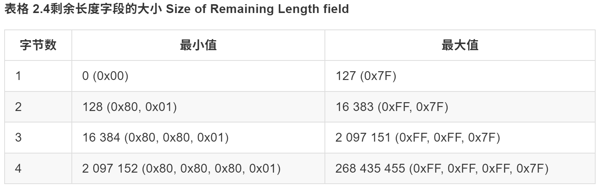
  
  根据后续得到的有效载荷，可以得到最终的剩余长度为：118（7*16+6=`0x76`）

#### 可变报头 Variable header

> 💡可以直接用这串：`00 04 4D 51 54 54 04 C2 00 64`，具体解释往下看

长度：10 个字节（byte）

- byte 1 ~ byte 6：协议名（Protocol Name）

  内容固定，为：`0` `4` `M` `Q` `T` `T`

  对应 16 进制：`00 04 4D 51 54 54`

- byte 7：协议级别（Protocol Level）

  内容固定，为：`0x04`

  > 对于3.1.1版协议，协议级别字段的值是4(0x04)。如果发现不支持的协议级别，服务端**必须**给发送一个返回码为0x01（不支持的协议级别）的CONNACK报文响应CONNECT报文，然后断开客户端的连接 [MQTT-3.1.2-2]。

- byte 8：连接标志（Connect Flags）

  位选择为：1 1 0 0 0 0 1 0

  对应 16 进制：`0xC2`

  位具体定义如下👇

  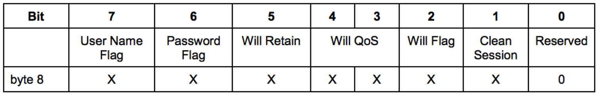

- byte 9~byte10：保持连接（Keep Alive）

  设置为：`00 64`（100秒）

  > 一共 16 位，确定保活时间，单位：秒。
  >
  > 上一条指令发送的时间超过 这个时间就会断开连接
  >
  > 2^16/60/60=18.204444，最大值是 18 小时 12 分 15 秒

#### 有效载荷 Payload

> 参考：[MQTT-TCP连接通信 (aliyun.com)](https://help.aliyun.com/document_detail/73742.html#section-4cb-emx-i4f)

长度不定，具体有几块内容和连接标志（Connect Flags）有关

> *：设备名称（DeviceName）👉DHT11_01  
> #：产品密钥（ProductKey）👉h6wxLg1Xd3V  
> 设备密钥（DeviceSecret）：7f004d6f1724fd41ffc67a8d5a61236d  


> 💡以下三部分内容都必须是「UTF-8 编码字符串」，具体解释就是在字符串前需要加上一个「两字节的长度字段」作为前缀


根据后续三块内容，得到最终的有效载荷字段：

`00 2A 44 48 54 31 31 5F 30 31 7C 73 65 63 75 72 65 6D 6F 64 65 3D 33 2C 73 69 67 6E 6D 65 74 68 6F 64 3D 68 6D 61 63 73 68 61 31 7C 00 14 44 48 54 31 31 5F 30 31 26 68 36 77 78 4C 67 31 58 64 33 56 00 28 61 31 36 64 64 30 34 33 65 31 35 37 65 38 66 63 35 66 32 64 36 66 32 65 64 61 66 63 64 33 37 30 33 34 39 33 31 64 65 61` 

##### 客户端标识符 Client Identifier

- 格式：`*|securemode=3,signmethod=hmacsha1|`
- 具体值：`DHT11_01|securemode=3,signmethod=hmacsha1|`
- 十六进制：`44 48 54 31 31 5F 30 31 7C 73 65 63 75 72 65 6D 6F 64 65 3D 33 2C 73 69 67 6E 6D 65 74 68 6F 64 3D 68 6D 61 63 73 68 61 31 7C` 
- 长度：42（2*16+10=`0x2A`）
- UTF-8 编码格式：`00 2A 44 48 54 31 31 5F 30 31 7C 73 65 63 75 72 65 6D 6F 64 65 3D 33 2C 73 69 67 6E 6D 65 74 68 6F 64 3D 68 6D 61 63 73 68 61 31 7C` 

##### 用户名 User Name

- 格式：`*&#`
- 具体值：`DHT11_01&h6wxLg1Xd3V`
- 十六进制：`44 48 54 31 31 5F 30 31 26 68 36 77 78 4C 67 31 58 64 33 56`
- 长度：20（1*16+4=`0x14`）
- UTF-8 编码格式：`00 14 44 48 54 31 31 5F 30 31 26 68 36 77 78 4C 67 31 58 64 33 56`

##### 密码 Password

- 格式：`clientId*deviceName*productKey#`
- 具体值：`clientIdDHT11_01deviceNameDHT11_01productKeyh6wxLg1Xd3V`
  - ❗密码需要经过 hmacsha1 加密，密钥为设备密钥（DeviceSecret）
  - > 在线加密网站：https://tool.oschina.net/encrypt?type=2
  - 所以实际值是：`a16dd043e157e8fc5f2d6f2edafcd37034931dea`
- 十六进制：`61 31 36 64 64 30 34 33 65 31 35 37 65 38 66 63 35 66 32 64 36 66 32 65 64 61 66 63 64 33 37 30 33 34 39 33 31 64 65 61`

- 长度：40（2*16+8=`0x28`）

- UTF-8 编码格式：`00 28 61 31 36 64 64 30 34 33 65 31 35 37 65 38 66 63 35 66 32 64 36 66 32 65 64 61 66 63 64 33 37 30 33 34 39 33 31 64 65 61`

#### CONNECT 报文正确性测试

发送 CONNECT 报文：`10 76 00 04 4D 51 54 54 04 C2 00 64 00 2A 44 48 54 31 31 5F 30 31 7C 73 65 63 75 72 65 6D 6F 64 65 3D 33 2C 73 69 67 6E 6D 65 74 68 6F 64 3D 68 6D 61 63 73 68 61 31 7C 00 14 44 48 54 31 31 5F 30 31 26 68 36 77 78 4C 67 31 58 64 33 56?00 28 61 31 36 64 64 30 34 33 65 31 35 37 65 38 66 63 35 66 32 64 36 66 32 65 64 61 66 63 64 33 37 30 33 34 39 33 31 64 65 61` 

> 💡注意要把接收显示为十六进制（HEX），否则会收到不可见字符（空白），试了很久以为哪里出错了，但是看控制台又显示可以连上，折腾半天发现是这个问题，太苦了

得到回应：`20 02 00 00`

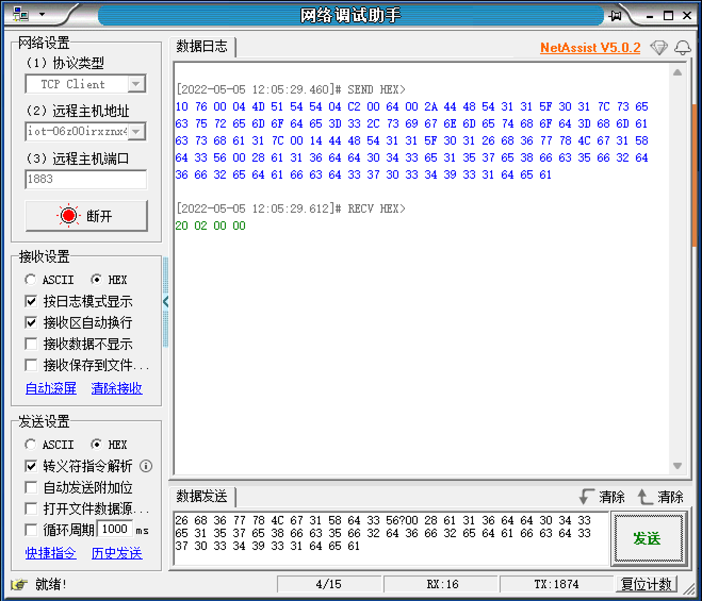


修改报文内容会被服务端断开连接：

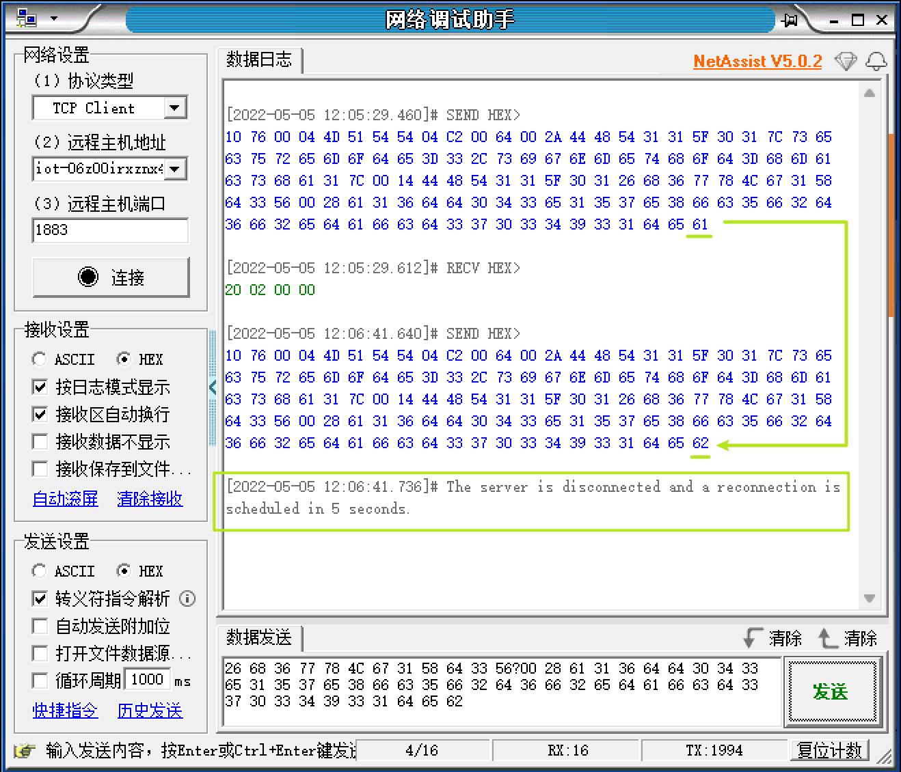


### CONNACK – 确认连接请求

> server → client

在 [CONNECT 报文正确性测试](#CONNECT-报文正确性测试)中可以看到，订阅确认报文为：`20 02 00 00`

#### 固定报头 Fixed header

长度：2 个字节（byte）

- byte 1：MQTT 报文类型：`20`(hex)

  > 高 4 位：第 2 种报文；低 4 位：保留位

- byte 2：`0x02`

  - 等于可变报头的长度（2字节），**也就是 2**

#### 可变报头 Variable header

长度：2 个字节

总之最后可变报头的部分为：`00 00`

> 如果服务端收到清理会话（CleanSession）标志为 1 的连接，除了将 CONNACK 报文中的<u>返回码</u>设置为 0 之外，还**必须**将 CONNACK 报文中的<u>当前会话</u>设置（Session Present）标志为 0
>
> 具体解释见[协议文档](https://mcxiaoke.gitbooks.io/mqtt-cn/content/mqtt/0302-CONNACK.html)

- byte 1：连接确认标志 Connect Acknowledge Flags
  - 前 7 位是 0，第 0 位是「当前会话 Session Present」
    - 如果 CONNECT 报文里 CleanSession 位是 1，那 Session Present 需要置 0
- byte 2：连接返回码 Connect Return code

#### 有效载荷 Payload

> CONNACK 报文没有有效载荷

### SUBSCRIBE - 订阅主题

> client → server

综合固定报头、可变报头、有效载荷，最终得到完整的 SUBSCRIBE 控制报文：

`82 39 00 0A 00 34 2F 73 79 73 2F 68 36 77 78 4C 67 31 58 64 33 56 2F 44 48 54 31 31 5F 30 31 2F 74 68 69 6E 67 2F 73 65 72 76 69 63 65 2F 70 72 6F 70 65 72 74 79 2F 73 65 74 00`

#### 固定报头 Fixed header

长度：2 ~ 5 个字节（byte）

- byte 1：MQTT 报文类型：`82`(hex)

  > 高 4 位：第 8 种报文；低 4 位：保留位，必须为 0 0 1 0

- byte 2 ~ byte 5：剩余长度

  - 等于可变报头的长度（2字节）加上有效载荷的长度
  
  根据后续得到的有效载荷，可以得到最终的剩余长度为：57（3*16+9=`0x39`）

#### 可变报头 Variable header

长度：2 个字节

直接用这串：`00 0A`

> 这两个字节的描述叫做「报文标识符」，订阅确认报文 SUBACK 的「报文标识符」需要和它保持一致
>
> 在 [SUBSCRIBE 报文正确性测试](#SUBSCRIBE-报文正确性测试)中可以看到，确实包含 `00 0A` 字段


#### 有效载荷 Payload

根据后续两块内容，得到最终的有效载荷字段：`00 34 2F 73 79 73 2F 68 36 77 78 4C 67 31 58 64 33 56 2F 44 48 54 31 31 5F 30 31 2F 74 68 69 6E 67 2F 73 65 72 76 69 63 65 2F 70 72 6F 70 65 72 74 79 2F 73 65 74 00`

##### 主题过滤器（Topic Filter）

> 主题过滤器需为「UTF-8 编码字符串」
>
> 过滤器直接定为 topic

**物联网平台/设备管理/产品/产品详情** > Topic 类列表 > 物模型通信 Topic

属性设置 topic：`/sys/h6wxLg1Xd3V/${deviceName}/thing/service/property/set`

带入deviceName(DHT11_01)：`/sys/h6wxLg1Xd3V/DHT11_01/thing/service/property/set`

十六进制：`2F 73 79 73 2F 68 36 77 78 4C 67 31 58 64 33 56 2F 44 48 54 31 31 5F 30 31 2F 74 68 69 6E 67 2F 73 65 72 76 69 63 65 2F 70 72 6F 70 65 72 74 79 2F 73 65 74`

长度：52（`0x34`）

UTF-8 编码格式：`00 34 2F 73 79 73 2F 68 36 77 78 4C 67 31 58 64 33 56 2F 44 48 54 31 31 5F 30 31 2F 74 68 69 6E 67 2F 73 65 72 76 69 63 65 2F 70 72 6F 70 65 72 74 79 2F 73 65 74`

##### 服务质量要求（Requested QoS）

只能是 0, 1 或 2

选择 QoS0：`0x00`

> 如果 QoS 不等于 0, 1 或 2，服务端**必须**认为SUBSCRIBE报文是不合法的并关闭网络连接 [MQTT-3-8.3-4]。
>
> 0：最多一次
>
> 1：最少一次
>
> 2：只一次

#### SUBSCRIBE 报文正确性测试

先发送 CONNECT 报文：`10 76 00 04 4D 51 54 54 04 C2 00 64 00 2A 44 48 54 31 31 5F 30 31 7C 73 65 63 75 72 65 6D 6F 64 65 3D 33 2C 73 69 67 6E 6D 65 74 68 6F 64 3D 68 6D 61 63 73 68 61 31 7C 00 14 44 48 54 31 31 5F 30 31 26 68 36 77 78 4C 67 31 58 64 33 56?00 28 61 31 36 64 64 30 34 33 65 31 35 37 65 38 66 63 35 66 32 64 36 66 32 65 64 61 66 63 64 33 37 30 33 34 39 33 31 64 65 61` 

再发送 SUBSCRIBE 报文：`82 39 00 0A 00 34 2F 73 79 73 2F 68 36 77 78 4C 67 31 58 64 33 56 2F 44 48 54 31 31 5F 30 31 2F 74 68 69 6E 67 2F 73 65 72 76 69 63 65 2F 70 72 6F 70 65 72 74 79 2F 73 65 74 00`


得到回应报文：`90 03 00 0A 01`

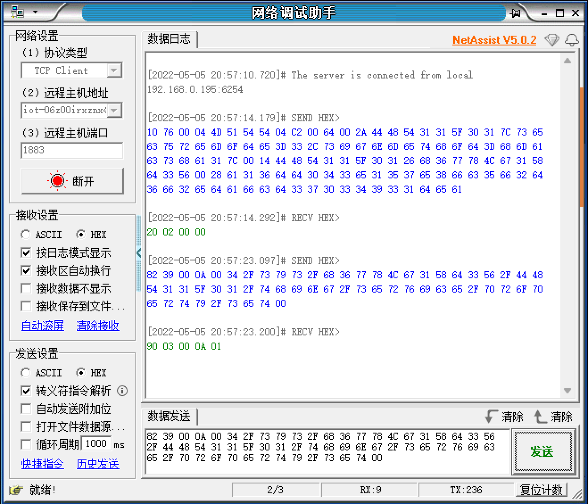

订阅成功，同时在 物联网平台/设备管理/设备/设备详情 > **Topic 列表** > **已订阅 Topic 列表** 中可以看到，有相关 topic 出现（`/sys/h6wxLg1Xd3V/DHT11_01/thing/service/property/set`）

### SUBACK – 订阅确认

> server → client

在 [SUBSCRIBE 报文正确性测试](#SUBSCRIBE-报文正确性测试)中可以看到，订阅确认报文为：`90 03 00 0A 01`

#### 固定报头 Fixed header

长度：2 个字节（byte）

- byte 1：MQTT 报文类型：`90`(hex)

  > 高 4 位：第 9 种报文；低 4 位：保留位

- byte 2：`0x03`

  - 等于可变报头的长度（2字节）加上有效载荷（1字节）的长度，**也就是 3**

#### 可变报头 Variable header

长度：2 个字节

直接用这串：`00 0A`(和 SUBSCRIBE 报文保持一致)

> 这两个字节的描述叫做「报文标识符」，它需要和对应的订阅主题报文 SUBSCRIBE 的「报文标识符」保持一致

#### 有效载荷 Payload

> 对于 QoS0，预期应该是返回 0，但是实测 QoS0 和 QoS1 的返回码都是 `01`

长度：1 个字节

内容：返回码清单

- 0x00 - 最大 QoS 0
- 0x01 - 成功 – 最大 QoS 1
- 0x02 - 成功 – 最大 QoS 2
- 0x80 - Failure 失败

> 0x00, 0x01, 0x02, 0x80 之外的 SUBACK 返回码是保留的，**不能**使用[MQTT-3.9.3-2]。
>
> 按照文档描述，订阅确认返回的 QoS 是**订阅主题申请的 QoS** 和**服务端可以授予的 QoS** 这二者的更小值

#### SUBACK  报文正确性测试

先发送 CONNECT 报文：`10 76 00 04 4D 51 54 54 04 C2 00 64 00 2A 44 48 54 31 31 5F 30 31 7C 73 65 63 75 72 65 6D 6F 64 65 3D 33 2C 73 69 67 6E 6D 65 74 68 6F 64 3D 68 6D 61 63 73 68 61 31 7C 00 14 44 48 54 31 31 5F 30 31 26 68 36 77 78 4C 67 31 58 64 33 56?00 28 61 31 36 64 64 30 34 33 65 31 35 37 65 38 66 63 35 66 32 64 36 66 32 65 64 61 66 63 64 33 37 30 33 34 39 33 31 64 65 61` 

发送 SUBSCRIBE 报文：

- 报文标识符 `0A`，QoS `00`：`82 39 00 0A 00 34 2F 73 79 73 2F 68 36 77 78 4C 67 31 58 64 33 56 2F 44 48 54 31 31 5F 30 31 2F 74 68 69 6E 67 2F 73 65 72 76 69 63 65 2F 70 72 6F 70 65 72 74 79 2F 73 65 74 00`
- 报文标识符 `0B`，QoS `00`：`82 39 00 0B 00 34 2F 73 79 73 2F 68 36 77 78 4C 67 31 58 64 33 56 2F 44 48 54 31 31 5F 30 31 2F 74 68 69 6E 67 2F 73 65 72 76 69 63 65 2F 70 72 6F 70 65 72 74 79 2F 73 65 74 00`
- 报文标识符 `0B`，QoS `01`：`82 39 00 0B 00 34 2F 73 79 73 2F 68 36 77 78 4C 67 31 58 64 33 56 2F 44 48 54 31 31 5F 30 31 2F 74 68 69 6E 67 2F 73 65 72 76 69 63 65 2F 70 72 6F 70 65 72 74 79 2F 73 65 74 01`


得到回应：

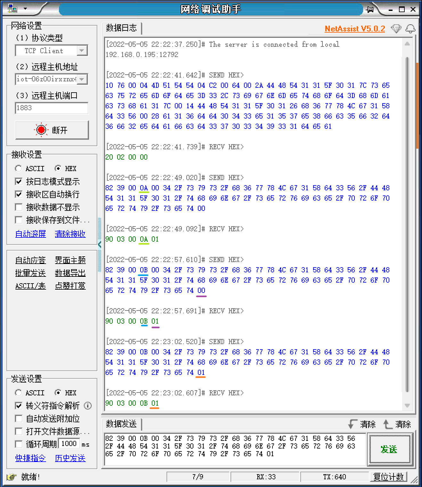

> 可以看到两点：
>
> - 报文标识符保持一致
> - QoS 0 和 QoS1 都返回 `01`

### UNSUBSCRIBE – 取消订阅

> client → server

> UNSUBSCRIBE 和 SUBSCRIBE 的思路基本类似，只是修改了报文类型，去除了 QoS

综合固定报头、可变报头、有效载荷，最终得到完整的 UNSUBSCRIBE 控制报文：

`A2 38 00 0A 00 34 2F 73 79 73 2F 68 36 77 78 4C 67 31 58 64 33 56 2F 44 48 54 31 31 5F 30 31 2F 74 68 69 6E 67 2F 73 65 72 76 69 63 65 2F 70 72 6F 70 65 72 74 79 2F 73 65 74`

#### 固定报头 Fixed header

长度：2 ~ 5 个字节（byte）

- byte 1：MQTT 报文类型：`A2`(hex)

  > 高 4 位：第 10 种报文；低 4 位：保留位，必须为 0 0 1 0

- byte 2 ~ byte 5：剩余长度

  - 等于可变报头的长度（2字节）加上有效载荷的长度

  根据后续得到的有效载荷，可以得到最终的剩余长度为：56（3*16+8=`0x38`）

#### 可变报头 Variable header

长度：2 个字节

直接用这串：`00 0A`

> 这两个字节的描述叫做「报文标识符」，取消订阅确认报文 UNSUBACK 的「报文标识符」需要和它保持一致

#### 有效载荷 Payload

只包含主题过滤器，详见[主题过滤器（Topic Filter）](#主题过滤器（Topic Filter）)

最终得到的 UTF-8 编码格式：`00 34 2F 73 79 73 2F 68 36 77 78 4C 67 31 58 64 33 56 2F 44 48 54 31 31 5F 30 31 2F 74 68 69 6E 67 2F 73 65 72 76 69 63 65 2F 70 72 6F 70 65 72 74 79 2F 73 65 74` （长度 52，加上两位长度前缀，总长 54）

#### UNSUBSCRIBE 报文正确性测试

先发送 CONNECT 报文：`10 76 00 04 4D 51 54 54 04 C2 00 64 00 2A 44 48 54 31 31 5F 30 31 7C 73 65 63 75 72 65 6D 6F 64 65 3D 33 2C 73 69 67 6E 6D 65 74 68 6F 64 3D 68 6D 61 63 73 68 61 31 7C 00 14 44 48 54 31 31 5F 30 31 26 68 36 77 78 4C 67 31 58 64 33 56?00 28 61 31 36 64 64 30 34 33 65 31 35 37 65 38 66 63 35 66 32 64 36 66 32 65 64 61 66 63 64 33 37 30 33 34 39 33 31 64 65 61` 

> 再发送 SUBSCRIBE 报文（保证有订阅可以取消）：`82 39 00 0A 00 34 2F 73 79 73 2F 68 36 77 78 4C 67 31 58 64 33 56 2F 44 48 54 31 31 5F 30 31 2F 74 68 69 6E 67 2F 73 65 72 76 69 63 65 2F 70 72 6F 70 65 72 74 79 2F 73 65 74 00`

再发送 UNSUBSCRIBE 报文：`A2 38 00 0A 00 34 2F 73 79 73 2F 68 36 77 78 4C 67 31 58 64 33 56 2F 44 48 54 31 31 5F 30 31 2F 74 68 69 6E 67 2F 73 65 72 76 69 63 65 2F 70 72 6F 70 65 72 74 79 2F 73 65 74`


得到回应报文：`B0 02 00 0A`

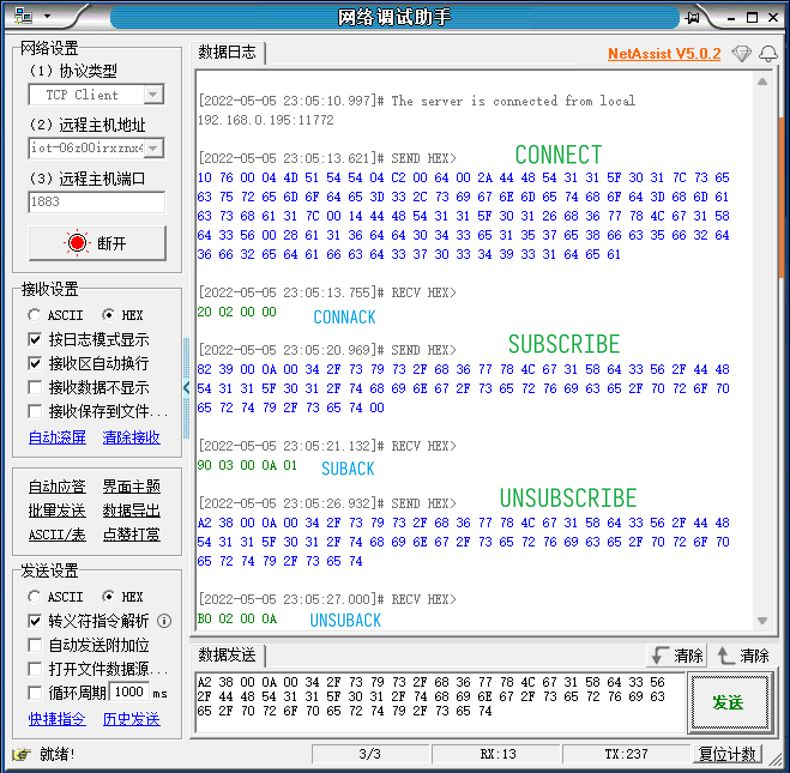

取消订阅成功，同时在 物联网平台/设备管理/设备/设备详情 > **Topic 列表** > **已订阅 Topic 列表** 中可以看到，相关 topic 已消失

### UNSUBACK – 取消订阅确认

> server → client

在 [UNSUBACK 报文正确性测试](#UNSUBSCRIBE-报文正确性测试)中可以看到，取消订阅确认报文为：`B0 02 00 0A`

#### 固定报头 Fixed header

长度：2 个字节（byte）

- byte 1：MQTT 报文类型：`B0`(hex)

  > 高 4 位：第 11 种报文；低 4 位：保留位

- byte 2：`0x02`

  - 等于可变报头的长度（2字节），**也就是 2**

#### 可变报头 Variable header

长度：2 个字节

直接用这串：`00 0A`(和 UNSUBSCRIBE 报文保持一致)

> 这两个字节的描述叫做「报文标识符」，它需要和对应的订阅主题报文 UNSUBSCRIBE 的「报文标识符」保持一致

#### 有效载荷 Payload

> UNSUBACK 报文没有有效载荷

### PUBLISH – 发布消息

> client → server

综合固定报头、可变报头、有效载荷，最终得到完整的 PUBLISH 控制报文：

`30 B5 01 00 33 2F 73 79 73 2F 68 36 77 78 4C 67 31 58 64 33 56 2F 44 48 54 31 31 5F 30 31 2F 74 68 69 6E 67 2F 65 76 65 6E 74 2F 70 72 6F 70 65 72 74 79 2F 70 6F 73 74 7B 22 69 64 22 3A 22 31 32 33 34 22 2C 22 76 65 72 73 69 6F 6E 22 3A 22 31 2E 30 22 2C 22 6D 65 74 68 6F 64 22 3A 22 74 68 69 6E 67 2E 65 76 65 6E 74 2E 70 72 6F 70 65 72 74 79 2E 70 6F 73 74 22 2C 22 70 61 72 61 6D 73 22 3A 7B 22 43 75 72 72 65 6E 74 48 75 6D 69 64 69 74 79 22 3A 31 32 2E 33 34 2C 22 43 75 72 72 65 6E 74 54 65 6D 70 65 72 61 74 75 72 65 22 3A 35 36 2E 37 38 7D 7D`

#### 固定报头 Fixed header

长度：2 ~ 5 个字节（byte）

- byte 1：MQTT 报文类型：`30`(hex)

  > 高 4 位：第 3 种报文；
  >
  > 低 4 位：与 QoS 有关（这里选择 QoS 为 0），此处设为全 0，具体含义见[文档](https://mcxiaoke.gitbooks.io/mqtt-cn/content/mqtt/0303-PUBLISH.html)

- byte 2 ~ byte 5：剩余长度

  - 等于可变报头的长度加上有效载荷的长度

  根据后续得到的可变报头和有效载荷，可以得到最终的剩余长度为：181（`1*128 + 53 = 1*128 + 3*16 + 5`=`35 01`）

  转换为 UTF-8 编码长度前缀：`B5 01`

#### 可变报头 Variable header

长度不定，由以下两部分构成

##### 主题名 Topic Name

**物联网平台/设备管理/产品/产品详情** > Topic 类列表 > 物模型通信 Topic

设备属性上报 topic：`/sys/h6wxLg1Xd3V/${deviceName}/thing/event/property/post`

带入deviceName(DHT11_01)：`/sys/h6wxLg1Xd3V/DHT11_01/thing/event/property/post`

十六进制：`2F 73 79 73 2F 68 36 77 78 4C 67 31 58 64 33 56 2F 44 48 54 31 31 5F 30 31 2F 74 68 69 6E 67 2F 65 76 65 6E 74 2F 70 72 6F 70 65 72 74 79 2F 70 6F 73 74 `

长度：51（`0x33`）

UTF-8 编码格式：`00 33 2F 73 79 73 2F 68 36 77 78 4C 67 31 58 64 33 56 2F 44 48 54 31 31 5F 30 31 2F 74 68 69 6E 67 2F 65 76 65 6E 74 2F 70 72 6F 70 65 72 74 79 2F 70 6F 73 74`（总长 53）

##### 报文标识符 Packet Identifier

无

> 只有当 QoS 等级是 1 或 2 时，报文标识符（Packet Identifier）字段才能出现在 PUBLISH 报文中

#### 有效载荷 Payload

json 格式内容（不包含长度前缀）

> 先看文档中的描述：
>
> 有效载荷包含将被发布的应用消息。数据的内容和格式是应用特定的。<u>有效载荷的长度这样计算：用固定报头中的剩余长度字段的值减去可变报头的长度</u>。包含零长度有效载荷的PUBLISH报文是合法的。
>
> 注意画线句特地说明了有效载荷长度的计算，原因在于有效载荷部分的 json 字段**不包含长度前缀**，因此字段长度的计算方式是通过剩余长度字段减去可变报头长度得到的。

这里给出针对 DHT11 上报温湿度的 json：

```json
{
    "id":"1234",
    "version":"1.0",
    "method":"thing.event.property.post",
    "params":{"CurrentHumidity":12.34,"CurrentTemperature":56.78}
}
```

压缩为单行：`{"id":"1234","version":"1.0","method":"thing.event.property.post","params":{"CurrentHumidity":12.34,"CurrentTemperature":56.78}}`

转换为 16 进制：`7B 22 69 64 22 3A 22 31 32 33 34 22 2C 22 76 65 72 73 69 6F 6E 22 3A 22 31 2E 30 22 2C 22 6D 65 74 68 6F 64 22 3A 22 74 68 69 6E 67 2E 65 76 65 6E 74 2E 70 72 6F 70 65 72 74 79 2E 70 6F 73 74 22 2C 22 70 61 72 61 6D 73 22 3A 7B 22 43 75 72 72 65 6E 74 48 75 6D 69 64 69 74 79 22 3A 31 32 2E 33 34 2C 22 43 75 72 72 65 6E 74 54 65 6D 70 65 72 61 74 75 72 65 22 3A 35 36 2E 37 38 7D 7D`（总长 128）

#### 响应

> QoS 为 0 时无响应字段，暂时忽略

#### 动作 Actions

> 文档没有说明具体格式，暂时忽略

#### PUBLISH 报文正确性测试

先发送 CONNECT 报文：`10 76 00 04 4D 51 54 54 04 C2 00 64 00 2A 44 48 54 31 31 5F 30 31 7C 73 65 63 75 72 65 6D 6F 64 65 3D 33 2C 73 69 67 6E 6D 65 74 68 6F 64 3D 68 6D 61 63 73 68 61 31 7C 00 14 44 48 54 31 31 5F 30 31 26 68 36 77 78 4C 67 31 58 64 33 56?00 28 61 31 36 64 64 30 34 33 65 31 35 37 65 38 66 63 35 66 32 64 36 66 32 65 64 61 66 63 64 33 37 30 33 34 39 33 31 64 65 61` 

再发送 PUBLISH 报文：

`30 B5 01 00 33 2F 73 79 73 2F 68 36 77 78 4C 67 31 58 64 33 56 2F 44 48 54 31 31 5F 30 31 2F 74 68 69 6E 67 2F 65 76 65 6E 74 2F 70 72 6F 70 65 72 74 79 2F 70 6F 73 74 7B 22 69 64 22 3A 22 31 32 33 34 22 2C 22 76 65 72 73 69 6F 6E 22 3A 22 31 2E 30 22 2C 22 6D 65 74 68 6F 64 22 3A 22 74 68 69 6E 67 2E 65 76 65 6E 74 2E 70 72 6F 70 65 72 74 79 2E 70 6F 73 74 22 2C 22 70 61 72 61 6D 73 22 3A 7B 22 43 75 72 72 65 6E 74 48 75 6D 69 64 69 74 79 22 3A 31 32 2E 33 34 2C 22 43 75 72 72 65 6E 74 54 65 6D 70 65 72 61 74 75 72 65 22 3A 35 36 2E 37 38 7D 7D`

> 修改倒数第三位（38 改为 39）并发送，物联网平台对应数据也发生改变


💡对于 QoS 0，无响应


在 物联网平台/设备管理/设备/设备详情 > **物模型数据** > **运行状态** 中可以看到发送给服务器的模块信息，与 json 中填写的数据一致

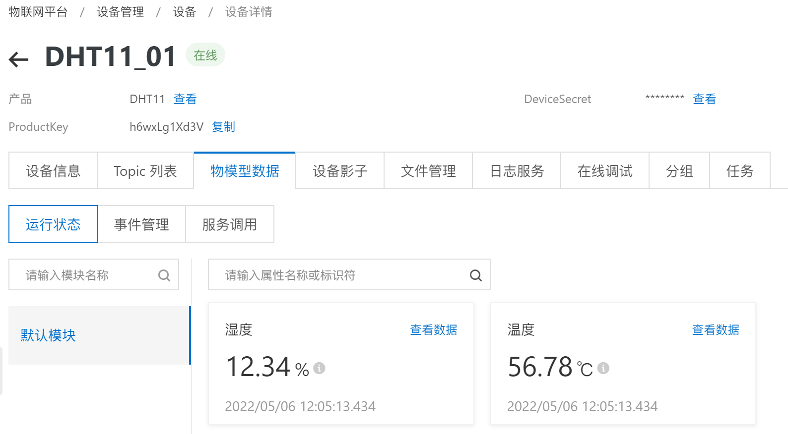

> 在 物联网平台/监控运维/日志服务 中也可以看到对应的 json 内容
>
> 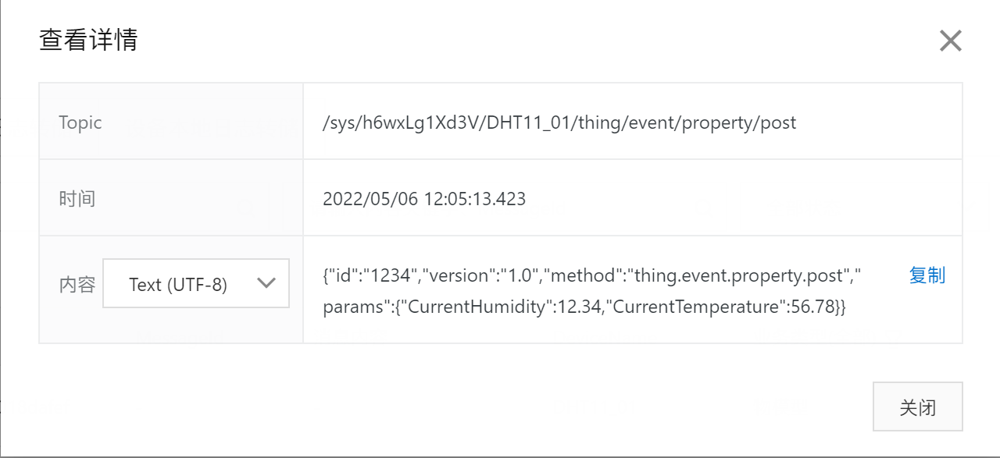

### PINGREQ – 心跳请求

> client → server

「我还活着」：`C0 00`

#### 固定报头 Fixed header

长度：2 个字节（byte）

- byte 1：MQTT 报文类型：`C0`(hex)

  > 高 4 位：第 12 种报文；低 4 位：保留位

- byte 2：剩余长度：`00`


#### 可变报头 Variable header

> PINGREQ 报文没有可变报头。

#### 有效载荷 Payload

> PINGREQ 报文没有有效载荷。

#### PINGREQ 报文正确性测试

先发送 CONNECT 报文：`10 76 00 04 4D 51 54 54 04 C2 00 64 00 2A 44 48 54 31 31 5F 30 31 7C 73 65 63 75 72 65 6D 6F 64 65 3D 33 2C 73 69 67 6E 6D 65 74 68 6F 64 3D 68 6D 61 63 73 68 61 31 7C 00 14 44 48 54 31 31 5F 30 31 26 68 36 77 78 4C 67 31 58 64 33 56?00 28 61 31 36 64 64 30 34 33 65 31 35 37 65 38 66 63 35 66 32 64 36 66 32 65 64 61 66 63 64 33 37 30 33 34 39 33 31 64 65 61` 

再发送 PINGREQ 报文：`C0 00`

得到响应：`D0 00`

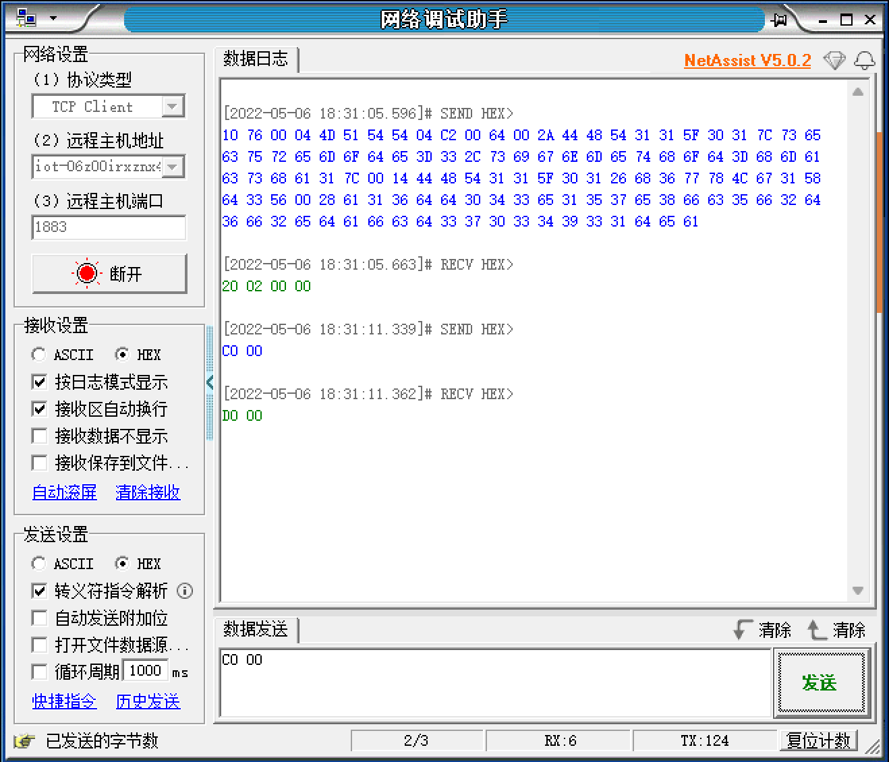

### PINGRESP – 心跳响应

> server → client

「哦」：`D0 00`

#### 固定报头 Fixed header

长度：2 个字节（byte）

- byte 1：MQTT 报文类型：`D0`(hex)

  > 高 4 位：第 13 种报文；低 4 位：保留位

- byte 2：剩余长度：`00`

#### 可变报头 Variable header

> PINGRESP 报文没有可变报头。

#### 有效载荷 Payload

> PINGRESP 报文没有有效载荷。

# MQTT.fx

## 连接信息信息配置

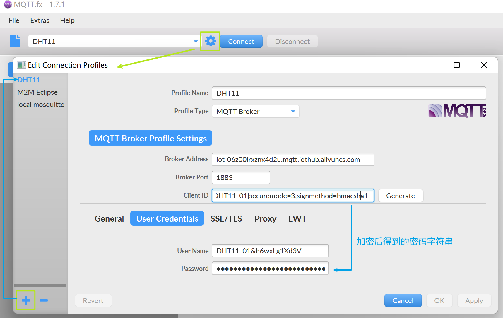

接入地址：iot-06z00irxznx4d2u.mqtt.iothub.aliyuncs.com  
Client ID：`DHT11_01|securemode=3,signmethod=hmacsha1|`  
User Name：`DHT11_01&h6wxLg1Xd3V`  
Password：`a16dd043e157e8fc5f2d6f2edafcd37034931dea`（哈希加密后）

## 发布消息测试

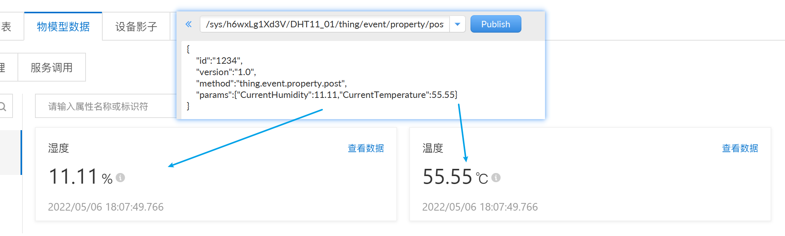

符合预期
