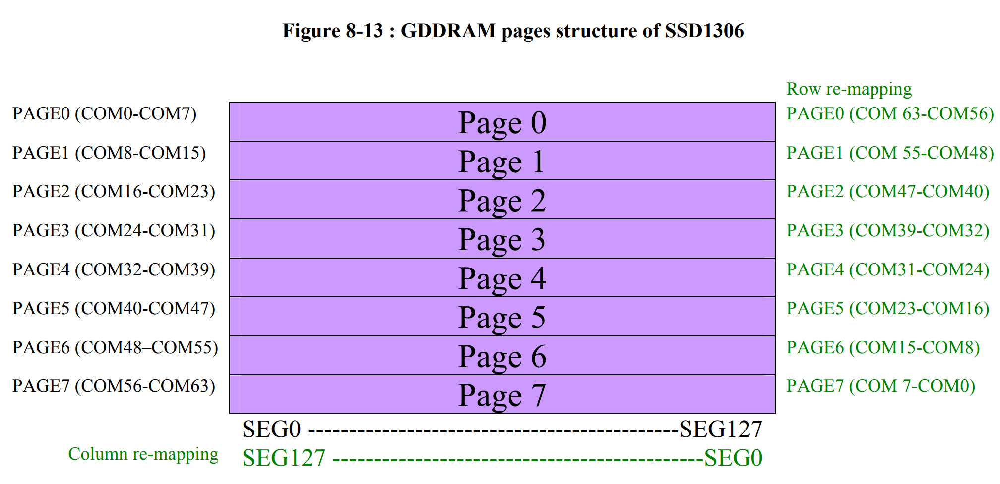
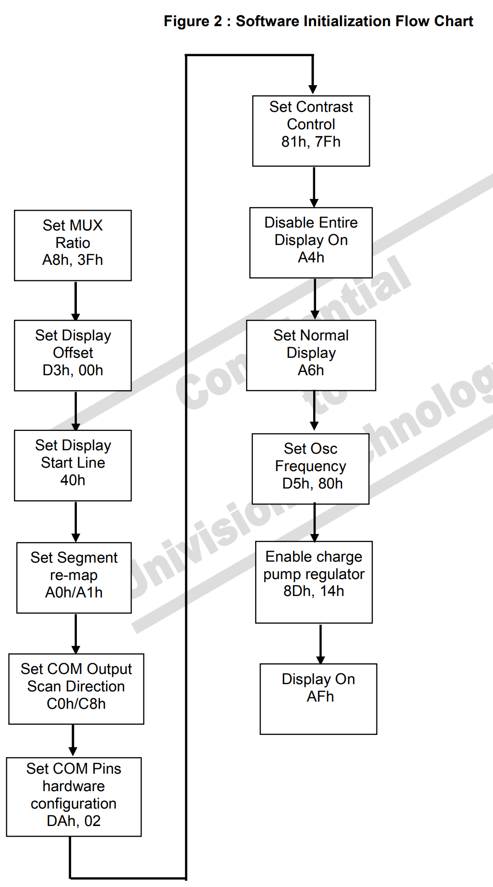
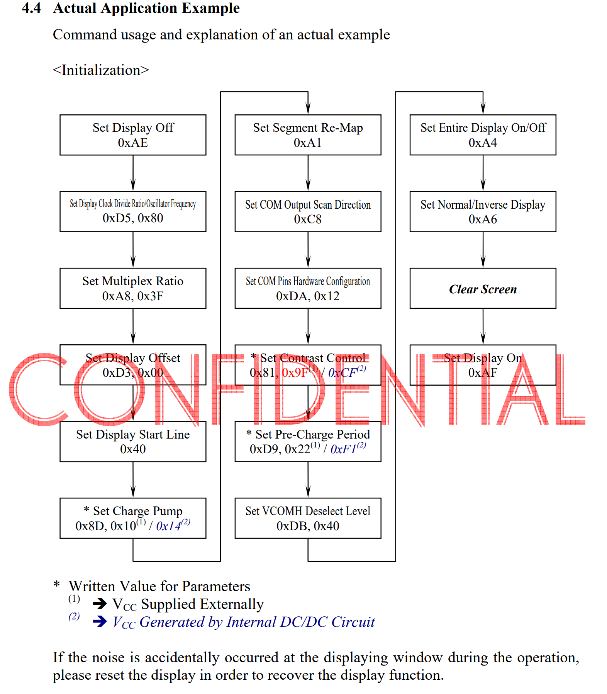

本节是基于 IIC 的 OLED 驱动模块，IIC 通信的内容较为简单，且已经实现，所以 OLED 驱动的内容就是对 SSD1306 的配置

主要参考材料是 [SSD1306-Revision 1.1 (Charge Pump).pdf](SSD1306-Revision 1.1 (Charge Pump).pdf)

对于编码实现，在源文件里已经有足够详细的注释，这里不再提及

这里给出一些关键点的截图和文字说明

**一些要点**

- 所有的配置信息都通过 IIC 发送数据实现

- 实际实现时将显示器进行了左右翻转以及上下翻转

  - > [SSD1306-Revision 1.1 (Charge Pump).pdf](SSD1306-Revision 1.1 (Charge Pump).pdf) 的流程图里给的例子就是这么设置的，似乎是一种常见的实现？

- 要注意 SEG、PAGE、COM 的具体含义

# GDDRAM 的布局结构（与 OLED 显示屏像素点对点映射）

> 实际实现采用的是绿色字的重映射版本

# 软件初始化流程图

> from  [SSD1306-Revision 1.1 (Charge Pump).pdf](SSD1306-Revision 1.1 (Charge Pump).pdf)

> from [SAS1-9046-B UG-2864HSWEG01-Univision.pdf](SAS1-9046-B UG-2864HSWEG01-Univision.pdf)
>
> 这个图更完整，在编码时使用的是按这个流程编写的

💡SSD1306 驱动存在**默认值**，经过测试，把部分本来就是默认值的配置语句注释掉也不影响显示，但是为了保证显示效果以及和流程图的对应关系，未删去
