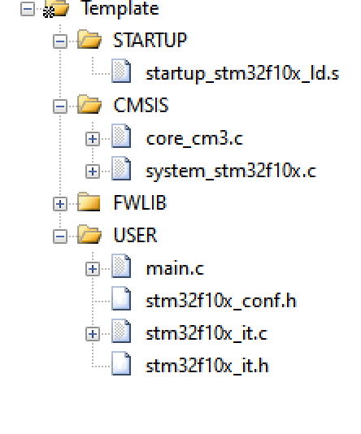

建立模板文件的过程

https://www.bilibili.com/video/BV1N7411x7Yk?p=23

# keil5 配置要点

## 文件结构

FWLIB 里的是 src 里全部的 `.c` 文件

配置 Define：USE_STDPERIPH_DRIVER,STM32F10X_LD

配置 Include：..\Libraries\CMSIS;..\Libraries\inc;..\User