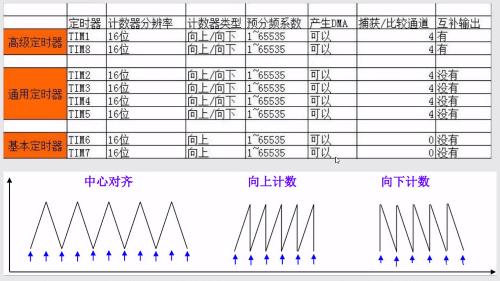
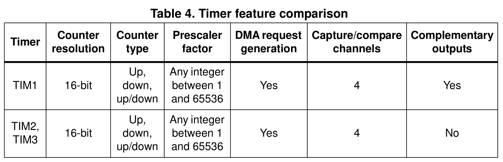

https://www.bilibili.com/video/BV1N7411x7Yk?p=58

这里提到 stm32f103 定时器始终是72MHz，结论推导没问题，但是预分频系数如何确定的，却没有说



从[选型手册](bookxnotepro://opennote/?nb={01a25f6c-fe16-454c-8f38-591392487e16}&book=c30a6e0a74357facb01b569988dd9a01&page=12&x=96&y=270&id=50)或者[数据手册](bookxnotepro://opennote/?nb={01a25f6c-fe16-454c-8f38-591392487e16}&book=d22bb8457c85552d28ca929b03ba7efd&page=17&x=297&y=510&id=52)上可以找到确切的定时器数量信息，如 stm32f103x4/x6 的定时器数量为 3 个



## TIME3 定时器配置步骤

1. 使能定时器时钟

   RCC_APB1PeriphClockCmd();

2. 初始化定时器

   TIM_TimeBaseInit();

3. 定时器中断配置

   TIM_ITConfig();

4. 使能定时器

   TIM_Cmd();

5. 编写中断服务函数

   TIMx_IRQHandler();

> 💡由于定时器涉及到**中断**，所以还需要配置 `NVIC`

## 完整实现

### TIM3

```c
void TIM3_Init(u16 arr, u16 psc)
{
	// 定时器初始化结构体
	TIM_TimeBaseInitTypeDef TIM_TimeBaseStructure;

	// NVIC 初始化结构体
	NVIC_InitTypeDef NVIC_InitStructure;

	// 使能定时器时钟
	RCC_APB1PeriphClockCmd(RCC_APB1Periph_TIM3, ENABLE);

	// 设置定时器初始化结构体的参数
	TIM_TimeBaseStructure.TIM_Period = arr;						// 重装载的值
	TIM_TimeBaseStructure.TIM_Prescaler = psc;					// 预分频的值
	TIM_TimeBaseStructure.TIM_ClockDivision = TIM_CKD_DIV1;		// 不分频
	TIM_TimeBaseStructure.TIM_CounterMode = TIM_CounterMode_Up; // 向上计数

	// 根据定时器初始化结构体初始化定时器
	TIM_TimeBaseInit(TIM3, &TIM_TimeBaseStructure);

	// 使能定时器中断
	TIM_ITConfig(TIM3, TIM_IT_Update, ENABLE);
	// 设置NVIC 初始化结构体的参数
	NVIC_InitStructure.NVIC_IRQChannel = TIM3_IRQn;			  // TIM3 的中断源
	NVIC_InitStructure.NVIC_IRQChannelPreemptionPriority = 2; // 抢占优先级 2
	NVIC_InitStructure.NVIC_IRQChannelSubPriority = 2;		  // 响应优先级 2
	NVIC_InitStructure.NVIC_IRQChannelCmd = ENABLE;			  // 中断使能

	// 根据 NVIC 初始化结构体初始化 NVIC
	NVIC_Init(&NVIC_InitStructure);

	// 使能定时器
	TIM_Cmd(TIM3, ENABLE);
}

void TIM3_IRQHandler(void)
{
	static u8 i = 0;
	if (TIM_GetITStatus(TIM3, TIM_IT_Update) != RESET)
	{
		switch (i)
		{
		case 0:
			GPIO_ResetBits(LED_GPIO_PORT, LED_GPIO_PIN);
			i++;
			break;
		case 1:
			GPIO_SetBits(LED_GPIO_PORT, LED_GPIO_PIN);
			i = 0;
			break;
		}
		// 清除标志位
		TIM_ClearITPendingBit(TIM3, TIM_IT_Update);
	}
}
```

### TIM2

```c
void TIM2_Init(u16 arr, u16 psc)
{
	// 定时器初始化结构体
	TIM_TimeBaseInitTypeDef TIM_TimeBaseStructure;

	// NVIC 初始化结构体
	NVIC_InitTypeDef NVIC_InitStructure;

	// 使能定时器时钟
	RCC_APB1PeriphClockCmd(RCC_APB1Periph_TIM2, ENABLE);

	// 设置定时器初始化结构体的参数
	TIM_TimeBaseStructure.TIM_Period = arr;						// 重装载的值
	TIM_TimeBaseStructure.TIM_Prescaler = psc;					// 预分频的值
	TIM_TimeBaseStructure.TIM_ClockDivision = TIM_CKD_DIV1;		// 不分频
	TIM_TimeBaseStructure.TIM_CounterMode = TIM_CounterMode_Up; // 向上计数

	// 根据定时器初始化结构体初始化定时器
	TIM_TimeBaseInit(TIM2, &TIM_TimeBaseStructure);

	// 使能定时器中断
	TIM_ITConfig(TIM2,TIM_IT_Update, ENABLE);
	// 设置NVIC 初始化结构体的参数
	NVIC_InitStructure.NVIC_IRQChannel = TIM2_IRQn;			  // TIM3 的中断源
	NVIC_InitStructure.NVIC_IRQChannelPreemptionPriority = 2; // 抢占优先级 2
	NVIC_InitStructure.NVIC_IRQChannelSubPriority = 2;		  // 响应优先级 2
	NVIC_InitStructure.NVIC_IRQChannelCmd = ENABLE;			  // 中断使能

	// 根据 NVIC 初始化结构体初始化 NVIC
	NVIC_Init(&NVIC_InitStructure);

	// 使能定时器
	TIM_Cmd(TIM2, ENABLE);
}

void TIM2_IRQHandler(void)
{
	static u8 i = 0;
	if (TIM_GetITStatus(TIM2, TIM_IT_Update) != RESET)
	{
		switch (i)
		{
		case 0:
			GPIO_ResetBits(GPIOA, GPIO_Pin_15);
			i++;
			break;
		case 1:
			GPIO_SetBits(GPIOA, GPIO_Pin_15);
			i = 0;
			break;
		}
		// 清除标志位
		TIM_ClearITPendingBit(TIM2, TIM_IT_Update);
	}
}
```

## stm32f10x_it

实际上，项目有专门用于放置中断服务函数的文件，即 `stm32f10x_it.c`

## 仿真

Proteus 仿真可正常执行，跨度约1秒、2秒，和 keil 仿真的跨度（0.66s）不一样，
