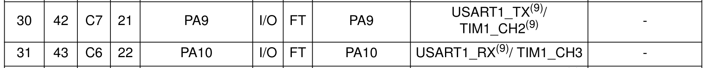
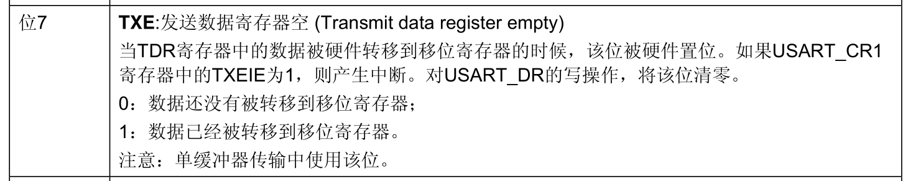
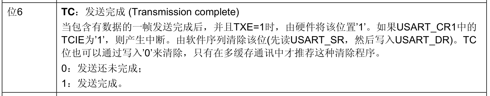
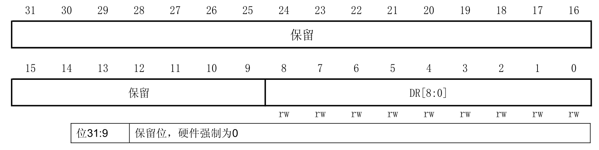
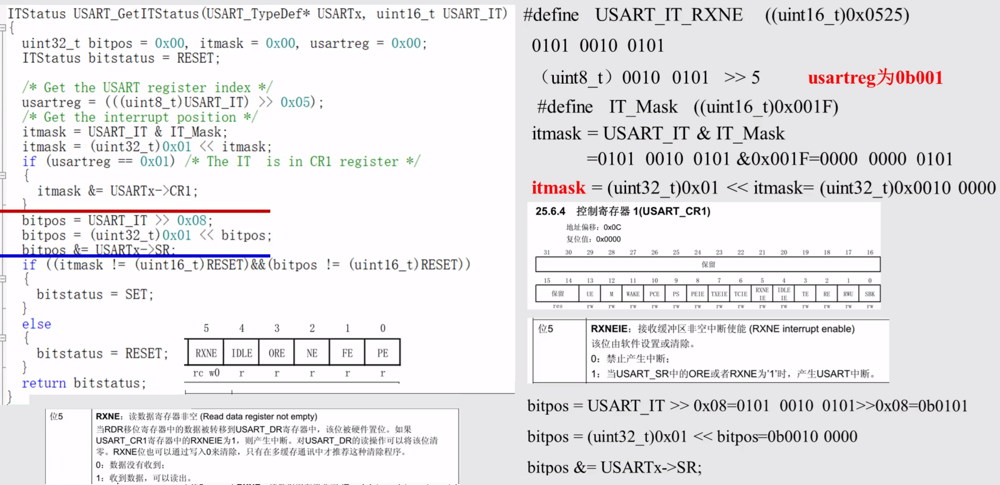
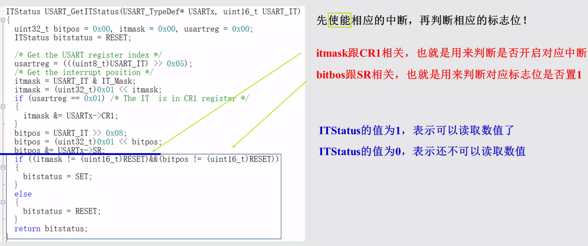
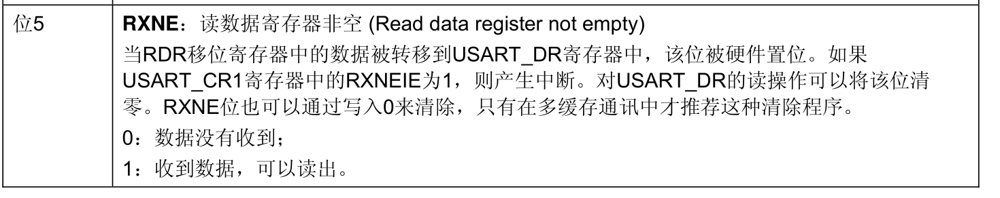
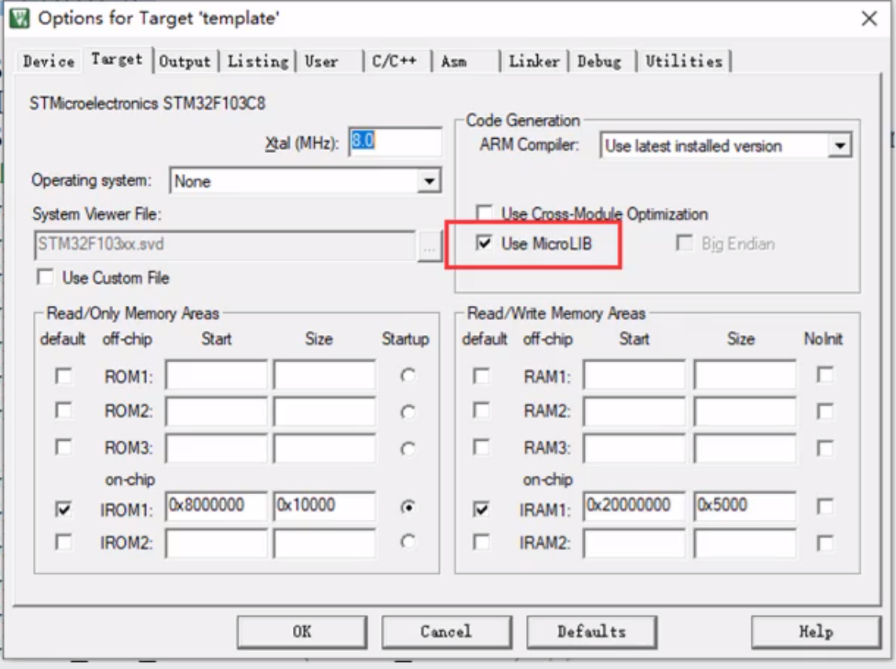

> USART 这块没有点灯，所以没有用到 Proteus 仿真

# USART

## 串口通信流程

1. 串口时钟、GPIO 时钟使能

  RCC_APB2PeriphClockCmd();

2. GPIO 端口模式设置

   GPIO_Init();

3. 串口参数初始化

   USART_Init();

4. 开启中断并且初始化 NVIC

   NVIC_Init();

   USART_ITConfig();

5. 串口使能

   USART_Cmd();

6. 编写中断处理函数

   USARTx_IRQHandler();


> 根据[参考手册](bookxnotepro://opennote/?nb={01a25f6c-fe16-454c-8f38-591392487e16}&book=47f07b86a273b11dbbc9034f7a90f448&page=109&x=322&y=661&id=63)可知
>
> 全双工模式下，`USARTx_TX` 采用推挽复用输出(`GPIO_Mode_AF_PP`)
>
> 全双工模式下，`USARTx_RX` 采用浮空输入或带上拉输入(`GPIO_Mode_IN_FLOATING`、`GPIO_Mode_IPU`)


## USART 针脚定义



根据[数据手册](bookxnotepro://opennote/?nb={01a25f6c-fe16-454c-8f38-591392487e16}&book=d22bb8457c85552d28ca929b03ba7efd&page=26&x=388&y=459&id=62)，`USART1_TX` 对应 30 号针脚 PA9；`USART1_RX` 对应 31 号针脚 PA10

## USART（发送单字符）

### 具体实现（MY_USART1）

> 这里给出一个没有中断的简易实现
>
> main 函数中使用以下语句即可实现发送 1 个字符 `I`
>
> ```c
> 	My_USART1();
> 	USART_SendData(USART1,'I');
> ```

```c
void My_USART1(void)
{
	// 串口初始化结构体
	USART_InitTypeDef USART_InitStructure;

	// GPIO 初始化结构体
	GPIO_InitTypeDef GPIO_InitStructure;

	// 串口时钟、GPIO 时钟使能
	RCC_APB2PeriphClockCmd(RCC_APB2Periph_USART1 | RCC_APB2Periph_GPIOA, ENABLE);

	// 串口初始化
	USART_InitStructure.USART_BaudRate = 9600;										// 波特率 9600
	USART_InitStructure.USART_WordLength = USART_WordLength_8b;						// 8 位数据位
	USART_InitStructure.USART_StopBits = USART_StopBits_1;							// 1 位停止位
	USART_InitStructure.USART_Parity = USART_Parity_No;								// 不进行奇偶校验
	USART_InitStructure.USART_HardwareFlowControl = USART_HardwareFlowControl_None; // 无硬件数据流控制
	USART_InitStructure.USART_Mode = USART_Mode_Rx | USART_Mode_Tx;					// 收/发模式
	USART_Init(USART1, &USART_InitStructure);

	// GPIO A9 初始化
	GPIO_InitStructure.GPIO_Pin = USART1_GPIO_PIN_TX;
	GPIO_InitStructure.GPIO_Speed = GPIO_Speed_50MHz;
	GPIO_InitStructure.GPIO_Mode = GPIO_Mode_AF_PP;
	GPIO_Init(GPIOA, &GPIO_InitStructure);

	/* A9 已经初始化结束了，GPIO_InitStructure 可以赋别的值继续用 */

	// GPIO A10 初始化
	GPIO_InitStructure.GPIO_Pin = USART1_GPIO_PIN_RX;
	GPIO_InitStructure.GPIO_Mode = GPIO_Mode_IN_FLOATING;
	GPIO_Init(GPIOA, &GPIO_InitStructure);

	// 开启中断并且初始化 NVIC

	// 串口使能
	USART_Cmd(USART1, ENABLE);

	// 编写中断处理函数
}
```

#### TXE 判断



由于没有进行任何的处理，如果同时执行两次 `USART_SendData()`，后者的数据**可能**会覆盖前者（DR 里的数据来不及发出去就被新数据覆盖了）

```c
USART_SendData(USART1,'I');
USART_SendData(USART1,'J'); // 👈可能只会收到 J
```

比较简单粗暴的方式可以选择在其中加上一段延迟，但是依然存在风险，而且影响传输效率

这时可以选择通过 `USART_GetFlagStatus(UART1, USART_FLAG_TXE)` 判断 `TXE` 的状态，当返回的 status 为 1 时，可以继续发送下一个字节

```C
USART_SendData(USART1, 'I');
while (USART_GetFlagStatus(USART1, USART_FLAG_TXE) == RESET);
USART_SendData(USART1, 'J');
```

加上了循环等待后就可以正常接收到两个字符了

> 比较 drama 的是，在用 **keil+虚拟串口** 测试时发现，如果连续两句 `USART_SendData()`，每次收到的都是 `I`，不是 `J`，与[视频](https://www.bilibili.com/video/BV1N7411x7Yk?p=68)的结果不同
>
> 这里列出一些实验结果
>
> 死循环外，连续输出 I、J 和 I、J、K，接收到的都是 I
>
> 死循环**内**，连续输出 I、J，接收到的只有连续的 I
>
> 死循环**内**，连续输出 I、J、K，接收到的是连续的 I、J、K
>
> 对于这种未定义行为，没有准确的答案，**一切都是可能的**

#### TC 判断



将 `TXE` 改为 `TC`

```c
USART_SendData(USART1, 'I');
while (USART_GetFlagStatus(USART1, USART_FLAG_TC) == RESET);
USART_SendData(USART1, 'J');
```

测试结果表明，只收到了 `I`，依然和[视频](https://www.bilibili.com/video/BV1N7411x7Yk?p=69)的结果不同


再尝试更多个输出

```c
USART_SendData(USART1, 'I');
while (USART_GetFlagStatus(USART1, USART_FLAG_TC) == RESET);
USART_SendData(USART1, 'J');
while (USART_GetFlagStatus(USART1, USART_FLAG_TC) == RESET);
USART_SendData(USART1, 'K');
while (USART_GetFlagStatus(USART1, USART_FLAG_TC) == RESET);
USART_SendData(USART1, 'L');
while (USART_GetFlagStatus(USART1, USART_FLAG_TC) == RESET);
USART_SendData(USART1, 'M');
while (USART_GetFlagStatus(USART1, USART_FLAG_TC) == RESET);
USART_SendData(USART1, 'N');
```

输出的结果为 `IKLMN`，依然和[视频](https://www.bilibili.com/video/BV1N7411x7Yk?p=69)的结果不同，但是符合预期

##### 分析

重点看图中 TC 描述的这句：「由**软件序列**清除该位(**先读 USART_SR，然后写入 USART_DR**)」

> software sequence，更准确的说应该是 software command sequence

这句话的意思其实是：当进行了 **读USART_SR** + **写USART_DR** 这两个步骤*（称其为软件序列）*后，TC 标志位才清零

> 相对应的，TXE 在[对 USART_DR 进行写操作时，就会清零](bookxnotepro://opennote/?nb={01a25f6c-fe16-454c-8f38-591392487e16}&book=47f07b86a273b11dbbc9034f7a90f448&page=539&x=385&y=507&id=67)（刚写入，数据自然**还没有被转移到移位寄存器**）

分析语句执行的操作👇

```C
USART_SendData(USART1, 'I');
👆 写USART_DR

while (USART_GetFlagStatus(USART1, USART_FLAG_TC) == RESET); 
👆 **读USART_SR**

USART_SendData(USART1, 'J');
👆 **写USART_DR**
    
while (USART_GetFlagStatus(USART1, USART_FLAG_TC) == RESET);
……
```

显然，直到执行完 `USART_SendData(USART1, 'J');` 才完成了 TC 位的清零，亦即，**直到第二个 while 循环开始，while 循环才进行实际上的等待**

所以**在第二个 while 循环前到底收到的是 `I` 或 `J` 或`IJ` 是不确定的**

> 💡需要注意一点
>
> 我们可以确定第一个循环不会执行的原因在于，USART_SR 的复位值是 `0x00C0`，即 `TXE` 和 `TC` 的初始值为 `1`

##### 解决方案 1

知道了原因解决方案倒也简单，在最开始再加上一条循环即可

```c
// 👇
while (USART_GetFlagStatus(USART1, USART_FLAG_TC) == RESET);
USART_SendData(USART1, 'I');
while (USART_GetFlagStatus(USART1, USART_FLAG_TC) == RESET);
USART_SendData(USART1, 'J');
while (USART_GetFlagStatus(USART1, USART_FLAG_TC) == RESET);
USART_SendData(USART1, 'K');
while (USART_GetFlagStatus(USART1, USART_FLAG_TC) == RESET);
USART_SendData(USART1, 'L');
while (USART_GetFlagStatus(USART1, USART_FLAG_TC) == RESET);
USART_SendData(USART1, 'M');
while (USART_GetFlagStatus(USART1, USART_FLAG_TC) == RESET);
USART_SendData(USART1, 'N');
```

**这条最开始的循环依然是不等待的**，但是它干了一件事：**读USART_SR**，因此下一步执行 `USART_SendData(USART1, 'I');`（**写USART_DR**）后，TC 就会清零，进入等待，直到字符 `I` 发送完毕，才结束等待

经实验，能够正确接收到 `IJKLMN`

##### 解决方案 2

当然也可以直接选择先对 `TC` 写入 0，来实现等待

使用函数：`USART_ClearFlag(USART1,USART_FLAG_TC);`


## 串口数据收发相关库函数

### USART_SendData()

```c
void USART_SendData(USART_TypeDef* USARTx, uint16_t Data)
{
  /* Check the parameters */
  assert_param(IS_USART_ALL_PERIPH(USARTx));
  assert_param(IS_USART_DATA(Data)); 
    
  /* Transmit Data */
  USARTx->DR = (Data & (uint16_t)0x01FF);
}
```

> USART_DR 只有低 9 位有效，其他位保留，所以 `Data` 要与上 `0x01FF`
>
> 

### uint16_t USART_ReceiveData();

```c
uint16_t USART_ReceiveData(USART_TypeDef* USARTx)
{
  /* Check the parameters */
  assert_param(IS_USART_ALL_PERIPH(USARTx));
  
  /* Receive Data */
  return (uint16_t)(USARTx->DR & (uint16_t)0x01FF);
}
```


## 串口传输状态相关库函数

FlagStatus USART_GetFlagStatus(USART_TypeDef* USARTx, uint16_t USART_FLAG);

void USART_ClearFlag(USART_TypeDef* USARTx, uint16_t USART_FLAG);

ITStatus USART_GetITStatus(USART_TypeDef* USARTx, uint16_t USART_IT);

void USART_ClearITPendingBit(USART_TypeDef* USARTx, uint16_t USART_IT);


> `USART_GetITStatus()` 和 `USART_GetFlagStatus()` 的区别在于前者判断**标志位是否置 1**的同时还判断了**是否中断使能**，而后者**只判断标志位**

### USART_GetFlagStatus()

```c
FlagStatus USART_GetFlagStatus(USART_TypeDef* USARTx, uint16_t USART_FLAG)
{
  FlagStatus bitstatus = RESET;
  /* Check the parameters */
  assert_param(IS_USART_ALL_PERIPH(USARTx));
  assert_param(IS_USART_FLAG(USART_FLAG));
  /* The CTS flag is not available for UART4 and UART5 */
  if (USART_FLAG == USART_FLAG_CTS)
  {
    assert_param(IS_USART_123_PERIPH(USARTx));
  }  
  
  if ((USARTx->SR & USART_FLAG) != (uint16_t)RESET)
  {
    bitstatus = SET;
  }
  else
  {
    bitstatus = RESET;
  }
  return bitstatus;
}
```

> 以 `USART_FLAG_TXE` 为例，它的宏定义值为 `((uint16_t)0x0080)`，与 [USART_SR](bookxnotepro://opennote/?nb={01a25f6c-fe16-454c-8f38-591392487e16}&book=47f07b86a273b11dbbc9034f7a90f448&page=539&x=234&y=140&id=64) 的第 8(7) 位的 `TXE` 对应
>
> 当 TDR 中**有**数据时，该位为 0，此时进入 `else` 分支，返回 `RESET`(0)
>
> 当 TDR 中**没有**数据时，该位为 1，此时进入 `if` 分支，返回 `SET`(1)
>
> 
>
> 


### USART_ClearFlag()

```c
void USART_ClearFlag(USART_TypeDef* USARTx, uint16_t USART_FLAG)
{
  /* Check the parameters */
  assert_param(IS_USART_ALL_PERIPH(USARTx));
  assert_param(IS_USART_CLEAR_FLAG(USART_FLAG));
  /* The CTS flag is not available for UART4 and UART5 */
  if ((USART_FLAG & USART_FLAG_CTS) == USART_FLAG_CTS)
  {
    assert_param(IS_USART_123_PERIPH(USARTx));
  } 
   
  USARTx->SR = (uint16_t)~USART_FLAG;
}
```

> 为什么敢把其他所有位都取反啊🤔
>
> `#define USART_FLAG_TC             ((uint16_t)0x0040)`


### USART_GetITStatus()

```c
ITStatus USART_GetITStatus(USART_TypeDef* USARTx, uint16_t USART_IT)
{
  uint32_t bitpos = 0x00, itmask = 0x00, usartreg = 0x00;
  ITStatus bitstatus = RESET;
  /* Check the parameters */
  assert_param(IS_USART_ALL_PERIPH(USARTx));
  assert_param(IS_USART_GET_IT(USART_IT));
  /* The CTS interrupt is not available for UART4 and UART5 */ 
  if (USART_IT == USART_IT_CTS)
  {
    assert_param(IS_USART_123_PERIPH(USARTx));
  }   
  
  /* Get the USART register index */
  usartreg = (((uint8_t)USART_IT) >> 0x05);
  /* Get the interrupt position */
  itmask = USART_IT & IT_Mask;
  itmask = (uint32_t)0x01 << itmask;
  
  if (usartreg == 0x01) /* The IT  is in CR1 register */
  {
    itmask &= USARTx->CR1;
  }
  else if (usartreg == 0x02) /* The IT  is in CR2 register */
  {
    itmask &= USARTx->CR2;
  }
  else /* The IT  is in CR3 register */
  {
    itmask &= USARTx->CR3;
  }
  
  bitpos = USART_IT >> 0x08;
  bitpos = (uint32_t)0x01 << bitpos;
  bitpos &= USARTx->SR;
  if ((itmask != (uint16_t)RESET)&&(bitpos != (uint16_t)RESET))
  {
    bitstatus = SET;
  }
  else
  {
    bitstatus = RESET;
  }
  
  return bitstatus;  
}
```





> 图中的说法不太对，不是「使能」，而是「凑」出使能的中断对应，看看对应位是否使能

## USART（发送字符串）

直接给出实现

```c
void USART_SendByte(USART_TypeDef* USARTx, uint16_t Data)
{
  /* Check the parameters */
  assert_param(IS_USART_ALL_PERIPH(USARTx));
  assert_param(IS_USART_DATA(Data)); 
    
  /* Transmit Data */
  USARTx->DR = (Data & (uint16_t)0x01FF);
  while (USART_GetFlagStatus(USARTx, USART_FLAG_TXE) == RESET);
}

void USART_SendString( USART_TypeDef * USARTx, char *str)
{
     while(*str!='\0')
     {
         USART_SendByte( USARTx, *str++ );	
     }
     while(USART_GetFlagStatus(USARTx,USART_FLAG_TC)==RESET);
}
```

`USART_SendByte()` 就是照抄库函数的 `USART_SendData()`，然后加一句 `TXE` 的判断，其目的在前面发送单字符的部分有过详细分析，是**避免数据覆盖**

`USART_SendString()` 则是循环调用 `USART_SendByte()`，最后加一句 `TC` 的判断，作用与判断 `TXE` 类似，这里是为了**保证整个字符串都传输完毕**


测试语句：

```c
My_USART1();
USART_SendString(USART1, "你好，世界！\r\nHello World!\r\n");
```

> 测试发现中文乱码，修改 main.c 为 **ANCI 编码**，问题解决

## USART（接收字符）

看一下库函数 `USART_ReceiveData()`

```c
uint16_t USART_ReceiveData(USART_TypeDef* USARTx)
{
  /* Check the parameters */
  assert_param(IS_USART_ALL_PERIPH(USARTx));
  
  /* Receive Data */
  return (uint16_t)(USARTx->DR & (uint16_t)0x01FF);
}
```

内容够简单，就是直接从 `USART_DR` 读数据

为了确认数据的有效性，再添加一个 [RXNE](bookxnotepro://opennote/?nb={01a25f6c-fe16-454c-8f38-591392487e16}&book=47f07b86a273b11dbbc9034f7a90f448&page=539&x=171&y=644&id=68) 的判断，实现 `USART_ReceieByte()`



实现如下👇

```c
uint8_t USART_ReceieByte(USART_TypeDef *USARTx)
{
	/* Check the parameters */
	assert_param(IS_USART_ALL_PERIPH(USARTx));

	while (USART_GetFlagStatus(USARTx, USART_FLAG_RXNE) == RESET)
		;
	return (uint16_t)(USARTx->DR & (uint16_t)0x01FF);
}
```

> 这个实现和[视频](https://www.bilibili.com/video/BV1N7411x7Yk?p=71)里不太一样，感觉最开始做一下参数检查就好了，然后再调用 `USART_ReceiveData()` 再检查一次有点多余，就干脆把语句拆出来了，视频里的是下面这个👇
>
> ```c
> uint8_t USART_ReceieByte(USART_TypeDef *USARTx)
> {
> 	while (USART_GetFlagStatus(USARTx, USART_FLAG_RXNE) == RESET);
> 	return (uint8_t)USART_ReceiveData(USARTx);
> }
> ```

主函数测试语句👇

```c
char temp;
while (1)
{
    temp = USART_ReceieByte(USART1);
    USART_SendByte(USART1, temp);
}
```

> 收到一个字符，就发送一个字符

实验结果表明，可以正常收到字符并发送，同时和视频里不同的是，发送多个字符时，出现明显的**丢字**（丢包）的问题，显然是来不及处理造成的

解决这个问题的第一个想法是自建缓冲 `buffer` 来解决，写到一半发现不对，收/发的语句的连着的，只要一边慢了就肯定丢字，这个解决的方式不行，还是要引入中断，再结合缓冲 `buffer` 来处理，在 `while` 里跑肯定会出问题

## USART（中断法收发字符）

1. 完善最开始编写的 `My_USART1()`

   开启中断并且初始化 NVIC

   ```c
   // NVIC 初始化结构体
   NVIC_InitTypeDef NVIC_InitStructure;
   
   // 开启中断并且初始化 NVIC
   USART_ITConfig(USART1, USART_IT_RXNE, ENABLE);// 开启 USART1 的接收中断
   NVIC_InitStructure.NVIC_IRQChannel = USART1_IRQn;
   NVIC_InitStructure.NVIC_IRQChannelPreemptionPriority = 0;
   NVIC_InitStructure.NVIC_IRQChannelSubPriority = 0;
   NVIC_InitStructure.NVIC_IRQChannelCmd = ENABLE;
   NVIC_Init(&NVIC_InitStructure);
   ```

2. 编写 USART1 的接收中断处理函数

   ```c
   void USART1_IRQHandler(void)
   {
   	uint8_t data; // 接收到的数据
       
   	// 如果接收到数据
   	if (USART_GetITStatus(USART1, USART_IT_RXNE) != RESET)
   	{
   		data = USART_ReceiveData(USART1); // 读取数据
   		USART_SendByte(USART1, data);     // 发送数据
   	}
   }
   ```

> 这个时候，把 `while(1){}` 留空，通过中断处理函数即可收发数据
>
> 当然，由于没有解决**收+发**的问题，所以**丢包的问题依然没有解决**


## printf() 和 scanf() 重定向

通过重写 `fputc()` 和 `fgetc()`，使 `printf()`、`scanf()`、`getchar()` 重定向到串口（要引入头文件 `stdio.h`）

```c
typedef struct __FILE FILE;
#pragma import(__use_no_semihosting)
struct __FILE
{
	int handle;
};
FILE __stdout;
_sys_exit(int x)
{
	x = x;
}

int fputc(int ch, FILE *f)
{
	USART_SendData(USART1, (uint8_t)ch);
	while (USART_GetFlagStatus(USART1, USART_FLAG_TXE) == RESET)
		;
	return (ch);
}

int fgetc(FILE *f)
{
	while (USART_GetFlagStatus(USART1, USART_FLAG_RXNE) == RESET)
		;
	return (int)USART_ReceiveData(USART1);
}
```


### 其他问题

printf()函数使用了**半主机模式**，会导致程序无法运行

> 半主机模式是ARM单片机的一种调试机制，它需要通过仿真器来连接电脑和ARM单片机，并调用相应的指令来实现单片机向电脑显示器打印信息。（相比串口调试而言更为复杂）

#### 解决方案 1

**使用微库**时，就默认关闭了半主机模式



#### 解决方案2


### 实验结果

`printf("你好，世界！Hello World!\r\n");`

```
你好，澜纾ello World!
愫茫世界！Hello World!
你好，！Hello World!
你好，世界！Hello World!
你茫澜纾Hello World!
愫茫澜纾ello World!
茫澜纾ello World!
好澜纾ello World!
愫澜纾ello World!
愫，世界！Hello World!
```

> 属实给我整笑了，不知道是仿真不行还是就是这么拉

多加一句判断 TC 的，试了几次，看起来好了点，也不知道是不是凑巧

```c
int fputc(int ch, FILE *f)
{
	USART_SendData(USART1, (uint8_t)ch);
	while (USART_GetFlagStatus(USART1, USART_FLAG_TXE) == RESET);
	while (USART_GetFlagStatus(USART1, USART_FLAG_TC) == RESET);
	return (ch);
}
```


## 虚拟串口调试步骤（Keil）

1. 打开虚拟串口 COM1<->COM2

2. 打开 keil 调试，command 输入

   ```
   MODE COM1 9600,0,8,1
   ASSIGN COM1<S1IN>S1OUT
   ```

   > assign 的 s**1**in 和 s**1**out 好像是串口 **1** 的意思，51 调试的时候没有 1，是 `ASSIGN COM1<SIN>SOUT`

3. 打开串口小助手，开启端口 COM2
