> WiFi 模块通过 esp-01s（esp8266） 实现

# esp-01s 功能测试

## 硬件连接（串口连接）

通过跳线帽将 **CH340**(CH330N) 与 **esp-01s** 连接（需要断开单片机和 CH340 的连接）

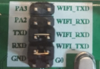

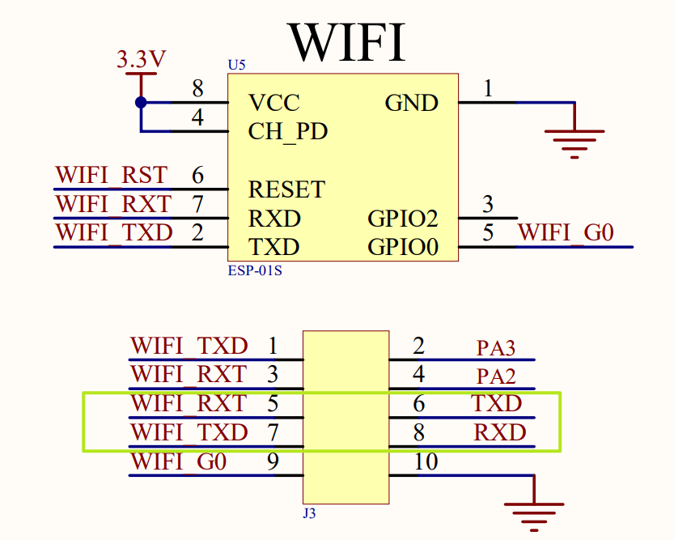

## AT 指令测试

> 测试软件：XCOM，波特率：115200

### 串口连通测试

AT	测试启动	OK


AT+GMR	版本信息	OK


ATE0	关闭回显	OK


ATE1	开启回显	OK


AT+RST	重启模块	ready

### WiFi 功能测试

[测试流程参考内容](https://zhuanlan.zhihu.com/p/166536234)（[Notion 备份](https://www.notion.so/ESP8266-e23fb0a9eb7840d0835dcdfe6ac78b43)）

AT+CWMODE?	查询 WiFi 模式	OK

> 1 : station（Station 模式）
>
> 2 : softAP（AP 模式，access point）
>
> 3 : softAP + station


> [Espressif IoT AT指令集_v0.1.5.pdf](Espressif IoT AT指令集_v0.1.5.pdf) 中提及，修改 WiFi 模式后「需重启后生效(AT+RST)」，但是在实际测试中发现不重启也没有什么已知的影响，但是可能存在未知的风险，所以实际应用时还是应该重启
>
> 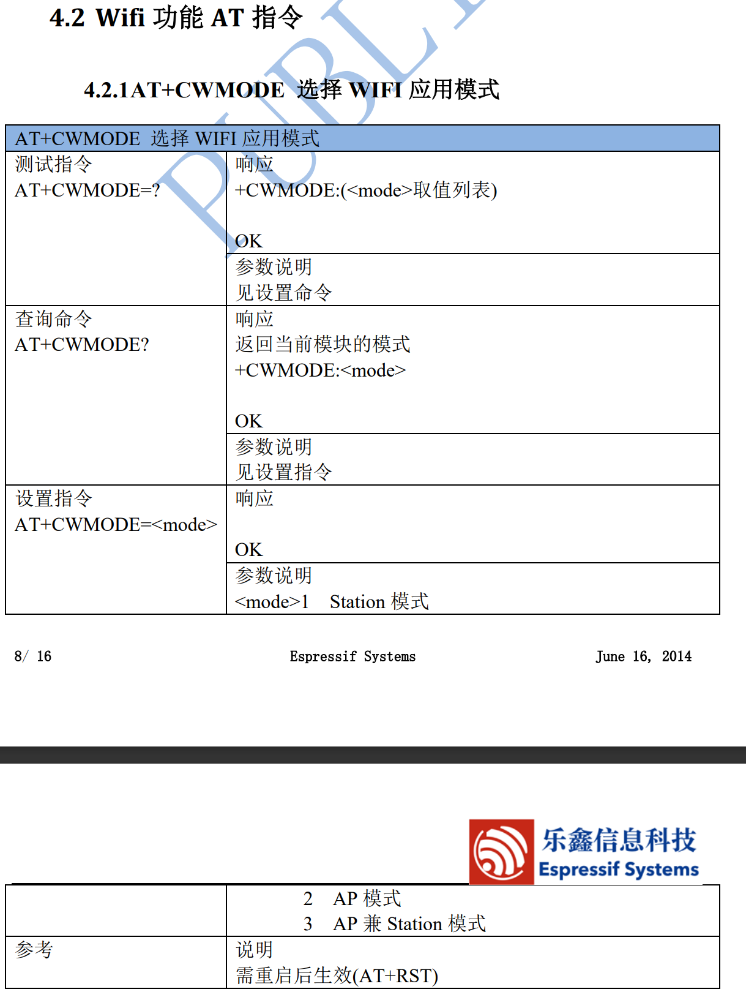

#### AP 模式设置

AT+CWMODE=2	设为 AP 模式	OK

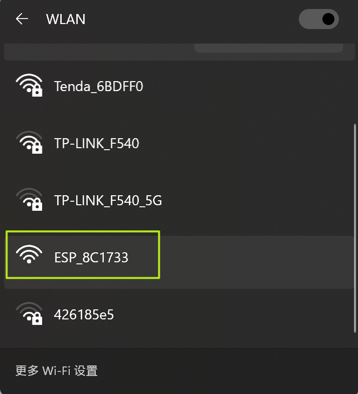


AT+CWSAP_DEF="ESP8266","1234567890",5,3	设置热点参数	OK

可连接

> SSID：ESP8266，密码：1234567890，通道 5，加密方式 WPA2_PSK

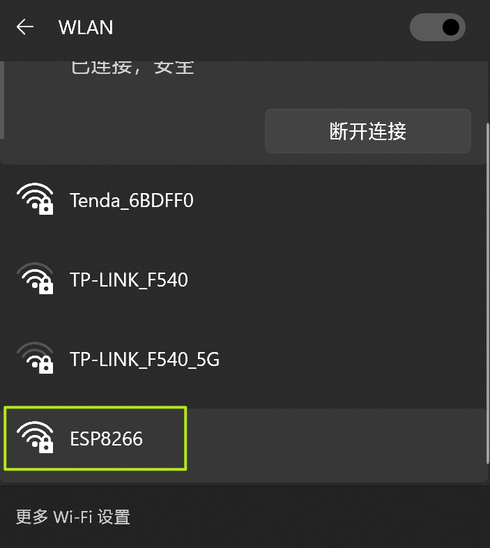

> 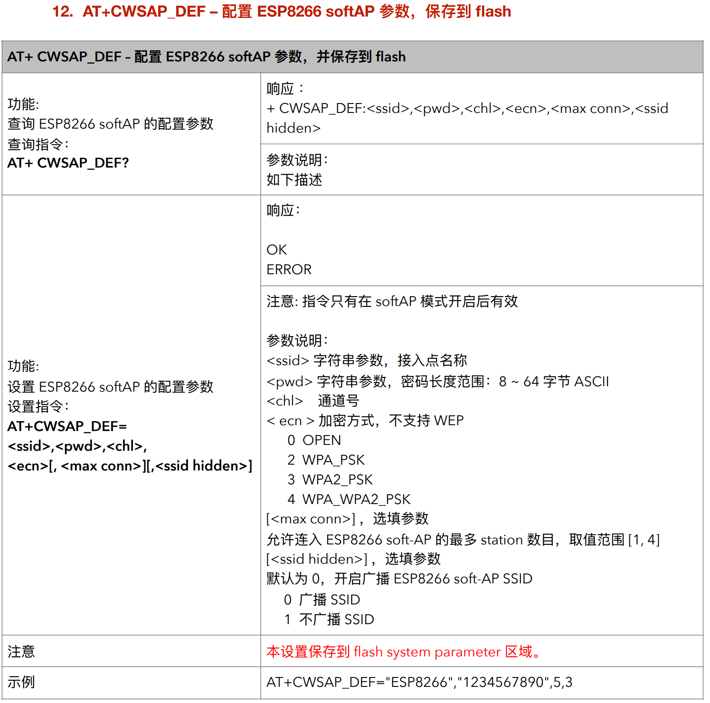

#### Station 模式设置

AT+CWMODE=1	设为 Station 模式	OK


AT+CWJAP_DEF="LGGRAM","12345678"	连接热点	OK

> WIFI CONNECTED
>
> WIFI GOT IP
>
> esp-01s 不支持连接 5GHz 频段，热点需支持 2.4GHz


> 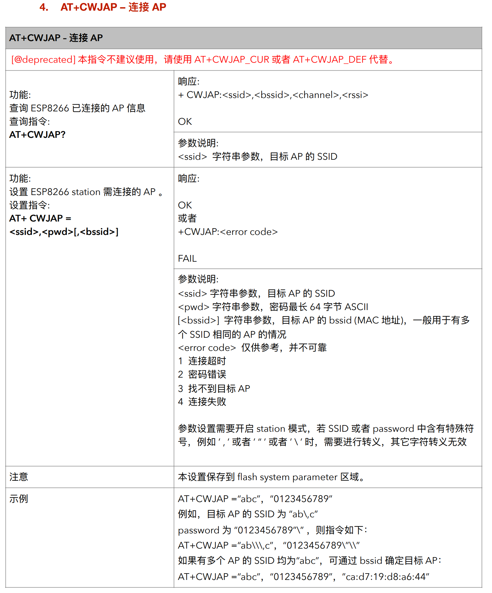


AT+CIPSTA?	查询 IP（esp 8266的）、网关、子网掩码	OK

#### TCP 实现局域网内设备通信

**串口侧**（COM）

AT+CIPSTART="TCP","192.168.0.195",8080	建立 TCP 连接	OK

AT+CIPSEND=14	指定发送的数据长度	OK

I m TCP Client	发送数据	OK

**网络侧**（TCP Server）

I m TCP Server


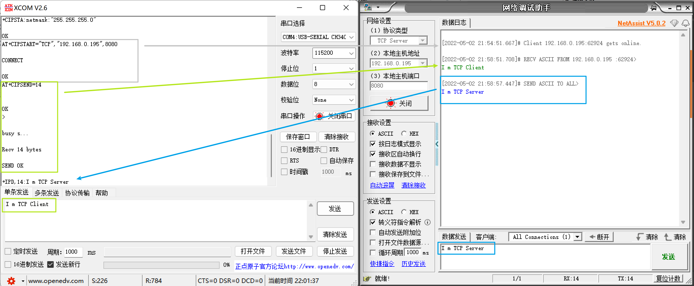

> 💡完整流程：
>
> 1. 设置 WiFi 模式为 Station：`AT+CWMODE=1`
> 2. 连接到局域网：`AT+CWJAP_DEF="LGGRAM","12345678"`
> 3. 建立 TCP 连接：`AT+CIPSTART="TCP","192.168.0.195",8080`
> 4. 提示发送数据长度为 14：`AT+CIPSEND=14`
> 5. 串口调试助手发送：`I m TCP Client`
> 6. 网络调试助手发送：`I m TCP Server`

#### 透传模式

前述的[TCP 通信](#TCP-实现局域网内设备通信)需要在发送数据前指令数据长度，收到的数据也存在`+IPD,<len>` 的前缀，不利于数据处理，针对这种情况，可以开启透传模式（`AT+CIPMODE=1`），开启透传模式后只需要在第一次发送数据时使用 `ATD+CIPSEND` 指令来告诉 ESP8266 开始透传发送，随后直接发送数据即可，在接收到数据时，也不存在 `+IPD,<len>` 前缀

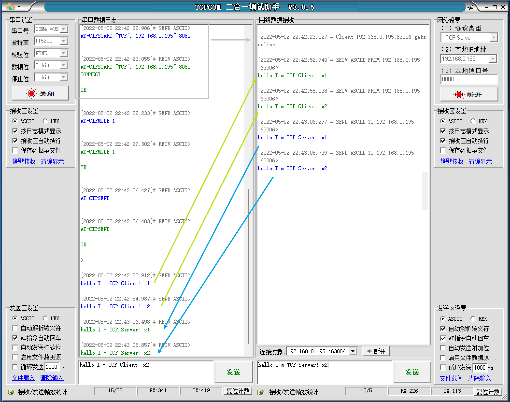

💡**完整流程**：

1. 设置 WiFi 模式为 Station：`AT+CWMODE=1`
2. 连接到局域网：`AT+CWJAP_DEF="LGGRAM","12345678"`
3. 建立 TCP 连接：`AT+CIPSTART="TCP","192.168.0.195",8080`
4. 开启透传模式：`AT+CIPMODE=1`
5. 开始透传发送：`AT+CIPSEND`
6. 串口调试助手发送：`hello I m TCP Client!`
7. 网络调试助手发送：`hello I m TCP Server!`

> 透传模式仅支持单连接（`AT+CIPMUX=0`），因为通常默认就是单连接，所以这里没有设置单连接的步骤
>
> 默认情况下，esp8266 上电会自动连接 AP，可以选择关闭这个功能（`AT+CWAUTOCONN=0`）


❗透传模式下无法识别 AT 指令（AT 指令将被视为字符串发送）

需要发送 `+++`(0x2B 0x2B 0x2B) 以退出发送模式

## 建立 TCP 通信完整流程

根据前述内容，这里给出一个相对完整的建立 TCP 通信的流程（用于编程实现）：

1. 配置 WiFi 模式：`AT+CWMODE=1`
2. 重启模块：`AT+RST`
3. 取消自动连接：`AT+CWAUTOCONN=0`
4. 连接到 AP：`AT+CWJAP_DEF="LGGRAM","12345678"`
5. 设置为单连接模式：`AT+CIPMUX=0`
6. 设置为透传模式：`AT+CIPMODE=1`
7. 建立 TCP 连接：`AT+CIPSTART="TCP","192.168.0.195",8080`
8. 进入透传模式：`AT+CIPSEND`

> 以上配置模式（应该）都会保存在 esp8266 的 flash 里（如果开启自动连接的话应该什么都不用配），但是如果需要修改配置，就需要连上串口用 AT 指令进行配置，所以为了完全由程序配置，还是需要一个完整的流程

通过串口发送 AT 指令实现的实验结果：

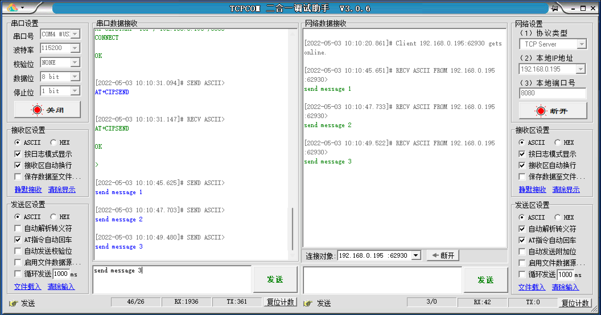

# 编程实现 WiFi 功能

> 前述已通过串口发送 AT 指令实现对 WiFi 模块（esp8266）的配置，本节将通过编程实现 AT 指令的发送（本质上还是通过串口发送 AT 指令，只是改为程序发送，而不是人工手动发送）

## 硬件连接（串口连接）

通过跳线帽将 esp8266 和 USART2 连接

> PA2：USART2_TX
>
> PA3：USART2_RX

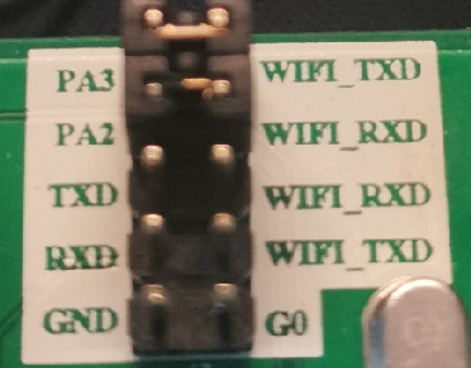

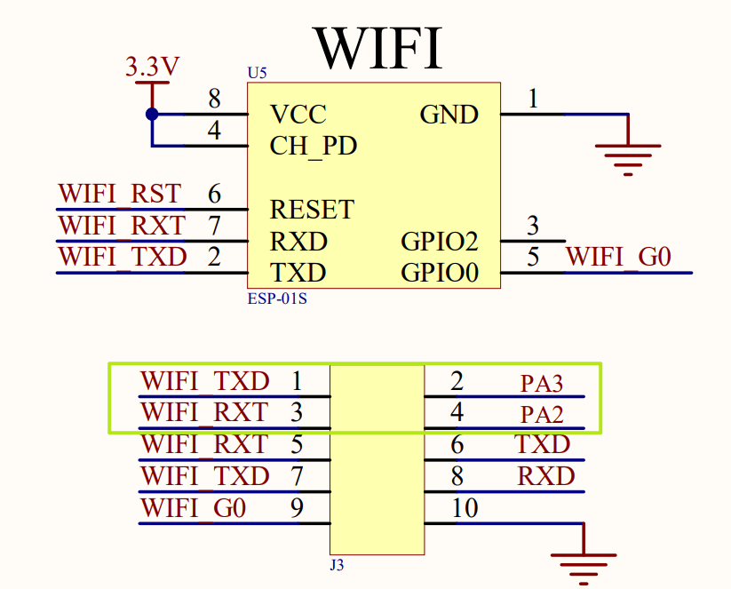

## 编程实现

### 串口模块

> 这里引入一个新的串口格式化输出程序

```c
/* --------------------  USART1 串口格式化输出 -------------------- */

/* ❗USART1_Printf() 需要引入以下三个头文件
    #include "stdio.h"      
    #include "stdarg.h"
    #include "string.h"
*/
__align(8) char USART1_TxBuff[256];  

/**
 * @brief USART1 格式化输出函数
 * 
 * @param fmt 遵循 printf 函数的格式化输出规则填写
 */
void USART1_Printf(char* fmt,...) 
{  
    uint8_t i =0,length=0;
    
    va_list ap;
    va_start(ap,fmt);
    vsprintf(USART1_TxBuff,fmt,ap);
    va_end(ap);
    
    length=strlen((const char*)USART1_TxBuff);
    while(i<length)
    {
        USART_SendByte(USART1,USART1_TxBuff[i]);		
        i++;		
    }
    while(USART_GetFlagStatus(USART1,USART_FLAG_TC)==RESET); 
}
```

按照类似 USART1 的方式构造 USART2 的串口初始化和输出模块，此处不做赘述

一些注意点：

- 名称替换 USART1 → USART2

- USART2 位于 APB1 总线，与 USART1（APB2） 不同，需要修改使能的时钟

- 引脚修改 

  - ```c
    #define USART1_GPIO GPIOA
    #define USART1_TX_PIN GPIO_Pin_9
    #define USART1_RX_PIN GPIO_Pin_10
    
    #define USART1_GPIO GPIOA
    #define USART1_TX_PIN GPIO_Pin_2
    #define USART1_RX_PIN GPIO_Pin_3
    ```

- 波特率

  - USART2 发送 AT 指令所需波特率为 115200

- NVIC 初始化
  - 原有的 NVIC 配置操作直接写在 USART 的初始化函数中，由于存在多个 NVIC 的配置操作，可以考虑将 NVIC 配置的操作单独作为一个模块
    - 另外，NVIC 的配置**需要进行且只进行一次**优先级分组，为了避免错误，也有必要引入单独的 NVIC 配置模块
    
      - > 到这个时候才发现，由于之前的程序没有真正用到优先级，所以全都没有设置过优先级分组😓

#### 串口接收中断处理

```c
/**
 * @brief USART2 的 接收中断 处理函数
 */
void USART2_IRQHandler(void)
{
    /*  如果引发了接收中断（接收中断标志位不为 0，接收数据寄存器不为空） */
    if (USART_GetITStatus(USART2, USART_IT_RXNE) != RESET)
    {
        /* 如果 USART2 的数据寄存器里有数据，就把它读出来，保存到输入缓冲区里 */
        if (USART_ReceiveData(USART2) != 0)
        {
            /* 把接收到的数据存到输入缓冲区里 */
            USART2_Rx_Buffer[USART2_Rx_Length++] = USART_ReceiveData(USART2);
        }
    }
}
```


### WiFi 模块

#### WiFi 初始化

##### AT 指令收发测试

首先需要测试 esp8266 能否收到 AT 指令

```c
/**
 * @brief WiFi 模块复位测试
 */
void WiFi_Reset_Test(void)
{
    int times = 0;

    /* 输入缓冲区 WiFi_Rx_Buffer 清零 */
    memset(WiFi_Rx_Buffer, 0, WIFI_RX_BUFFER_SIZE);
    /* 输入缓冲区当前缓冲规模 WiFi_Rx_Length 清零 */
    WiFi_Rx_Length = 0;

    /* 💡 手动按单片机上的复位键进行复位 */
    
    while (++times<100)
    {
        printf("Waiting Wfi module reset...%d\r\n", times);
        delay_ms(100);
        if (strstr(WiFi_Rx_Buffer, "ready"))
        {
            break;
        }
    }

    /* 在规定时间内收到 「ready」，则复位成功，否则复位失败 */
    if (times < 100)
        printf("WiFi module reset success!\r\n");
    else
        printf("WiFi module reset failed!\r\n");
}
```

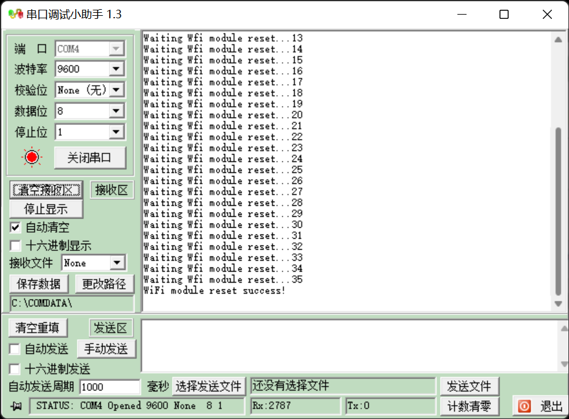

##### 具体实现

###### WiFi_Send_AT_Instruction

> 根据 [AT 指令收发测试](#AT-指令收发测试) 的思路，就可以构建发送 AT 指令的函数

```c
/**
 * @brief 向 WiFi 模块（通过串口）发送 AT 指令
 *
 * @param command 要发送的 AT 指令
 * @param positive_response 预期响应包含的字符串
 * @param wait_time 等待时间（单位：s）
 *
 * @retval true 得到预期响应
 * @retval false 未得到预期响应
 */
bool WiFi_Send_AT_Instruction(char *command, char *positive_response, uint8_t wait_time)
{
    /* 等待时间（wait_time） 以秒为单位，每 100ms 检查一次缓冲区，所以 ×10 */
    wait_time *= 10;

    /* 输入缓冲区清零 */
    memset(WiFi_Rx_Buffer, 0, WIFI_RX_BUFFER_SIZE);
    WiFi_Rx_Length = 0;

    /* 发送 AT 指令 */
    USART2_Printf("%s\r\n", command);

    /* wait_time == 0 时跳出循环 */
    while (--wait_time)
    {
        // printf("Waiting respond...%d\r\n", wait_time);
        // printf("%d ", wait_time);
        delay_ms(100);
        if (strstr(WiFi_Rx_Buffer, positive_response))
        {
            break;
        }
    }

    /* 在倒计时前内收到预期响应，则返回 true，否则返回 false */
    if (wait_time)
    {
        return true;
    }
    else
    {
        return false;
    }
}
```

###### WiFi_Init

通过调用 WiFi_Send_AT_Instruction 就可以实现所有 AT 指令的发送，由此即可完成整个 WiFi 初始化的流程，具体代码见源码

```c
void WiFi_Init(void)
{
    /* WiFi 模块复位 */
    /* 配置 WiFi 模式 */
    /* 重启 WiFi 模块 */
    /* 取消自动连接 */
    /* 连接到 AP */
    /* 设置为单连接模式 */
    /* 设置为透传模式 */
    /* 建立 TCP 通信 */
    /* 进入透传模式（准备开始发送数据） */
}
```

##### 测试函数

这里给出测试模块的实现及其测试结果，符合目标预期

```c
/**
 * @brief USART2 测试函数(就是测试向 WiFi 模块发送 AT 指令)
 *
 */
void TEST_USART2(void)
{
    delay_init();
    NVIC_Config();
    USART1_Init();
    USART2_Init();
    WiFi_Init();

    /* 发送数据 */
    USART2_Printf("I'm client x1\r\n");
    delay_ms(100);
    USART2_Printf("I'm client x2\r\n");
    delay_ms(100);
    USART2_Printf("I'm client x3\r\n");
    delay_ms(100);

    /* 手动退出透传模式 */
    USART2_Printf("+++");
    delay_ms(1000);
    USART2_Printf("AT+CIPMODE=0\r\n");
}
```


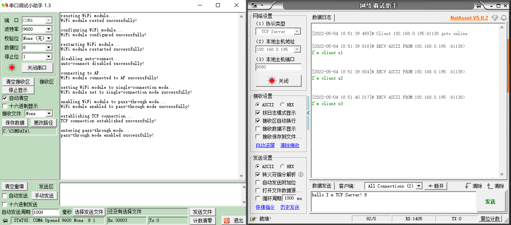