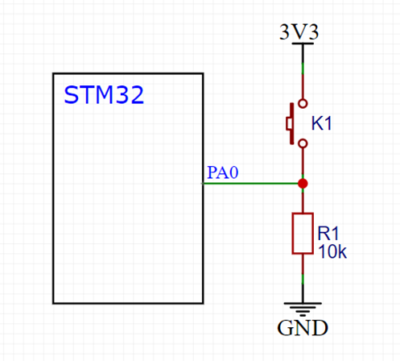

> 这一节引入了模块化

# 按键硬件电路接法

1. 直接接地，I/O 口需要设置为**上拉**输入模式，引脚默认高电平


2. I/O 口外接上拉电阻，I/O 口可以设置为**上拉**输入模式（高电平更加稳定，但引脚拉低时损耗更大）或浮空模式，引脚默认高电平


3. 直接接高电平，I/O 口需要设置为**下拉**输入模式，引脚默认低电平


4. I/O 口外接下拉电阻，I/O 口可以设置为**下拉**输入模式或浮空模式，引脚默认低电平



# C语言数据类型对照关系表

> 建议使用 stdint 列的表示方式，ST关键字是较早版本的表示方式，为保证兼容性，依然可用

| **关键字**         | **位数** | **表示范围**             | **stdint关键字** | **ST关键字** |
| ------------------ | -------- | ------------------------ | ---------------- | ------------ |
| char               | 8        | -128 ~ 127               | int8_t           | s8           |
| unsigned char      | 8        | 0 ~ 255                  | uint8_t          | u8           |
| short              | 16       | -32768 ~ 32767           | int16_t          | s16          |
| unsigned short     | 16       | 0 ~ 65535                | uint16_t         | u16          |
| int                | 32       | -2147483648 ~ 2147483647 | int32_t          | s32          |
| unsigned int       | 32       | 0 ~ 4294967295           | uint32_t         | u32          |
| long               | 32       | -2147483648 ~ 2147483647 |                  |              |
| unsigned long      | 32       | 0 ~ 4294967295           |                  |              |
| long long          | 64       | -(2^64)/2 ~ (2^64)/2-1   | int64_t          |              |
| unsigned long long | 64       | 0 ~ (2^64)-1             | uint64_t         |              |
| float              | 32       | -3.4e38 ~ 3.4e38         |                  |              |
| double             | 64       | -1.7e308 ~ 1.7e308       |                  |              |

# 输入/输出寄存器数据读取

## 相关函数

> 对应全部 16 位或某一位输入/输出寄存器的读操作

```c
uint8_t GPIO_ReadInputDataBit(GPIO_TypeDef* GPIOx, uint16_t GPIO_Pin);

uint16_t GPIO_ReadInputData(GPIO_TypeDef* GPIOx);

uint8_t GPIO_ReadOutputDataBit(GPIO_TypeDef* GPIOx, uint16_t GPIO_Pin);

uint16_t GPIO_ReadOutputData(GPIO_TypeDef* GPIOx);
```

GPIO_ReadOutputDataBit(...) 函数应用

```c
void LED1_Toggle(void){
	if(GPIO_ReadOutputDataBit(GPIOA, GPIO_Pin_1)==0){
		GPIO_SetBits(GPIOA, GPIO_Pin_1);
	}
	else{
		GPIO_ResetBits(GPIOA, GPIO_Pin_1);
	}
}
```


