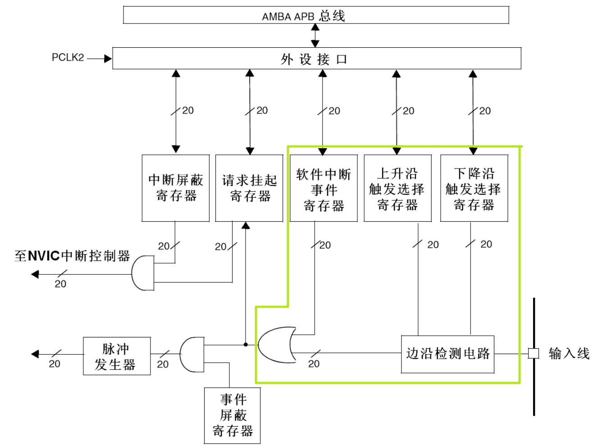
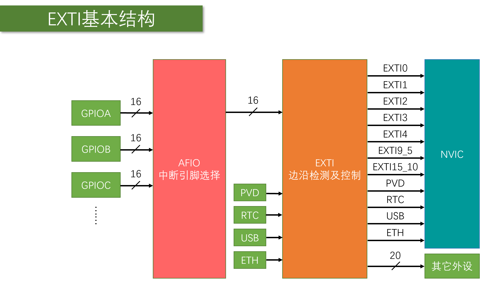
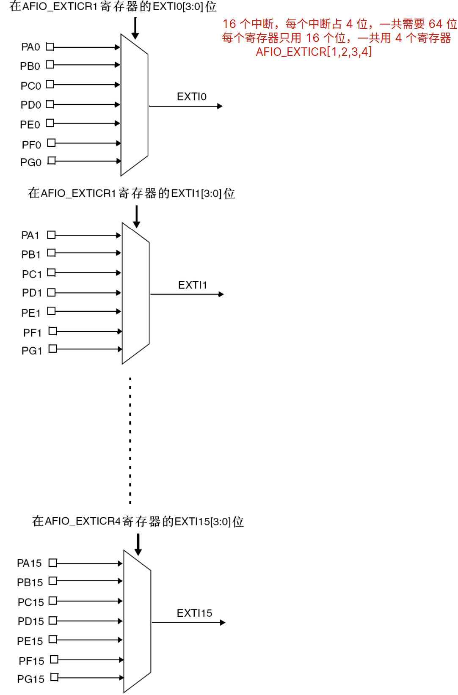

> 没有硬件，没有实验，没有写程序

# EXTI（Extern Interrupt）外部中断

- EXTI 可以监测指定 GPIO 口的电平信号，当其指定的 GPIO 口产生电平变化时，EXTI 将立即向 NVIC 发出中断申请，经过 NVIC 裁决后即可中断 CPU 主程序，使 CPU 执行 EXTI 对应的中断程序
- 支持的触发方式：上升沿/下降沿/双边沿/软件触发
  - 
- 支持的 GPIO 口：所有 GPIO 口，**但相同的 Pin 不能同时触发中断**
  - 亦即：若 PA1 被用作中断触发引脚，PB1 不能再被设为中断触发引脚

- 通道数：16 个 GPIO_Pin，外加 PVD 输出、RTC 闹钟、USB 唤醒、以太网唤醒
- 触发响应方式：中断响应/事件响应
  - **中断响应**触发 CPU 处理（即执行中断处理函数）
  - **事件响应**触发其他外设的操作（即由其他外设做出反应，而不是引发 CPU 中断）
    - 信号角度而言，触发的响应信号不通向CPU，而是通向外设

## EXTI 基本机构

- **从 AFIO 到 EXTI** 只有 16 个通道，对应 GPIO 的 16 个 GPIO_Pin
  - 每一个通道对应一个 Pin，所以相同的 Pin 不能同时触发中断
- **PVD、RTC、USB、ETH 直接输入到 EXTI**，也就是不通过 GPIO 直接触发中断机制
- EXTI5~EXTI9、EXTI10~EXTI15 各触发一个中断函数，也就是做了合并。如果要区分不同的中断，还要进一步根据标志位区分具体是哪个 GPIO_Pin 触发的中断
- 有另外 20 条输出到其他外设，用于触发**事件响应**

## 外部中断适用场景

- 突发性，不可预测的信号输入
- 时效性，需要立刻进行响应，否则可能丢失数据

典型场景：红外、旋钮

> 按键需要进行消抖，不建议使用外部中断实现，而是通过定时器实现

# AFIO

AFIO 主要用于**引脚复用**功能的选择和重定义

在 STM32 中，AFIO 主要完成两个任务：复用功能引脚重映射、中断引脚选择
