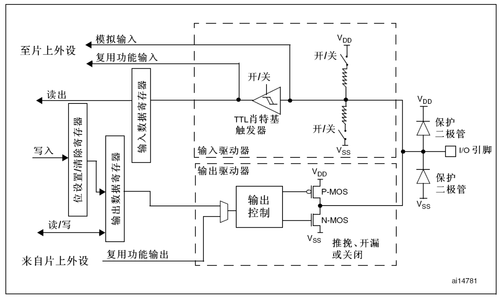

> https://www.bilibili.com/video/BV1th411z7sn?p=5

# I/O 端口电路结构

👉[参考手册](bookxnotepro://opennote/?nb={01a25f6c-fe16-454c-8f38-591392487e16}&book=47f07b86a273b11dbbc9034f7a90f448&page=104&x=190&y=493&id=73)



> VDD：内部**工作电压**；VSS：公共**接地电压**

## I/O 引脚保护电路


I/O 引脚的输入电压为 0~3.3V。

当高于 3.3V 时，电流流向 VDD，不会进入内部电路；

当低于 0V 时（相对于 VSS 的负电压），电流从 VSS 流出，不会从内部电路汲取电流。

两个保护二极管的作用都是保护内部电路，使进入内部电路的电压为 0~3.3V（此时两个保护二极管均不导通)

## 输入驱动器


### 上拉/下拉输入电路


**接通**上面的开关，断开下面的开关，为上拉输入模式

断开上面的开关，**接通**下面的开关，为下拉输入模式

上下都断开，则为浮空输入模式

> 在 F1 系列没有专门设置输入上拉或者下拉的寄存器，属于伪上/下拉

### 施密特触发器


英文显示的是**施密特触发器**（TTL Schmitt trigger）

查到的说法是：TTL肖特基触发器可以理解为用肖特基管构成的施密特触发器，其主要目的是**整形**，使模拟信号转换为数字信号


> [史密特觸發器-Schmitt trigger – xuan!LAB](http://www.xuan.idv.tw/wordpress/?p=2755)

看图，当输入电平高于正向阈值时，将输出高电平。但是当输入电平低于正向阈值时，输出的电平不会改变，直到输入电平低于负向阈值，才会改变（输出低电平）。

同样的，当输入电平低于负向阈值时，将输出低电平。但是当输入电平高于负向阈值时，输出的电平不会改变，直到输入电平高于正向阈值，才会改变（输出高电平）。

这么做可以有效避免信号波动引发的**抖动**，经过施密特触发器，信号就可以输入**输入数据寄存器**了


💡注意看施密特触发器的两端，因为模拟输入需要模拟信号，所以接在施密特触发器之前。而其他信号需要的是数字信号，所以是接在施密特触发器之后的。

## 位设置/清除寄存器

单独设置 I/O 的某一位有三种方式

1. 读取[数据寄存器](bookxnotepro://opennote/?nb={01a25f6c-fe16-454c-8f38-591392487e16}&book=47f07b86a273b11dbbc9034f7a90f448&page=114&x=211&y=67&id=95)（全部 16 位）的值，通过**按位与**（&=）、**按位或**（|=）的方式修改其中的某一位，然后再写入数据寄存器。这种方式效率不高

2. 通过[端口位设置/清除寄存器(GPIOx_BSRR)](bookxnotepro://opennote/?nb={01a25f6c-fe16-454c-8f38-591392487e16}&book=47f07b86a273b11dbbc9034f7a90f448&page=114&x=274&y=297&id=94)进行设置

   

3. 通过[位带操作](bookxnotepro://opennote/?nb={01a25f6c-fe16-454c-8f38-591392487e16}&book=da99ea474b8a9ac1f85ec2d26dd693a1&page=86&x=146&y=262&id=93)进行

## 输出驱动器


### P-MOS 和 N-MOS

P-MOS 和 N-MOS 可以看作电子开关，通过电子信号可以控制，而开关（P-MOS 和 N-MOS）负责将信号接到 VDD 或 VSS）。

具体对应三种输出方式：推挽、开漏、关闭

**推挽输出**：P-MOS 和 N-MOS 均有效

1. 输出数据寄存器的值为 1 时，上管（P-MOS）导通，下管（N-MOS）断开，输出接到 VDD（即输出**高电平**）。
2. 输出数据寄存器的值为 0 时，上管（P-MOS）断开，下管（N-MOS）导通，输出接到 VSS（即输出**低电平**）。

> 推挽输出模式下，STM32 输出的高低电平都有较强的驱动能力，因此特称为强推输出模式

**开漏输出**：P-MOS 无效，N-MOS 工作

1. 输出数据寄存器的值为 1 时，下管（N-MOS）断开，输出断开，处于**高阻模式**。
2. 输出数据寄存器的值为 0 时，下管（N-MOS）导通，输出接到 VSS（即输出**低电平**）。

- 开漏输出模式下，低电平具有驱动能行，高电平没有驱动能力。开漏输出可以作为通信协议的驱动模式，如 I2C 通信的引脚，采用的就是开漏输出模式。

- 在多机模式下，开漏输出模式可以避免各个设备的相互干扰。


- 另外，开漏输出模式可以输出 5V 的电平信号。方式为：在 I/O 引脚接一个上拉电阻到 5V 的电源。
  - 当输出数据寄存器的值为 0 时，下管（N-MOS）导通，输出接到 VSS，正常输出低电平
  - 当输出数据寄存器的值为 1 时，下管（N-MOS）断开，输出断开，I/O 引脚由外部上拉电阻至 5V，这样就可以输出 5V 的电平信号，用于兼容一些5V电平的设备

**关闭**：当引脚配置为输入模式时，P-MOS 和 N-MOS 均**无效**，输出关闭，端口电平由外部信号控制

## 输入模式电路配置


> 输入模式下，输出驱动器断开

## 输出模式电路配置


> 输出模式下，输入驱动器依然有效,但是具体读到的内容根**据模式有所不同**
>
> 在**开漏**模式时，对输入数据寄存器的读访问可得到 **I/O 状态**
>
> 在**推挽**模式时，对输出数据寄存器的读访问得到**最后一次写的值**

# GPIO 模式

| **模式名称** | **性质** | **特征**                                               |
| ------------ | -------- | ------------------------------------------------------ |
| 浮空输入     | 数字输入 | 可读取引脚电平，若引脚悬空，则**电平不确定**           |
| 上拉输入     | 数字输入 | 可读取引脚电平，内部连接上拉电阻，悬空时默认**高**电平 |
| 下拉输入     | 数字输入 | 可读取引脚电平，内部连接下拉电阻，悬空时默认**低**电平 |
| 模拟输入     | 模拟输入 | GPIO无效，引脚直接接入内部ADC                          |
| 开漏输出     | 数字输出 | 可输出引脚电平，高电平为高阻态，低电平接VSS            |
| 推挽输出     | 数字输出 | 可输出引脚电平，高电平接VDD，低电平接VSS               |
| 复用开漏输出 | 数字输出 | 由片上外设控制，高电平为高阻态，低电平接VSS            |
| 复用推挽输出 | 数字输出 | 由片上外设控制，高电平接VDD，低电平接VSS               |

- 复用输出时，输出数据寄存器断开，由片上外设控制输出引脚

- 除了模拟输入模式外，其他模式下数字输入均有效，只是<u>读到的内容可能有所不同</u>

  - 在**开漏/复用开漏**模式下，对输入数据寄存器的读访问可得到 **I/O 状态**

    在推挽/复用推挽模式下，对输出数据寄存器的读访问得到**最后一次写的值**

# GPIO 寄存器

## 端口配置寄存器


> from [参考手册](bookxnotepro://opennote/?nb={01a25f6c-fe16-454c-8f38-591392487e16}&book=47f07b86a273b11dbbc9034f7a90f448&page=112&x=495&y=234&id=121)


> I/O 一共 16 个引脚，每个引脚需要用到 4 位进行模式配置，一共 64 位，一个寄存器 32 位，所以需要两个端口配置寄存器来配置全部 16 个引脚


> 其他寄存器略过，懒得加了，直接看参考手册不香吗

# 其他

## 关于推挽输出模式（强推输出模式）

先看一个程序片段👇

```c
while (1)
{
    GPIO_SetBits(GPIOC, GPIO_Pin_13);
    Delay_ms(500);
    GPIO_ResetBits(GPIOC, GPIO_Pin_13);
    Delay_ms(500);
}
```

这是一段循环闪烁 LED 的代码，不多做解释。

在 stm32 点亮 LED 的实验中，通常是采用外接电源，I/O 引脚输出**低电平点亮 LED** 的方式。而且输出模式通常都是**通用推挽输出**（GPIO_Mode_Out_PP）。

如果实验正常的情况下（LED 能够正常闪烁），把 LED 的两个针脚反接，可以看到 LED 依然能够正常闪烁，这说明**通用推挽输出是强推输出模式**，即**高低电平都有较强的驱动能力**。

如果这时将输出模式改为**开漏输出**，LED 将不再闪烁，而将 LED 的两个引脚接回最初的模式，LED 又可以正常闪烁，这说明**开漏输出在高电平没有驱动的能力，而在低电平有驱动能力**。

> 这个实验的复现是有条件，[视频](https://www.bilibili.com/video/BV1th411z7sn?p=6)里 LED 是直接插在面包板上的，不知道接上了电阻会不会影响实验结果，没有板子，没法脑补

