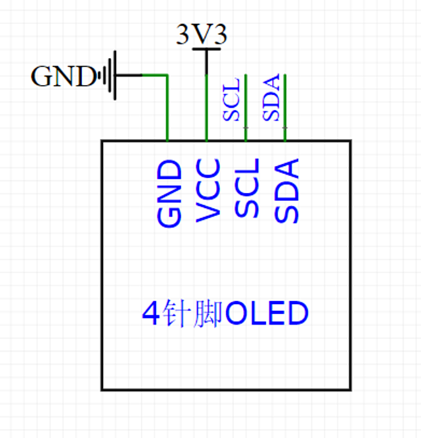
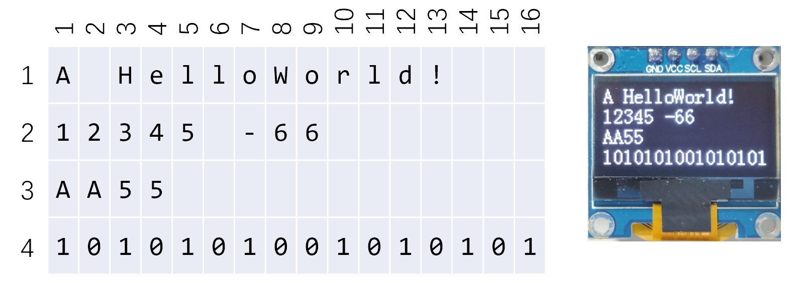
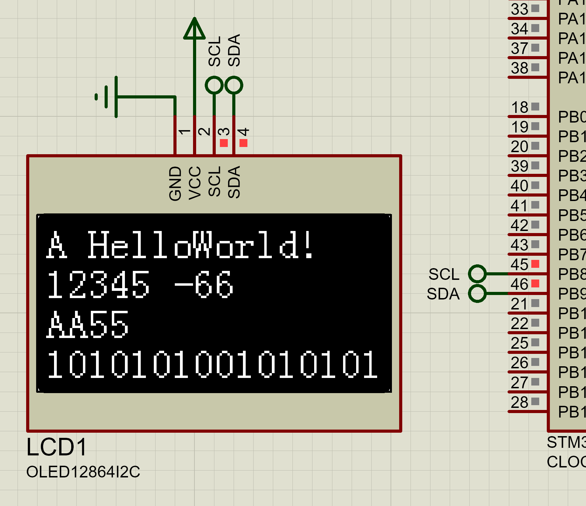

# OLDE

## OLED 参数

- 大小：0.96 寸

- 分辨率：128*64

- 引脚顺序：GND VCC SCL SDA
- 协议：IIC
- 供电：不知道（Proteus 里没写，反正 3.3V 肯定会亮 =.=）

## OLED 字符对照关系

> 字宽 8 像素，字高 16 像素

## OLED 驱动函数

> SCL 接 PB8，SDA 接 PB9

| **函数**                              | **作用**             |
| ------------------------------------- | -------------------- |
| OLED_Init();                          | 初始化               |
| OLED_Clear();                         | 清屏                 |
| OLED_ShowChar(1, 1, 'A');             | 显示一个字符         |
| OLED_ShowString(1, 3, "HelloWorld!"); | 显示字符串           |
| OLED_ShowNum(2, 1, 12345, 5);         | 显示十进制数字       |
| OLED_ShowSignedNum(2, 7, -66, 2);     | 显示有符号十进制数字 |
| OLED_ShowHexNum(3, 1, 0xAA55, 4);     | 显示十六进制数字     |
| OLED_ShowBinNum(4, 1, 0xAA55, 16);    | 显示二进制数字       |

## 实验结果

> 符合预期，但是折腾了很久玄学问题，Proteus，八嘎！我完全不知道问题是怎么解决的，我试了好几个之前的项目，最后复制了一个可以跑通的图

