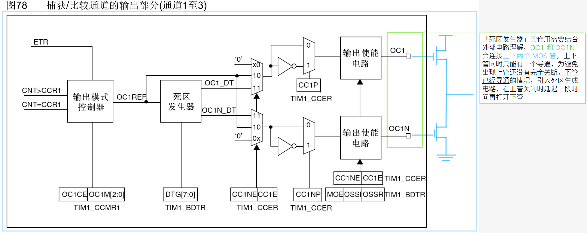
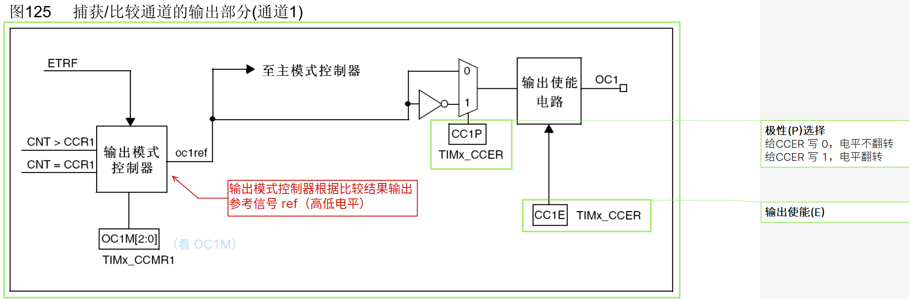
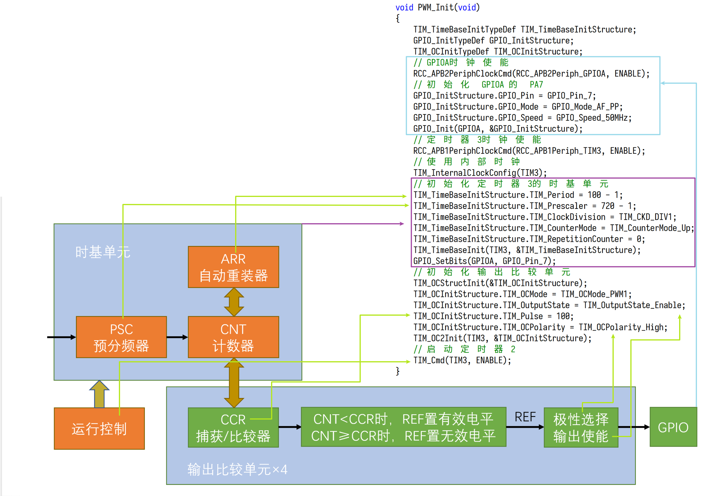

# OC（Output Compare）输出比较

- 输出比较可以通过比较 CNT 与 CCR 寄存器值的关系，来对输出电平进行置 1、置 0 或翻转的操作，用于输出一定频率和占空比的 PWM 波形
- 每个高级定时器和通用定时器都拥有 4 个输出比较通道
  - 基本定时器没有输入捕获和输出比较的功能
- 高级定时器的前 3 个通道额外拥有死区生成和互补输出的功能
  - 





### 输出比较模式 1


> - 冻结的情况下上一次输出什么电平，冻结时一直输出这个电平不变（CNT 和 CCR 的比较**无效化**，保持原电平）
> - **有效/无效电平**可以简单认为是**高/低电平**
>   - **匹配时**置有效/无效电平是**一次性的**，<u>不会持续有效</u>
>   - 若需要**持续输出**有效/无效电平，应该配置**强制为**无效/有效电平
> - CNT=CCR 时 REF 电平翻转，实际上表示的意义是 50% 占空比，输出波形频率为更新频率/2（每次更新改变电平，更新两次输出一个完整的波形）
> - PWM1 和 PWM2 **只是电平取反的关系**，其他完全一样，一半选 PWM1 就行了
>   - 看到这里可以发现，输出比较时有两处可以设置极性，一个是通过配置模式设置，一个是通过配置极性选择设置
>     - TIMx_CCMR1 里的 [OC1M](bookxnotepro://opennote/?nb={01a25f6c-fe16-454c-8f38-591392487e16}&book=47f07b86a273b11dbbc9034f7a90f448&page=288&x=270&y=109&id=222)
>     - TIMx_CCER 里的 [CC1E](bookxnotepro://opennote/?nb={01a25f6c-fe16-454c-8f38-591392487e16}&book=47f07b86a273b11dbbc9034f7a90f448&page=291&x=287&y=529&id=226)

# PWM 简介


> 惯性系统：可以利用人眼的视觉残留、电机的惯性驱动等现象的系统

# PWM 输出基本结构




## 参数计算


PWM频率：   Freq = CK_PSC / (PSC + 1) / (ARR + 1)

PWM占空比： Duty = CCR / (ARR + 1)

PWM分辨率： Reso = 1 / (ARR + 1)


# 呼吸灯实现

PWM 初始化：

```c
/**
 * 呼吸灯，PA7
 * 查表得到，PA7 可复用作为 TIM3_CH2（定时器3的通道2）
 */
// PWM 初始化函数
void PWM_Init(void)
{
	TIM_TimeBaseInitTypeDef TIM_TimeBaseInitStructure;
	GPIO_InitTypeDef GPIO_InitStructure;
	TIM_OCInitTypeDef TIM_OCInitStructure;

	// GPIOA时钟使能
	RCC_APB2PeriphClockCmd(RCC_APB2Periph_GPIOA, ENABLE);

	// 初始化 GPIOA 的 PA7
	GPIO_InitStructure.GPIO_Pin = GPIO_Pin_7;
	GPIO_InitStructure.GPIO_Mode = GPIO_Mode_AF_PP; // 复用推挽输出（由定时器而不是输出寄存器控制输出）
	GPIO_InitStructure.GPIO_Speed = GPIO_Speed_50MHz;
	GPIO_Init(GPIOA, &GPIO_InitStructure);

	// 定时器3时钟使能
	RCC_APB1PeriphClockCmd(RCC_APB1Periph_TIM3, ENABLE);

	// 使用内部时钟（没配置的话，默认就是内部时钟，所以这句可以不写）
	TIM_InternalClockConfig(TIM3);

	/*
	TIM_Prescaler = 7200-1，72MHz 进行 7200 分频，得到 10kHz，即计数频率为 10kHz
	TIM_Period    = 10000-1，计数器以 10kHz 计数 10000 次，即 1s
	 */
	// 初始化定时器3的时基单元
	TIM_TimeBaseInitStructure.TIM_Period = 100 - 1;					// 周期（=自动重装器 ARR 的值）
	TIM_TimeBaseInitStructure.TIM_Prescaler = 720 - 1;				// 预分频器的值（PSC）
	TIM_TimeBaseInitStructure.TIM_ClockDivision = TIM_CKD_DIV1;		// 采样频率分频系数
	TIM_TimeBaseInitStructure.TIM_CounterMode = TIM_CounterMode_Up; // 向上计数模式
	TIM_TimeBaseInitStructure.TIM_RepetitionCounter = 0;			// 重复计数器的值，TIM1 和 TIM8 才有效
	TIM_TimeBaseInit(TIM3, &TIM_TimeBaseInitStructure);
	GPIO_SetBits(GPIOA, GPIO_Pin_7);

	// 初始化输出比较单元
	TIM_OCStructInit(&TIM_OCInitStructure);						  // 初始化结构体(赋默认值，避免未定义情况)
	TIM_OCInitStructure.TIM_OCMode = TIM_OCMode_PWM1;			  // PWM 模式 1
	TIM_OCInitStructure.TIM_OutputState = TIM_OutputState_Enable; // 输出使能
	TIM_OCInitStructure.TIM_Pulse = 100;						  // 脉冲宽度(CCR 的值)
	TIM_OCInitStructure.TIM_OCPolarity = TIM_OCPolarity_High;	  // 输出极性，高电平有效
	TIM_OC2Init(TIM3, &TIM_OCInitStructure);					  // 初始化 TIM3 的通道2

	// 启动定时器2
	TIM_Cmd(TIM3, ENABLE);
}
```

main：

```c
int main(void)
{
	PWM_Init();
	while (1)
	{
		for (i = 20; i <= 100; i++)
		{
			TIM_SetCompare2(TIM3, i);
			Delay_ms(20);
		}
		for (; i >= 20; i--)
		{
			TIM_SetCompare2(TIM3, i);
			Delay_ms(20);
		}
	}
}

```

