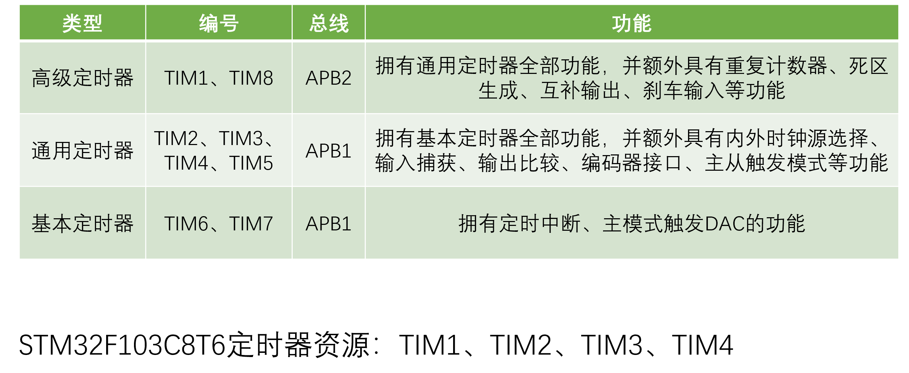
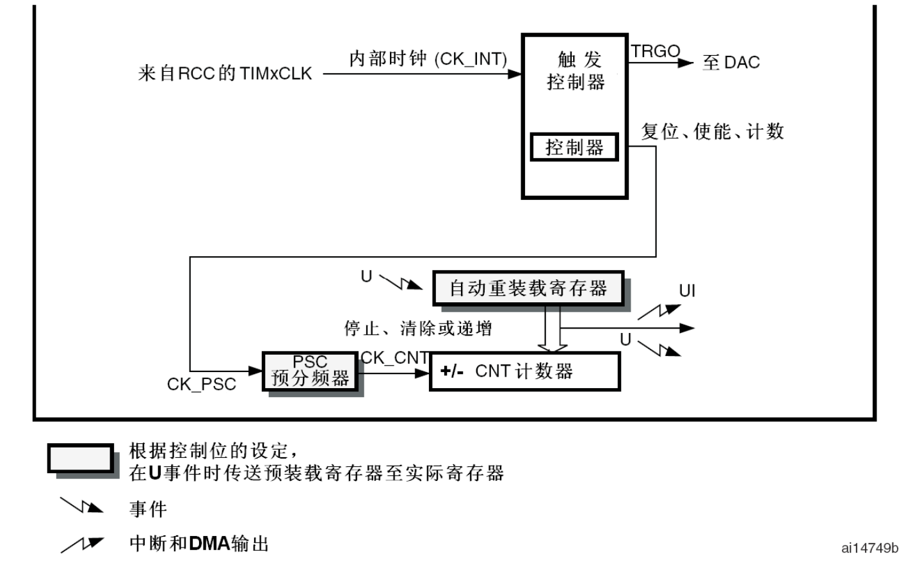
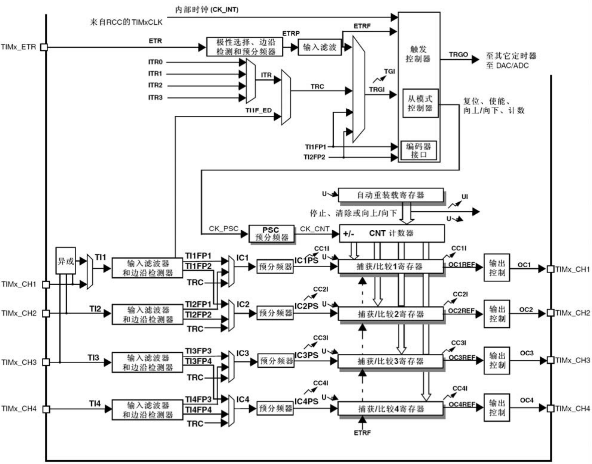
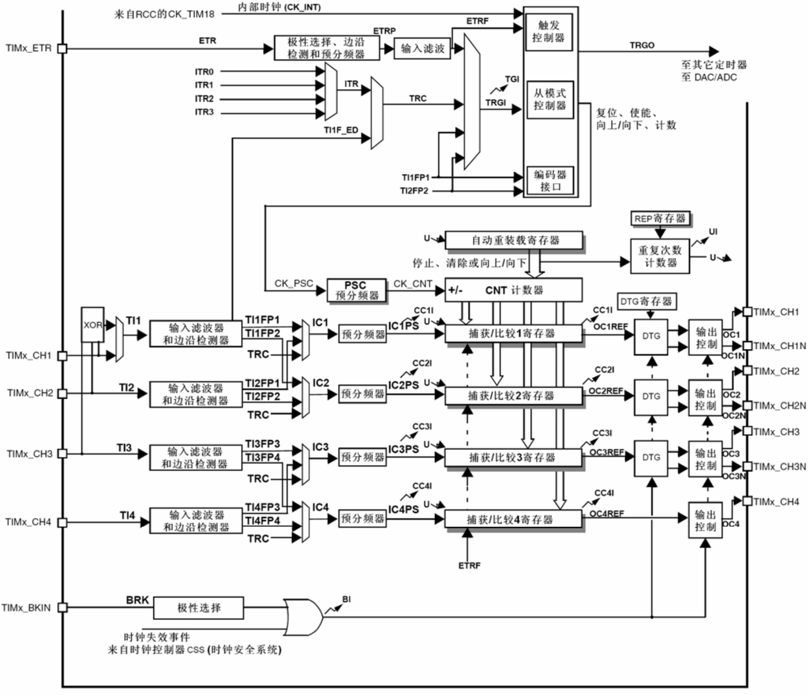
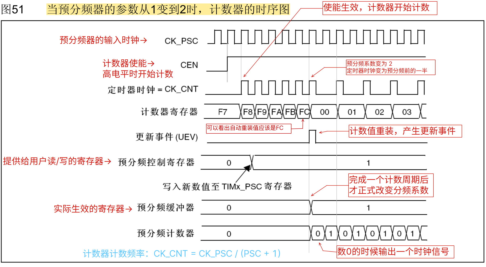
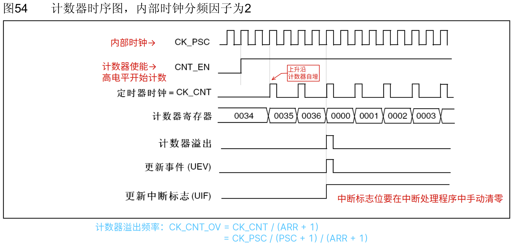
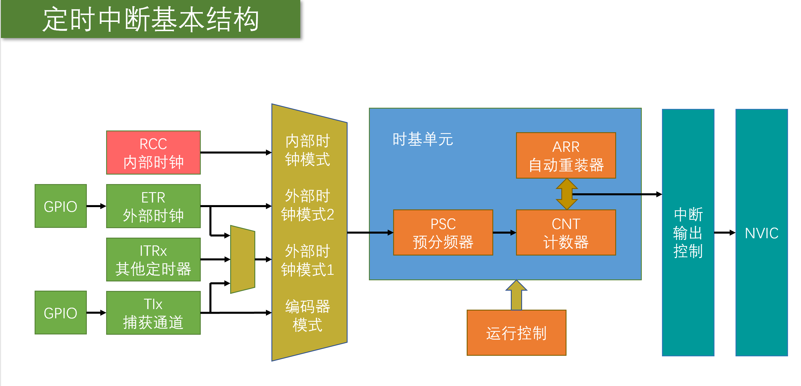
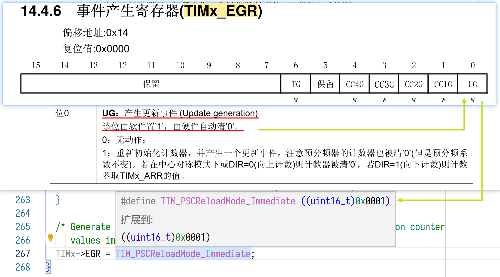

# TIM（Timer）定时器

定时器可以对输入的时钟进行计数，并在计数值达到设定值时触发中断

<u>16 位计数器、预分频器、自动重装寄存器</u>的时基单元，在 72MHz 计数时钟下可以实现最大 59.65s 的定时（$\mathrm{\frac{1}{(72M / 2^{16} / 2^{16}}}$）

定时器不仅具备基本的定时中断功能，而且还包含内外时钟源选择、输入捕获、输出比较、编码器接口、主从触发模式等多种功能

## 定时器类型

定时器根据复杂度和应用场景分为了高级定时器、通用定时器、基本定时器三种类型



> 💡定时器框图里带阴影效果的寄存器，都是有缓冲寄存器（影子寄存器）的

### 基本定时器

> [基本定时器框图](bookxnotepro://opennote/?nb={01a25f6c-fe16-454c-8f38-591392487e16}&book=47f07b86a273b11dbbc9034f7a90f448&page=297&x=177&y=439&id=134)



内部时钟给出时钟基准 => 经过预分频器分频（0 对应不分频，1 对应分频 2倍……）=> CNT 计数器自增并和自动重装载寄存器比对数值，当数值相等，引发中断（或产生事件）并从初值开始再次从 0 开始计数

### 通用定时器

> [通用定时器框图](bookxnotepro://opennote/?nb={01a25f6c-fe16-454c-8f38-591392487e16}&book=47f07b86a273b11dbbc9034f7a90f448&page=253&x=177&y=63&id=135)




- 基本定时器只支持向上计数（递增），通用和高级定时器支持向下（递减）和对齐（0→N→0→N…）计数
- 基本定时器只能选择内部时钟，通用定时器开始支持外部时钟
  - 我晕了（时钟输入部分）：https://www.bilibili.com/video/BV1th411z7sn?p=13&t=1146.9

### 高级定时器

> [高级定时器框图](bookxnotepro://opennote/?nb={01a25f6c-fe16-454c-8f38-591392487e16}&book=47f07b86a273b11dbbc9034f7a90f448&page=199&x=188&y=63&id=136)



## 预分频器时序图

> from [参考手册](bookxnotepro://opennote/?nb={01a25f6c-fe16-454c-8f38-591392487e16}&book=47f07b86a273b11dbbc9034f7a90f448&page=200&x=252&y=260&id=144)



## 计数器时序图

> from [参考手册](bookxnotepro://opennote/?nb={01a25f6c-fe16-454c-8f38-591392487e16}&book=47f07b86a273b11dbbc9034f7a90f448&page=201&x=228&y=572&id=157)



## 时钟树

> from [参考手册](bookxnotepro://opennote/?nb={01a25f6c-fe16-454c-8f38-591392487e16}&book=47f07b86a273b11dbbc9034f7a90f448&page=55&x=156&y=63&id=169)


# 定时器中断实现




## 定时器初始化函数

```c
// 定时器2初始化，频率为1Hz（1 秒中断一次）
void Timer_Init(void)
{
	TIM_TimeBaseInitTypeDef TIM_TimeBaseInitStructure;
	NVIC_InitTypeDef NVIC_InitStructure;

	// 开启定时器2的时钟
	RCC_APB1PeriphClockCmd(RCC_APB1Periph_TIM2, ENABLE);

	// 使用内部时钟（没配置的话，默认就是内部时钟，所以这句可以不写）
	TIM_InternalClockConfig(TIM2);

	/*
	TIM_Prescaler = 7200-1，72MHz 进行 7200 分频，得到 10kHz，即计数频率为 10kHz
	TIM_Period    = 10000-1，计数器以 10kHz 计数 10000 次，即 1s
	 */
	// 初始化定时器2的时基单元
	TIM_TimeBaseInitStructure.TIM_Period = 10000;					// 周期（=自动重装器的值）
	TIM_TimeBaseInitStructure.TIM_Prescaler = 7200 - 1;				// 预分频器的值
	TIM_TimeBaseInitStructure.TIM_ClockDivision = TIM_CKD_DIV1;		// 采样频率分频系数
	TIM_TimeBaseInitStructure.TIM_CounterMode = TIM_CounterMode_Up; // 向上计数模式
	// TIM_TimeBaseInitStructure.TIM_RepetitionCounter = 0; // 重复计数器的值，TIM1 和 TIM8 才有效
	TIM_TimeBaseInit(TIM2, &TIM_TimeBaseInitStructure);

	// 开启定时器2的中断
	TIM_ITConfig(TIM2, TIM_IT_Update, ENABLE);

	// 初始化 NVIC
	NVIC_InitStructure.NVIC_IRQChannel = TIM2_IRQn;			  // 中断通道
	NVIC_InitStructure.NVIC_IRQChannelPreemptionPriority = 0; // 抢占优先级
	NVIC_InitStructure.NVIC_IRQChannelSubPriority = 1;		  // 响应优先级
	NVIC_InitStructure.NVIC_IRQChannelCmd = ENABLE;			  // 通道使能
	NVIC_Init(&NVIC_InitStructure);

	// 启动定时器2
	TIM_Cmd(TIM2, ENABLE);
}
```

### 关于 `TIM_ClockDivision`

这里给出时基单元初始化的结构体

```c
typedef struct
{
    uint16_t TIM_Prescaler;
    uint16_t TIM_CounterMode;
    uint16_t TIM_Period;  
    uint16_t TIM_ClockDivision;  
    uint8_t TIM_RepetitionCounter;
} TIM_TimeBaseInitTypeDef;  
```

其中 `TIM_ClockDivision` 有点特别，它的注释说：

> Specifies the clock division.
>
> （指定时钟分频）


说白了就是配置时钟分频，那是谁的时钟分频？第一反应肯定是**定时器的时钟分频啊**


但是还有一项 `TIM_Prescaler`，它的注释是：

> Specifies the prescaler value used to divide the TIM clock.
>
> （指定用于分频 TIME 时钟的预分频器值）

显然 `TIM_Prescaler` 才是配置定时器的时钟分频的


实际上 `TIM_ClockDivision` 是设置内部时钟（CK_INT）频率与数字滤波器（ETR，TIx）使用的采样频率之间的分频比例的（与输入捕获相关），0（TIM_CKD_DIV1） 表示滤波器的频率和定时器的频率是一样的（不分配）

## 定时器中断处理函数

```c
void TIM2_IRQHandler(void)
{
	// 判断的定时器中断源是初始化的时设定的 TIM_IT_Update
	if (TIM_GetITStatus(TIM2, TIM_IT_Update) == SET) // 检查更新中断发生与否
	{
		counter++; //counter 是 main.c 设置的一个全局变量
		TIM_ClearITPendingBit(TIM2, TIM_IT_Update); // 清除中断标志
	}
}
```

主函数通过 OLED 显示counter：

```c
OLED_Init();
Timer_Init();
OLED_ShowString(1, 1, "Counter:");
while (1)
{
    OLED_ShowNum(1, 9, counter,5);
}
```

> 实验发现计数每次都是从 1 开始，这和 `TIM_TimeBaseInit()` 的实现有关

### 关于 `TIM_TimeBaseInit()`

这里给出 `TIM_TimeBaseInit()` 的部分代码

```c
void TIM_TimeBaseInit(TIM_TypeDef* TIMx, TIM_TimeBaseInitTypeDef* TIM_TimeBaseInitStruct)
{
    ...
  /* Generate an update event to reload the Prescaler and the Repetition counter values immediately */
  TIMx->EGR = TIM_PSCReloadMode_Immediate;           
}
```

在 `TIM_TimeBaseInit()` 的最后一句语句前，有这句注释

> Generate an update event to reload the Prescaler and the Repetition counter values immediately
>
> （生成一个更新事件，**立即**重新加载预分频器和重复计数器的值）

前面提及由于存在缓存寄存器（影子寄存器）这一设计，预分频系数并不会立即生效（只有在引发中断，也就是更新事件后，才开始生效），因此为了让该值立即生效，这里手动产生了一个更新事件

> 每次计数器溢出时可以产生更新事件，在 `TIMx_EGR` 寄存器中(通过软件方式或者使用从模式控制器)设置 `UG` 位也同样可以产生一个更新事件。（from [参考手册](bookxnotepro://opennote/?nb={01a25f6c-fe16-454c-8f38-591392487e16}&book=47f07b86a273b11dbbc9034f7a90f448&page=254&x=319&y=756&id=189)）


没啥好说的了，上图👇




因为上述原因，所以**每次初始化完毕之后，就会立刻进入中断**（单片机一上电就进入中断）

解决方法为：在 `TIM_TimeBaseInit()` 之后将标志位清除

```c
···
TIM_TimeBaseInit(TIM2, &TIM_TimeBaseInitStructure); // 初始化定时器2的时基单元
TIM_ClearFlag(TIM2, TIM_FLAG_Update); // 清除更新标志（避免一上电就触发中断）
TIM_ITConfig(TIM2, TIM_IT_Update, ENABLE); // 开启定时器2的中断，定时器中断源为 TIM_IT_Update
···
```


## 测试用主函数

```c
uint16_t counter = 0;
int main(void)
{
	OLED_Init();
	Timer_Init();
	OLED_ShowString(1, 1, "Counter:");
	OLED_ShowString(2, 1, "CNT:");
	while (1)
	{
		OLED_ShowNum(1, 9, counter,5);
		/* TIM_Period=10000，可以看到 OLED 上 CNT 从 0~9999 循环
		   修改 TIM_Period、TIM_Prescaler 的值，可以看到相应的变化 */
		OLED_ShowNum(2, 9, TIM_GetCounter(TIM2),5); 
	}
}
```

# 定时器外部中断实现

写到一半发现我没有条件触发复用IO😓，最后用回形针摸阵脚实现了……（不过触发的不太稳定，有时候连条好几个数，毕竟是手搓）

这里给出实现：

> 和内部时钟相比只是修改了时钟，然后配置了 GPIOA（用于外部时钟复用）

```c
void External_Clock_Timer_Init(void)
{
	TIM_TimeBaseInitTypeDef TIM_TimeBaseInitStructure;
	NVIC_InitTypeDef NVIC_InitStructure;
	GPIO_InitTypeDef GPIO_InitStructure;

	// 开启定时器2的时钟
	RCC_APB1PeriphClockCmd(RCC_APB1Periph_TIM2, ENABLE);

	// 开启GPIOA的时钟
	RCC_APB2PeriphClockCmd(RCC_APB2Periph_GPIOA, ENABLE);

	// 初始化 GPIOA
	GPIO_InitStructure.GPIO_Pin = GPIO_Pin_0;
	GPIO_InitStructure.GPIO_Mode = GPIO_Mode_IPU;
	GPIO_Init(GPIOA, &GPIO_InitStructure);

	// 使用外部时钟
	// 定时器2，不分频，高电平/上升沿触发，不用滤波器（bookxnotepro://opennote/?nb={01a25f6c-fe16-454c-8f38-591392487e16}&book=47f07b86a273b11dbbc9034f7a90f448&page=283&x=176&y=448&id=193）
	TIM_ETRClockMode2Config(TIM2, TIM_ExtTRGPSC_OFF, TIM_ExtTRGPolarity_NonInverted, 0);

	/*
	TIM_Prescaler = 0，不分频
	TIM_Period    = 10-1，数到 10 中断一次
	 */
	// 初始化定时器2的时基单元
	TIM_TimeBaseInitStructure.TIM_Period = 10;					// 周期（=自动重装器的值）
	TIM_TimeBaseInitStructure.TIM_Prescaler = 1 - 1;				// 预分频器的值
	TIM_TimeBaseInitStructure.TIM_ClockDivision = TIM_CKD_DIV1;		// 采样频率分频系数
	TIM_TimeBaseInitStructure.TIM_CounterMode = TIM_CounterMode_Up; // 向上计数模式
	// TIM_TimeBaseInitStructure.TIM_RepetitionCounter = 0; // 重复计数器的值，TIM1 和 TIM8 才有效
	TIM_TimeBaseInit(TIM2, &TIM_TimeBaseInitStructure);

	TIM_ClearFlag(TIM2, TIM_FLAG_Update); // 清除更新标志（避免一上电就触发中断）

	// 开启定时器2的中断，定时器中断源为 TIM_IT_Update
	TIM_ITConfig(TIM2, TIM_IT_Update, ENABLE);

	// 初始化 NVIC
	NVIC_InitStructure.NVIC_IRQChannel = TIM2_IRQn;			  // 中断通道
	NVIC_InitStructure.NVIC_IRQChannelPreemptionPriority = 0; // 抢占优先级
	NVIC_InitStructure.NVIC_IRQChannelSubPriority = 1;		  // 响应优先级
	NVIC_InitStructure.NVIC_IRQChannelCmd = ENABLE;			  // 通道使能
	NVIC_Init(&NVIC_InitStructure);

	// 启动定时器2
	TIM_Cmd(TIM2, ENABLE);
}
```

