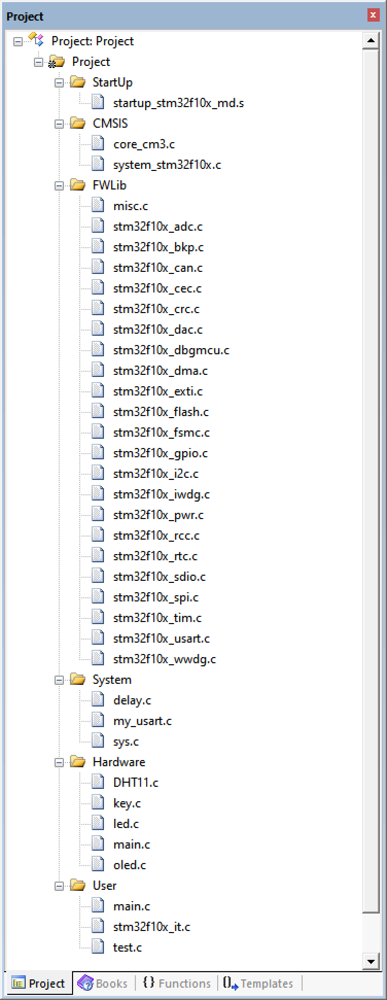
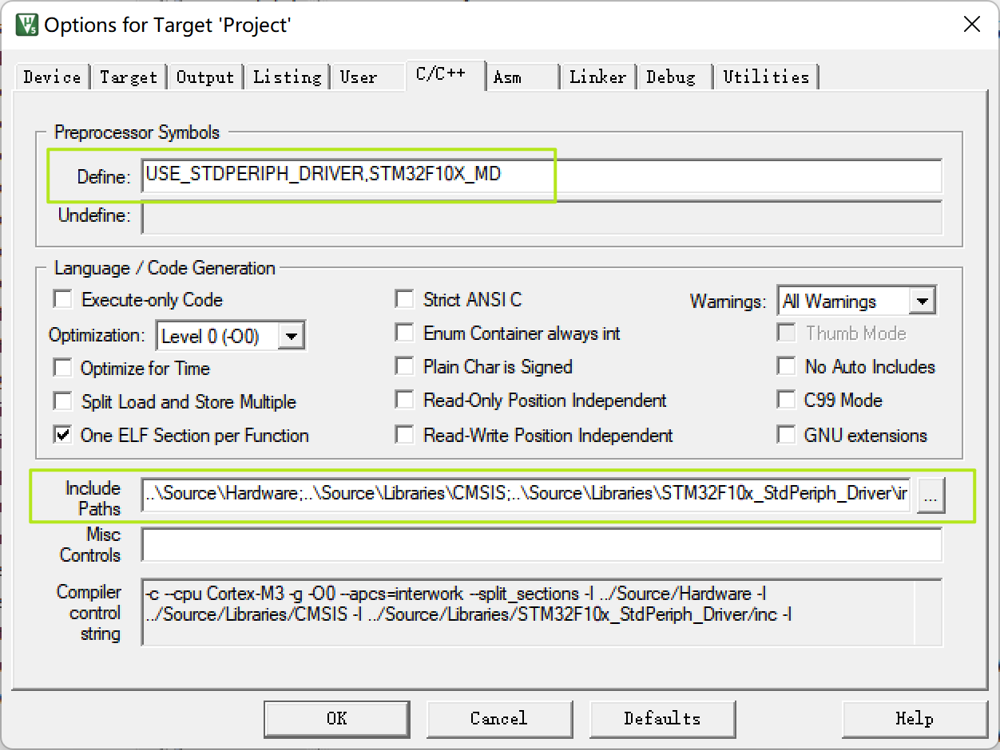
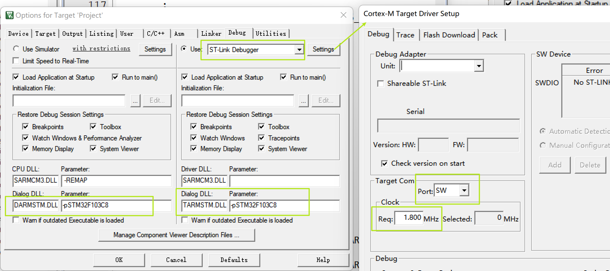
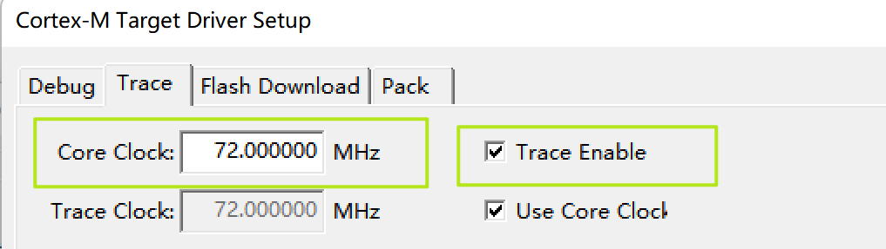
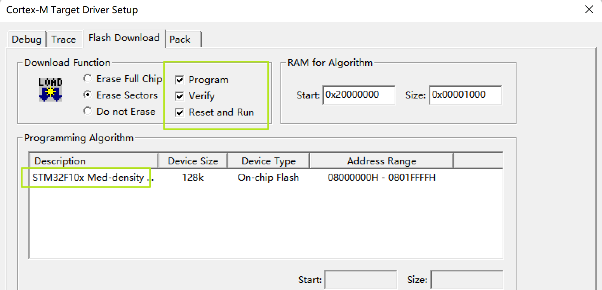

# 部分硬件说明

- 开发板：STM32F103C8T6
- LED
  - PA7
  - PA8
- OLED
  - 大小：0.96 寸
  - 分辨率：128*64
  - 引脚顺序：GND VCC SCL SDA
    - SCL：PB6
    - SDA：PB7
  - 协议：IIC
- 按键
  - KEY1：PB15
  - KEY2：PB1

# 模板说明

根据目前拥有的一些模块建立的项目模板

## keil 配置

### 源文件分组

- StarUp：启动文件（汇编 `.s`）
- CMSIS：`core_cm3.c` 和 `system_stm32f10x.c`
- FWLib：固件库（`src` 文件夹里的全部 `.c` 文件）
- System：自定义基础工具相关
- Hardware：硬件外设相关
- User：`main.c`、`stm32f10x_it.c`、`test.c` 

### 部分配置项

- Define：`USE_STDPERIPH_DRIVER,STM32F10X_MD`
- Include Paths：`..\Source\Hardware;..\Source\Libraries\CMSIS;..\Source\Libraries\STM32F10x_StdPeriph_Driver\inc;..\Source\System;..\Source\User`

- DARMSTM.DLL
- TARMSTM.DLL
- -pSTM32F103C8

## 测试模块

- LED 亮灭

- 串口输出测试字符串

- OLED 显示测试字符串

